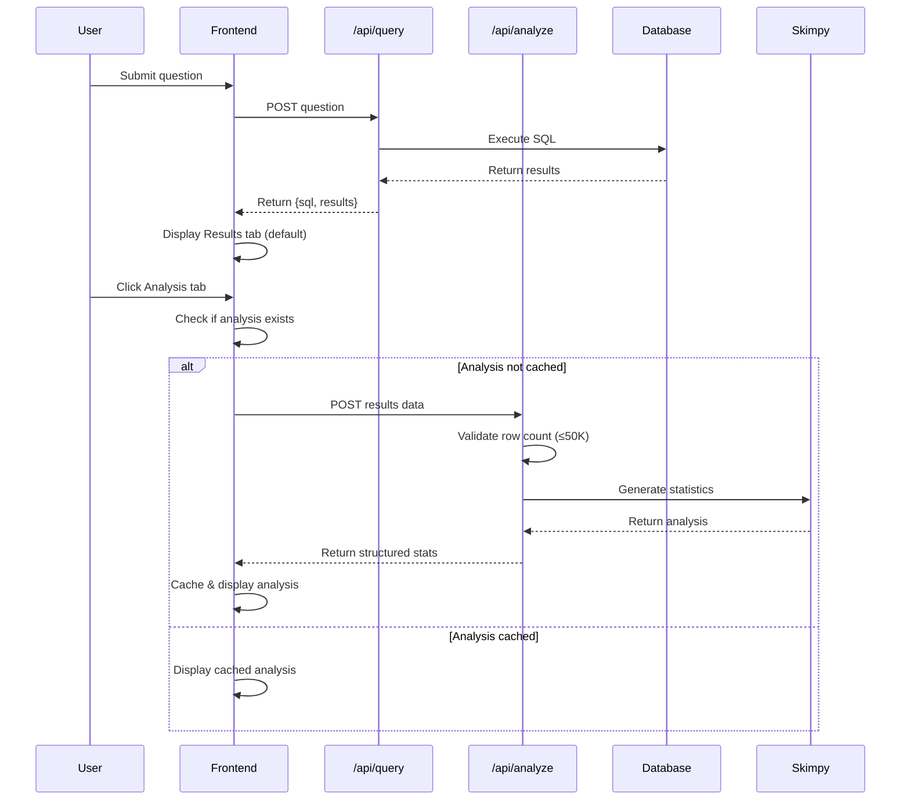
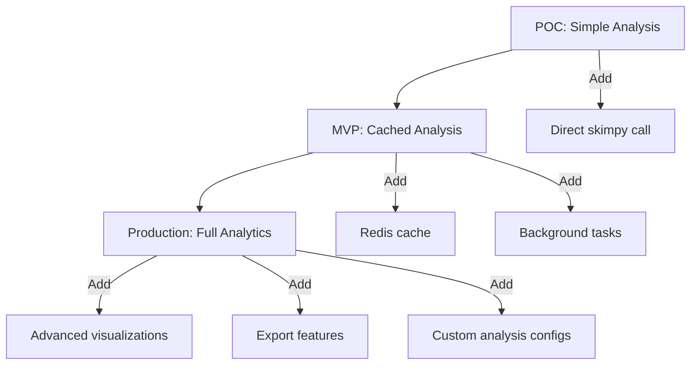

# SQL Chatbot Analysis Feature - Architecture Document

**Winston, Architect**  
**Version:** 1.0  
**Date:** 2025-09-30  
**Status:** POC Extension

---

## Executive Summary

This document outlines the architectural integration of an automatic data analysis feature into the existing SQL Chatbot POC. The feature adds statistical analysis capabilities using the `skimpy` library, enabling users to instantly understand data characteristics without leaving the application.

### Change Log

| Date       | Version | Description                              | Author    |
|:-----------|:--------|:-----------------------------------------|:----------|
| 2025-09-30 | 1.0     | Initial architecture for analysis feature | Winston   |

---

## 1. Integration Overview

### 1.1 Current System State

The existing POC follows a simple 3-tier architecture:

**Frontend (HTML/JS)** → **Backend (FastAPI)** → **Database (SQL Server)**

Current flow:
1. User submits question via frontend
2. `/api/query` endpoint processes request
3. OpenAI GPT-5 generates SQL
4. SQL executes against database
5. Results returned to frontend
6. Results displayed in simple table

### 1.2 New Analysis Flow

The analysis feature extends this flow without disrupting existing functionality:



---

## 2. Architecture Decisions

### 2.1 Analysis Endpoint Design

**Decision:** Create separate `/api/analyze` endpoint (not integrated into `/api/query`)

**Rationale:**
- **Separation of Concerns:** Query execution and analysis are distinct operations
- **Error Isolation:** Analysis failures don't affect core query functionality
- **Performance:** Analysis only runs when user views the Analysis tab (lazy loading)
- **Flexibility:** Users can query without triggering analysis overhead
- **Maintainability:** Cleaner code structure with focused endpoints

**Alternative Considered:** Combined endpoint returning both results + analysis
- Rejected due to: forced analysis on every query, increased response time, coupling of concerns

### 2.2 Data Flow Architecture

**Frontend → Backend Data Transfer:**

```python
# Request to /api/analyze
{
    "columns": ["ProductID", "Name", "ListPrice"],
    "rows": [
        {"ProductID": 1, "Name": "Product A", "ListPrice": 49.99},
        {"ProductID": 2, "Name": "Product B", "ListPrice": 29.99}
    ]
}

# Response from /api/analyze (success)
{
    "status": "success",
    "row_count": 150,
    "variable_types": {
        "numeric": 2,
        "categorical": 1,
        "datetime": 0
    },
    "numeric_stats": [
        {
            "column": "ListPrice",
            "count": 150,
            "mean": 45.23,
            "std": 12.45,
            "min": 10.00,
            "q25": 35.50,
            "q50": 44.00,
            "q75": 55.25,
            "max": 99.99
        }
    ],
    "cardinality": [
        {"column": "ProductID", "unique_count": 150, "total_count": 150},
        {"column": "Name", "unique_count": 148, "total_count": 150}
    ],
    "missing_values": [
        {"column": "ProductID", "null_count": 0, "null_percentage": 0.0},
        {"column": "Name", "null_count": 2, "null_percentage": 1.33}
    ]
}

# Response (row limit exceeded)
{
    "status": "too_large",
    "row_count": 75000,
    "message": "Analysis unavailable for datasets exceeding 50,000 rows. Please refine your query for detailed statistics."
}

# Response (error)
{
    "status": "error",
    "message": "Analysis could not be generated for this dataset.",
    "error_detail": "Unsupported data type encountered"
}
```

### 2.3 Frontend State Management

**Decision:** Use simple JavaScript object for state management (no framework)

**State Structure:**
```javascript
const appState = {
    currentQuery: {
        question: "",
        sql: "",
        results: {columns: [], rows: []},
        timestamp: null
    },
    analysis: {
        data: null,        // Cached analysis response
        status: "idle",    // idle | loading | success | error
        error: null
    },
    ui: {
        activeTab: "results"  // "results" | "analysis"
    }
};
```

**Rationale:**
- **Simplicity:** POC doesn't justify framework overhead
- **Sufficient:** Handles tab switching, caching, and state persistence
- **Maintainable:** Easy to understand and debug
- **Future-Ready:** Can migrate to React/Vue if POC graduates to production

### 2.4 Error Handling Strategy

**Multi-Layer Approach:**

```
┌─────────────────────────────────────┐
│  Layer 1: Input Validation          │
│  - Row count check (≤50K)           │
│  - Data structure validation        │
│  - Returns: too_large | invalid     │
└─────────────────────────────────────┘
           ↓ (if valid)
┌─────────────────────────────────────┐
│  Layer 2: DataFrame Conversion      │
│  - pandas DataFrame creation         │
│  - Type inference                    │
│  - Returns: error on failure        │
└─────────────────────────────────────┘
           ↓ (if successful)
┌─────────────────────────────────────┐
│  Layer 3: Skimpy Analysis           │
│  - try-catch wrapper                 │
│  - Extract structured data           │
│  - Returns: success | error         │
└─────────────────────────────────────┘
           ↓ (any failure)
┌─────────────────────────────────────┐
│  Frontend Error Display             │
│  - Show user-friendly message        │
│  - Keep Results tab functional       │
│  - Log technical details             │
└─────────────────────────────────────┘
```

**Error Messages by Scenario:**

| Scenario | Backend Response | Frontend Display |
|:---------|:-----------------|:-----------------|
| Row count > 50K | `status: "too_large"` | "Analysis unavailable for datasets exceeding 50,000 rows. Please refine your query for detailed statistics." |
| Skimpy processing error | `status: "error"` | "Analysis could not be generated for this dataset." |
| Invalid data types | `status: "error"` | "Analysis could not be generated for this dataset." |
| Network failure | N/A | "Failed to generate analysis. Please try again." |
| Empty dataset | N/A | Analysis tab disabled (no data to analyze) |

### 2.5 Performance Considerations

**Memory Usage:**

| Dataset Size | Estimated Memory | Status |
|:-------------|:-----------------|:-------|
| 1K rows × 10 cols | ~2 MB | ✓ Optimal |
| 10K rows × 10 cols | ~20 MB | ✓ Good |
| 50K rows × 10 cols | ~100 MB | ✓ Acceptable |
| 50K rows × 50 cols | ~500 MB | ⚠️ Limit threshold |
| 100K rows × 10 cols | ~200 MB | ✗ Rejected (row limit) |

**Processing Time Estimates:**

- **Small datasets** (< 1K rows): < 200ms
- **Medium datasets** (1K-10K rows): 200ms - 1s
- **Large datasets** (10K-50K rows): 1s - 2s
- **Above limit** (> 50K rows): Rejected immediately

**Optimization Strategies:**

1. **Lazy Loading:** Analysis only triggered when Analysis tab clicked
2. **Client-Side Caching:** Analysis persists in memory during session
3. **Early Rejection:** Row count check before expensive processing
4. **Async Processing:** FastAPI async endpoint (non-blocking)
5. **Frontend Loading UX:** Spinner/progress indicator during analysis

---

## 3. Component Architecture

### 3.1 Backend Components

#### 3.1.1 New Analysis Service Module

**File:** `app/analysis_service.py`

**Responsibilities:**
- Convert query results to pandas DataFrame
- Apply row limit validation
- Execute skimpy analysis
- Extract and structure statistics
- Handle errors gracefully

**Key Functions:**

```python
def analyze_query_results(columns: list, rows: list) -> dict:
    """
    Main entry point for analysis.
    Returns structured analysis or error response.
    """
    
def _validate_row_limit(row_count: int, max_rows: int = 50000) -> bool:
    """Validate dataset size."""
    
def _convert_to_dataframe(columns: list, rows: list) -> pd.DataFrame:
    """Convert API data to DataFrame."""
    
def _extract_variable_types(df: pd.DataFrame) -> dict:
    """Extract column type distribution."""
    
def _extract_numeric_stats(df: pd.DataFrame) -> list:
    """Extract numeric column statistics."""
    
def _extract_cardinality(df: pd.DataFrame) -> list:
    """Extract unique value counts."""
    
def _extract_missing_values(df: pd.DataFrame) -> list:
    """Extract null/missing value analysis."""
```

#### 3.1.2 Updated Main Application

**File:** `app/main.py`

**New Endpoint:**

```python
class AnalyzeRequest(BaseModel):
    columns: list[str]
    rows: list[dict]

@app.post("/api/analyze")
async def analyze_results(request: AnalyzeRequest):
    """
    Endpoint for generating statistical analysis of query results.
    """
    try:
        analysis = await analysis_service.analyze_query_results(
            columns=request.columns,
            rows=request.rows
        )
        return analysis
    except Exception as e:
        return {
            "status": "error",
            "message": "Analysis could not be generated for this dataset.",
            "error_detail": str(e)
        }
```

### 3.2 Frontend Components

#### 3.2.1 UI Structure Changes

**File:** `static/index.html`

**New Structure:**

```html
<!-- Existing question input and submit button remain -->

<hr>
<h2>Generated SQL Query:</h2>
<pre id="sql-query-output"></pre>

<!-- NEW: Tabbed Interface -->
<div class="tab-container">
    <button class="tab-button active" data-tab="results">Results</button>
    <button class="tab-button" data-tab="analysis">Analysis</button>
</div>

<!-- NEW: Tab Content Containers -->
<div id="results-tab" class="tab-content active">
    <h2>Results:</h2>
    <div id="results-output"></div>
</div>

<div id="analysis-tab" class="tab-content">
    <h2>Statistical Analysis:</h2>
    <div id="analysis-loading" class="loading-indicator" style="display: none;">
        Generating analysis...
    </div>
    <div id="analysis-output"></div>
</div>
```

#### 3.2.2 JavaScript State & Logic

**File:** `static/app.js`

**New Components:**

```javascript
// State management
const appState = {
    currentQuery: {...},
    analysis: {...},
    ui: {...}
};

// Tab switching handler
function handleTabSwitch(tabName) {
    // Update UI active state
    // If switching to analysis and not loaded, trigger analysis
    // Display cached analysis if available
}

// Analysis API call
async function fetchAnalysis(columns, rows) {
    // POST to /api/analyze
    // Update state
    // Render analysis
}

// Analysis rendering
function renderAnalysis(analysisData) {
    // Create variable types summary
    // Create numeric statistics table
    // Create cardinality table
    // Create missing values table
}
```

---

## 4. Data Models

### 4.1 Backend Models

```python
# Request Models
class AnalyzeRequest(BaseModel):
    columns: list[str]
    rows: list[dict]

# Response Models
class AnalysisSuccess(BaseModel):
    status: Literal["success"]
    row_count: int
    variable_types: dict[str, int]
    numeric_stats: list[dict]
    cardinality: list[dict]
    missing_values: list[dict]

class AnalysisTooLarge(BaseModel):
    status: Literal["too_large"]
    row_count: int
    message: str

class AnalysisError(BaseModel):
    status: Literal["error"]
    message: str
    error_detail: Optional[str]
```

### 4.2 Frontend State Types

```javascript
// TypeScript-style annotations (for documentation)
interface AppState {
    currentQuery: {
        question: string;
        sql: string;
        results: {
            columns: string[];
            rows: Record<string, any>[];
        };
        timestamp: number | null;
    };
    analysis: {
        data: AnalysisResponse | null;
        status: 'idle' | 'loading' | 'success' | 'error';
        error: string | null;
    };
    ui: {
        activeTab: 'results' | 'analysis';
    };
}
```

---

## 5. Security & Validation

### 5.1 Input Validation

**Backend Validation:**

1. **Row Limit Check:** Enforce 50,000 row maximum
2. **Data Structure Validation:** Ensure columns/rows are valid arrays
3. **Type Safety:** Use Pydantic models for request validation
4. **SQL Safety:** (Already implemented) Only SELECT queries allowed

**Frontend Validation:**

1. **Empty Results Check:** Disable Analysis tab if no data
2. **Minimum Row Check:** Require ≥2 rows for analysis
3. **Tab State Management:** Prevent race conditions during loading

### 5.2 Error Boundaries

**Backend:**
- Try-catch around DataFrame conversion
- Try-catch around skimpy analysis
- Graceful degradation (return partial results if possible)

**Frontend:**
- Network error handling
- Invalid response handling
- Display fallback UI on errors
- Keep Results tab functional regardless of Analysis failures

---

## 6. Testing Strategy

### 6.1 Backend Testing

**Unit Tests:**
```python
def test_analyze_valid_dataset():
    """Test analysis with valid dataset."""

def test_analyze_row_limit_exceeded():
    """Test rejection of datasets > 50K rows."""

def test_analyze_empty_dataset():
    """Test handling of empty dataset."""

def test_analyze_numeric_only():
    """Test analysis with only numeric columns."""

def test_analyze_categorical_only():
    """Test analysis with only categorical columns."""

def test_analyze_mixed_types():
    """Test analysis with mixed data types."""

def test_analyze_with_nulls():
    """Test analysis with missing values."""

def test_analyze_invalid_data():
    """Test error handling for invalid data."""
```

**Integration Tests:**
```python
def test_analyze_endpoint_success():
    """Test /api/analyze endpoint with valid data."""

def test_analyze_endpoint_too_large():
    """Test /api/analyze endpoint with > 50K rows."""

def test_analyze_endpoint_error():
    """Test /api/analyze endpoint error handling."""
```

### 6.2 Frontend Testing

**Manual Testing Scenarios:**

1. **Happy Path:**
   - Submit query → View Results tab → Click Analysis tab → Verify analysis displayed

2. **Large Dataset:**
   - Submit query returning > 50K rows → Click Analysis tab → Verify "too large" message

3. **Empty Results:**
   - Submit query with no results → Verify Analysis tab disabled/appropriate message

4. **Tab Switching:**
   - Generate analysis → Switch between tabs → Verify analysis persists

5. **Network Error:**
   - Simulate network failure → Verify error message displayed

6. **Multiple Queries:**
   - Run query 1 → View analysis → Run query 2 → Verify analysis cleared/regenerated

---

## 7. Dependencies

### 7.1 New Python Packages

Add to `requirements.txt`:

```txt
skimpy==0.0.9          # Statistical analysis library
pandas>=2.0.0          # DataFrame operations (likely already present)
numpy>=1.24.0          # Numerical operations (skimpy dependency)
```

**Version Rationale:**
- `skimpy` 0.0.9: Latest stable version
- `pandas` 2.0+: Modern API, better performance
- `numpy` 1.24+: Compatible with pandas 2.0

### 7.2 No Frontend Dependencies

- Pure JavaScript implementation (no frameworks)
- No build step required
- Browser-native APIs only

---

## 8. Deployment Considerations

### 8.1 Configuration

**Environment Variables (`.env`):**

```bash
# Existing variables remain...

# Analysis Feature Configuration
ANALYSIS_MAX_ROWS=50000           # Maximum rows for analysis
ANALYSIS_TIMEOUT_SECONDS=5        # Analysis processing timeout
```

### 8.2 Resource Requirements

**No Change for POC:**
- Memory: Existing container limits sufficient (< 1GB)
- CPU: Analysis completes in < 2s on single core
- Storage: No persistent storage required

**If Scaling Beyond POC:**
- Consider async task queue (Celery/Redis) for > 50K rows
- Add caching layer (Redis) for repeated analyses
- Implement rate limiting on `/api/analyze` endpoint

---

## 9. Monitoring & Observability

### 9.1 Logging

**Backend Logging:**

```python
# In analysis_service.py
import logging

logger = logging.getLogger(__name__)

def analyze_query_results(columns, rows):
    logger.info(f"Starting analysis for dataset: {len(rows)} rows, {len(columns)} columns")
    
    if len(rows) > MAX_ROWS:
        logger.warning(f"Dataset too large: {len(rows)} rows (max: {MAX_ROWS})")
        
    try:
        # Analysis logic
        logger.info("Analysis completed successfully")
    except Exception as e:
        logger.error(f"Analysis failed: {str(e)}", exc_info=True)
```

**Frontend Logging:**

```javascript
// In app.js
function logAnalysisEvent(event, data) {
    console.log(`[Analysis] ${event}:`, data);
}

// Usage
logAnalysisEvent('started', {rowCount, columnCount});
logAnalysisEvent('completed', {duration, status});
logAnalysisEvent('error', {message, error});
```

### 9.2 Metrics to Track

**Performance Metrics:**
- Analysis request count
- Average analysis duration
- Row count distribution
- Error rate by type
- Cache hit rate (if implemented)

**User Behavior Metrics:**
- Analysis tab usage rate
- Average time on Analysis tab
- Queries with > 50K rows (blocked analyses)

---

## 10. Migration Path to Production

### 10.1 POC → MVP Enhancements

1. **Caching Layer:**
   - Implement Redis for analysis result caching
   - Cache key: hash of (columns, rows)
   - TTL: 1 hour (configurable)

2. **Async Processing:**
   - Move analysis to background task queue
   - Add WebSocket for real-time progress updates
   - Support larger datasets (100K+ rows)

3. **Enhanced Visualizations:**
   - Add histogram charts (Chart.js)
   - Correlation matrix heatmap
   - Distribution plots

4. **Export Functionality:**
   - Download analysis as CSV
   - Generate PDF reports
   - API endpoint for programmatic access

### 10.2 Architectural Evolution



---

## 11. Implementation Checklist

### 11.1 Backend Tasks

- [ ] Install skimpy dependency
- [ ] Create `app/analysis_service.py`
- [ ] Implement row limit validation
- [ ] Implement DataFrame conversion
- [ ] Integrate skimpy analysis
- [ ] Extract variable types
- [ ] Extract numeric statistics
- [ ] Extract cardinality data
- [ ] Extract missing values data
- [ ] Add `/api/analyze` endpoint to main.py
- [ ] Add error handling
- [ ] Add logging
- [ ] Write unit tests
- [ ] Write integration tests

### 11.2 Frontend Tasks

- [ ] Update HTML with tab structure
- [ ] Add tab CSS styles
- [ ] Implement state management
- [ ] Add tab switching logic
- [ ] Implement analysis API call
- [ ] Add loading indicator
- [ ] Implement analysis rendering
  - [ ] Variable types display
  - [ ] Numeric statistics table
  - [ ] Cardinality table
  - [ ] Missing values table
- [ ] Add error handling
- [ ] Test tab persistence
- [ ] Test empty results scenario
- [ ] Test large dataset scenario

### 11.3 Documentation Tasks

- [ ] Update README.md with analysis feature
- [ ] Document new API endpoint
- [ ] Update architecture diagram
- [ ] Create user guide for Analysis tab

---

## 12. Risk Assessment

| Risk | Likelihood | Impact | Mitigation |
|:-----|:-----------|:-------|:-----------|
| Skimpy processing timeout on large datasets | Medium | Medium | Enforce 50K row limit; add timeout |
| Memory overflow with many concurrent requests | Low | High | POC single-user; add rate limiting for production |
| Unsupported data types cause failures | Medium | Low | Comprehensive error handling; graceful degradation |
| Frontend performance with large analysis results | Low | Low | Analysis results are already summarized; minimal data |
| User confusion with tab interface | Low | Medium | Clear default tab; intuitive labels |

---

## 13. Conclusion

This architecture integrates the analysis feature cleanly into the existing POC without disrupting core functionality. Key design principles:

1. **Separation of Concerns:** Dedicated `/api/analyze` endpoint
2. **Error Isolation:** Analysis failures don't break query functionality
3. **Performance:** Lazy loading + 50K row limit + caching
4. **Simplicity:** No framework overhead; pure JavaScript state management
5. **Extensibility:** Clear migration path to production-ready system

The implementation maintains POC simplicity while laying groundwork for future enhancements. All components follow existing code patterns and integrate seamlessly with current architecture.

---

## Appendix A: File Changes Summary

**New Files:**
- `app/analysis_service.py` (analysis logic)
- `tests/test_analysis_service.py` (unit tests)
- `tests/test_analyze_endpoint.py` (integration tests)

**Modified Files:**
- `app/main.py` (add `/api/analyze` endpoint)
- `static/index.html` (add tab structure)
- `static/app.js` (add analysis logic)
- `static/styles.css` (add tab styles)
- `requirements.txt` (add skimpy dependency)
- `README.md` (document analysis feature)

**Unchanged Core Files:**
- `app/services.py` (query logic remains untouched)
- `app/config.py` (no config changes for POC)

---

## Appendix B: API Reference

### POST /api/analyze

**Request:**
```json
{
  "columns": ["col1", "col2"],
  "rows": [
    {"col1": value1, "col2": value2},
    ...
  ]
}
```

**Response (Success):**
```json
{
  "status": "success",
  "row_count": 150,
  "variable_types": {"numeric": 2, "categorical": 1},
  "numeric_stats": [...],
  "cardinality": [...],
  "missing_values": [...]
}
```

**Response (Too Large):**
```json
{
  "status": "too_large",
  "row_count": 75000,
  "message": "Analysis unavailable..."
}
```

**Response (Error):**
```json
{
  "status": "error",
  "message": "Analysis could not be generated...",
  "error_detail": "..."
}
```

---

**Document prepared by:** Winston, Architect  
**For questions or clarifications, please contact the development team.**
