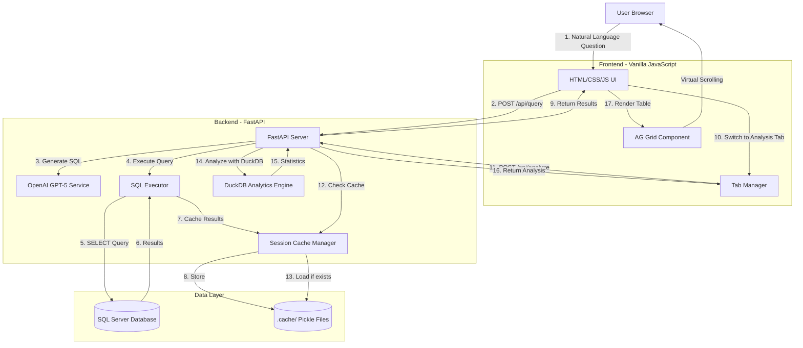
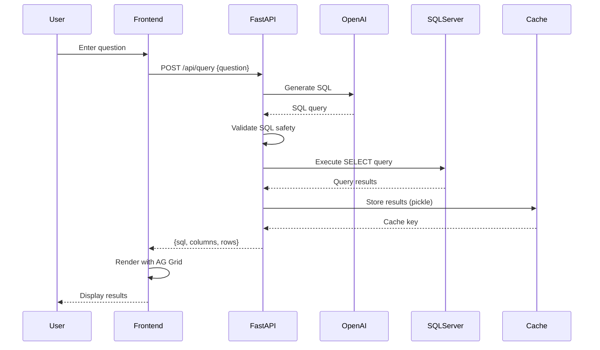
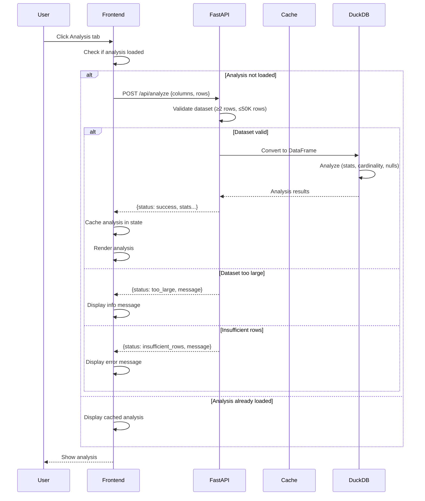
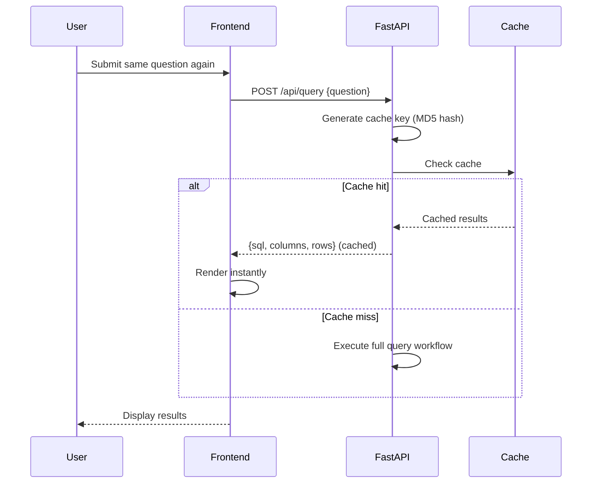
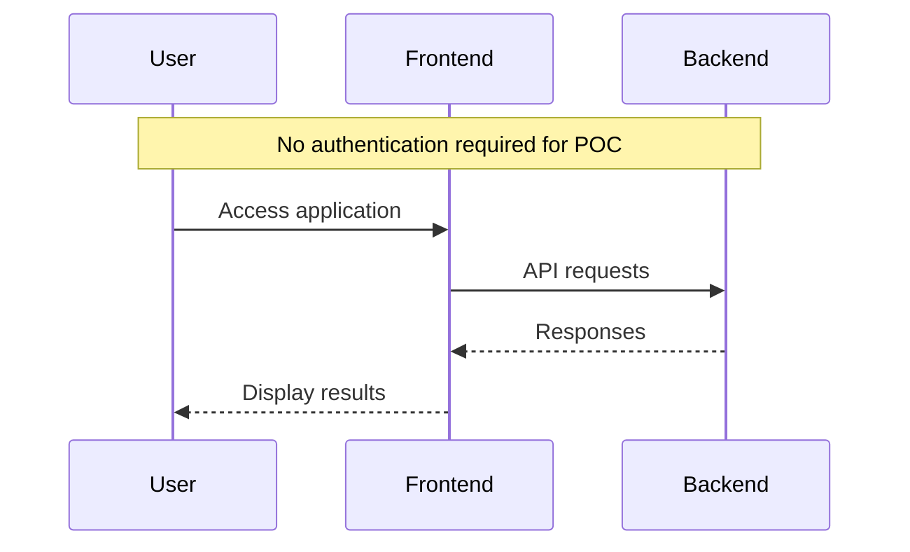
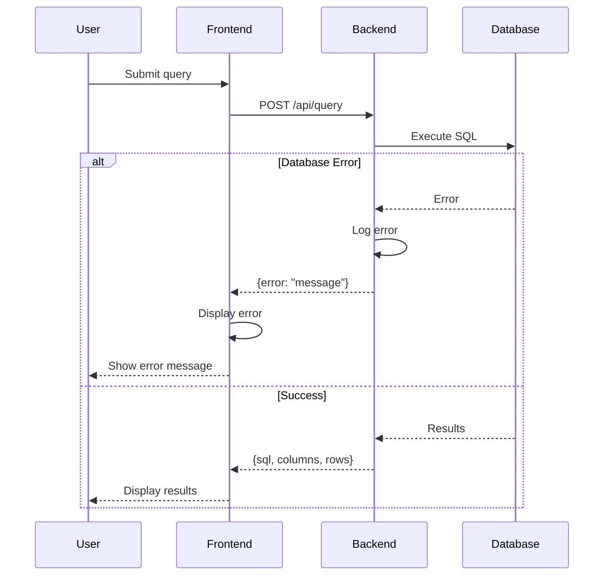

# SQL Chatbot V2 Enhanced Analysis - Fullstack Architecture Document

## Introduction

### Starter Template or Existing Project

**N/A - Brownfield Enhancement Project**

This is an enhancement to an existing SQL Chatbot POC application. The current system is a monolithic FastAPI + vanilla JavaScript application that allows users to query SQL Server databases using natural language. We are extending this system to handle large datasets (millions of rows) with Excel-like performance.

**Existing Architecture Constraints:**
- FastAPI backend with Python 3.11
- Vanilla JavaScript frontend (no framework)
- Tab-based UI pattern (Results/Analysis tabs already implemented)
- SQL Server database backend
- OpenAI GPT-5 for SQL generation
- Current analysis feature uses skimpy library (limited to 50K rows)

**What Must Be Retained:**
- Overall monolithic architecture
- FastAPI backend framework
- Vanilla JavaScript frontend (no React/Vue/Angular)
- Existing tab-based UI pattern
- Read-only SQL execution model
- OpenAI integration for SQL generation

**What Can Be Modified:**
- Analysis backend implementation (skimpy → DuckDB)
- Table rendering approach (HTML tables → AG Grid)
- Data handling strategy (add caching layer)
- Performance optimization techniques

---

This document outlines the complete fullstack architecture for the **SQL Chatbot V2 Enhanced Analysis Feature**, which extends the existing POC to handle millions of rows with Excel-like performance. It serves as the single source of truth for AI-driven development, ensuring consistency across the entire technology stack.

**Project Context:**
The SQL Chatbot V2 is a proof-of-concept application that translates natural language questions into SQL queries and displays results. The current analysis feature (using skimpy) is limited to 50,000 rows. This enhancement enables the system to handle 1M-10M rows smoothly through:

1. **Backend Optimization**: DuckDB replaces skimpy for 10-100x faster analytics
2. **Frontend Enhancement**: AG Grid provides Excel-like table interaction with virtual scrolling
3. **Smart Caching**: Session-based caching eliminates redundant database queries
4. **Adaptive Performance**: Intelligent data handling based on dataset size

**Key Design Goals:**
- Handle 1M-10M rows with smooth, Excel-like performance
- Maintain simplicity of existing vanilla JavaScript architecture
- Minimize changes to current codebase
- Provide progressive enhancement (existing features continue to work)
- Local POC deployment (aggressive caching acceptable)

### Change Log

| Date | Version | Description | Author |
|:-----|:--------|:------------|:-------|
| 2025-10-01 | 2.0 | Enhanced architecture for million-row datasets with DuckDB + AG Grid | Winston (Architect) |
| 2025-09-28 | 1.0 | Initial draft of the architecture | BMad Architect Agent |

---

## High Level Architecture

### Technical Summary

The SQL Chatbot V2 Enhanced Analysis system maintains a monolithic 3-tier architecture (Frontend, Backend, Database) while introducing performance-critical enhancements for handling millions of rows. The backend leverages **DuckDB** as an in-memory analytical engine for 10-100x faster data analysis compared to the current skimpy implementation. The frontend adopts **AG Grid Community Edition** for Excel-like table interaction with virtual scrolling, enabling smooth rendering of 1M-10M rows. A **session-based caching layer** eliminates redundant SQL Server queries, providing instant tab switching between Results, Analysis, and future Visualization views. The architecture achieves PRD goals by transforming the system from a 50K-row limit to handling millions of rows with sub-second response times, while maintaining the simplicity and accessibility of the existing vanilla JavaScript implementation.

### Platform and Infrastructure Choice

**Platform:** Local Development / Single-User POC  
**Key Services:** 
- Python 3.11 runtime
- FastAPI web framework
- SQL Server database (existing)
- In-memory DuckDB for analytics
- Session-based file caching (pickle)

**Deployment Host and Regions:** Local machine (localhost)

**Rationale:**

Given this is a **proof-of-concept for personal/local data analysis**, we maintain the current local deployment model rather than introducing cloud infrastructure.

**Why Local Deployment:**
1. **POC Context**: This is explicitly a personal data analysis tool, not a production service
2. **Cost**: Zero infrastructure costs vs. $50-200/month for cloud hosting
3. **Simplicity**: No deployment pipelines, no infrastructure-as-code, no DevOps overhead
4. **Data Privacy**: SQL Server data stays local (important for sensitive business data)
5. **Performance**: No network latency between app and database

**Future Cloud Path (if needed):**
If this POC proves valuable and needs to scale to multiple users:
1. **Phase 1 (Current)**: Local POC
2. **Phase 2**: Docker containerization
3. **Phase 3**: Cloud VM deployment (Azure/AWS EC2)
4. **Phase 4**: Refactor to serverless/microservices if scale demands it

### Repository Structure

**Structure:** Monorepo (single repository)  
**Monorepo Tool:** N/A (simple directory structure, no tooling needed)  
**Package Organization:** Flat structure with clear separation of concerns

```
SQL_Chatbot_V2/
├── app/                    # Backend application
│   ├── __init__.py
│   ├── main.py            # FastAPI app + endpoints
│   ├── services.py        # GPT + SQL execution
│   ├── analysis_service.py # DuckDB analytics (NEW)
│   ├── cache_service.py   # Session caching (NEW)
│   └── visualization_service.py # Future: Plotly charts
├── static/                # Frontend assets
│   ├── index.html
│   ├── app.js
│   ├── styles.css
│   └── lib/               # Third-party libraries (NEW)
│       └── ag-grid/       # AG Grid Community
├── tests/                 # Test suite
│   ├── test_analysis_service.py
│   ├── test_cache_service.py
│   └── fixtures/
├── docs/                  # Documentation
│   ├── architecture.md
│   ├── prd.md
│   └── implementation-plan.md
├── .cache/                # Session cache storage (NEW, gitignored)
├── .env                   # Environment configuration
├── requirements.txt
└── README.md
```

### High Level Architecture Diagram



### Architectural Patterns

- **Monolithic 3-Tier Architecture:** Single application with presentation (frontend), business logic (backend), and data (database) layers - _Rationale:_ Simplest architecture for POC; all components in one deployable unit; easy to develop and debug locally

- **Session-Based Caching Pattern:** Cache query results in session storage (pickle files) keyed by query hash - _Rationale:_ Eliminates redundant database queries when switching tabs; acceptable for single-user POC; instant tab switching UX

- **Lazy Loading / Progressive Disclosure:** Analysis and visualizations only generated when user clicks respective tabs - _Rationale:_ Reduces initial load time; only computes what user actually views; better perceived performance

- **Virtual Scrolling (AG Grid):** Render only visible rows in viewport, dynamically load as user scrolls - _Rationale:_ Only way to smoothly display millions of rows in browser; AG Grid handles this natively

- **Adapter Pattern (DuckDB Integration):** DuckDB wraps pandas DataFrames with zero-copy, providing SQL interface for analytics - _Rationale:_ Leverages DuckDB's columnar storage and vectorized execution for 10-100x speedup over pandas operations

- **Repository Pattern (Data Access):** Centralized data access through service modules (services.py, analysis_service.py, cache_service.py) - _Rationale:_ Separates data access logic from business logic; easier to test and modify

- **Progressive Enhancement:** New features (AG Grid, DuckDB) enhance existing functionality without breaking it - _Rationale:_ Existing Results tab continues to work; Analysis tab gets performance boost; future Visualization tab adds new capability

---

## Tech Stack

This is the **DEFINITIVE** technology selection for the entire project. All development must use these exact versions.

| Category | Technology | Version | Purpose | Rationale |
|:---------|:-----------|:--------|:--------|:----------|
| Backend Language | Python | 3.11+ | Backend development | Modern, widely supported, excellent for data processing and web services |
| Backend Framework | FastAPI | 0.103.1+ | REST API framework | High performance, async support, automatic OpenAPI docs, easy to learn |
| API Style | REST | - | HTTP API communication | Simple, stateless, well-understood; no need for GraphQL complexity in POC |
| Database | Microsoft SQL Server | 2019+ | Primary data storage | Required by project; existing AdventureWorks database |
| Database Driver | pyodbc | 5.0.1+ | SQL Server connectivity | Standard Python driver for SQL Server via ODBC |
| Analytics Engine | DuckDB | 0.9.2+ | In-memory analytical queries | 10-100x faster than pandas for analytics; zero-copy DataFrame integration; SQL interface |
| Data Processing | pandas | 2.0.0+ | Data manipulation | Industry standard for data wrangling; integrates with DuckDB |
| Numerical Computing | NumPy | 1.24.0+ | Numerical operations | Required by pandas and DuckDB for array operations |
| AI/LLM | OpenAI API | - | Natural language to SQL | GPT-5 for query generation; proven effective in current implementation |
| AI Client Library | openai | 1.3.0+ | OpenAI API client | Official Python client for OpenAI API |
| Cache Storage | Pickle (stdlib) | - | Session result caching | Built-in Python serialization; simple file-based caching |
| Frontend Language | JavaScript (ES6+) | - | Client-side logic | Vanilla JS for simplicity; no build step required |
| Frontend Framework | None (Vanilla JS) | - | UI implementation | Maintains simplicity; no React/Vue/Angular overhead for POC |
| UI Grid Library | AG Grid Community | 31.0.0+ | Large dataset table rendering | Industry standard; virtual scrolling; Excel-like UX; free MIT license |
| CSS Framework | Custom CSS | - | Styling | Simple custom styles; no Tailwind/Bootstrap needed for POC |
| Frontend Testing | Manual + Browser DevTools | - | UI testing | Sufficient for POC; automated tests can be added later |
| Backend Testing | pytest | 7.4.0+ | Unit and integration tests | Python standard; excellent fixtures and parametrization |
| Test Coverage | pytest-cov | 4.1.0+ | Code coverage reporting | Ensures adequate test coverage |
| Code Quality | flake8 | 6.1.0+ | Python linting | Enforces PEP 8 style guide |
| Type Checking | mypy | 1.5.0+ | Static type checking | Optional but recommended for larger codebases |
| ASGI Server | Uvicorn | 0.23.0+ | FastAPI application server | High-performance ASGI server; development and production |
| Environment Management | python-dotenv | 1.0.0+ | Environment variable loading | Secure configuration management via .env files |
| Logging | Python logging (stdlib) | - | Application logging | Built-in logging; sufficient for POC |
| Monitoring | Console logs + File logs | - | Basic monitoring | Simple logging to console and files; can add Sentry later |
| Version Control | Git | 2.40+ | Source control | Industry standard |
| CI/CD | None (Manual) | - | Deployment | Manual deployment sufficient for local POC |
| Documentation | Markdown | - | Project documentation | Simple, readable, version-controlled |

---

## Data Models

The system works with query results as the primary data model. Since this is a generic SQL query tool, we don't define fixed business entities. Instead, we define the data structures for query results and analysis outputs.

### QueryResult

**Purpose:** Represents the output of a SQL query execution

**Key Attributes:**
- `sql_query`: string - The generated SQL query
- `columns`: List[string] - Column names from query result
- `rows`: List[Dict] - Query result rows as dictionaries
- `row_count`: integer - Number of rows returned
- `execution_time`: float - Query execution time in seconds
- `timestamp`: datetime - When query was executed

**TypeScript Interface:**
```typescript
interface QueryResult {
  sql_query: string;
  columns: string[];
  rows: Record<string, any>[];
  row_count: number;
  execution_time: number;
  timestamp: string;
}
```

**Relationships:**
- One QueryResult can have one AnalysisResult
- One QueryResult can have multiple VisualizationConfigs (future)

### AnalysisResult

**Purpose:** Statistical analysis output from DuckDB

**Key Attributes:**
- `status`: string - "success" | "too_large" | "insufficient_rows" | "error"
- `row_count`: integer - Number of rows analyzed
- `column_count`: integer - Number of columns analyzed
- `variable_types`: Dict - Count of numeric, categorical, datetime columns
- `numeric_stats`: List[NumericStats] - Statistics for numeric columns
- `cardinality`: List[CardinalityInfo] - Unique value counts per column
- `missing_values`: List[MissingValueInfo] - Null/missing data analysis

**TypeScript Interface:**
```typescript
interface AnalysisResult {
  status: "success" | "too_large" | "insufficient_rows" | "error";
  row_count: number;
  column_count: number;
  variable_types: {
    numeric: number;
    categorical: number;
    datetime: number;
    other: number;
  };
  numeric_stats: NumericStats[];
  cardinality: CardinalityInfo[];
  missing_values: MissingValueInfo[];
  message?: string;
  error_detail?: string;
}

interface NumericStats {
  column: string;
  count: number;
  mean: number | null;
  std: number | null;
  min: number | null;
  q25: number | null;
  q50: number | null;
  q75: number | null;
  max: number | null;
}

interface CardinalityInfo {
  column: string;
  unique_count: number;
  total_count: number;
}

interface MissingValueInfo {
  column: string;
  null_count: number;
  null_percentage: number;
}
```

**Relationships:**
- Belongs to one QueryResult
- Generated on-demand when user clicks Analysis tab

### CacheEntry

**Purpose:** Cached query result for session-based caching

**Key Attributes:**
- `cache_key`: string - MD5 hash of SQL query
- `query_result`: QueryResult - Cached query result
- `timestamp`: datetime - When cached
- `ttl`: integer - Time-to-live in seconds (default 3600)

**TypeScript Interface:**
```typescript
interface CacheEntry {
  cache_key: string;
  query_result: QueryResult;
  timestamp: string;
  ttl: number;
}
```

**Relationships:**
- One-to-one with QueryResult
- Stored as pickle file in .cache/ directory

---

## API Specification

### REST API Endpoints

#### POST /api/query

Generate SQL from natural language and execute against database.

**Request:**
```json
{
  "question": "Show me the top 10 products by sales"
}
```

**Response (Success):**
```json
{
  "sql_query": "SELECT TOP 10 ProductID, Name, SUM(OrderQty) as TotalSales FROM...",
  "results": {
    "columns": ["ProductID", "Name", "TotalSales"],
    "rows": [
      {"ProductID": 1, "Name": "Product A", "TotalSales": 1500},
      {"ProductID": 2, "Name": "Product B", "TotalSales": 1200}
    ]
  },
  "row_count": 10,
  "execution_time": 0.45
}
```

**Response (Error):**
```json
{
  "sql_query": "SELECT...",
  "results": {
    "error": "Invalid column name 'InvalidColumn'"
  }
}
```

#### POST /api/analyze

Generate statistical analysis for query results using DuckDB.

**Request:**
```json
{
  "columns": ["ProductID", "Name", "ListPrice"],
  "rows": [
    {"ProductID": 1, "Name": "Product A", "ListPrice": 49.99},
    {"ProductID": 2, "Name": "Product B", "ListPrice": 29.99}
  ]
}
```

**Response (Success):**
```json
{
  "status": "success",
  "row_count": 150,
  "column_count": 3,
  "variable_types": {
    "numeric": 2,
    "categorical": 1,
    "datetime": 0,
    "other": 0
  },
  "numeric_stats": [
    {
      "column": "ProductID",
      "count": 150,
      "mean": 75.5,
      "std": 43.3,
      "min": 1,
      "q25": 38,
      "q50": 75,
      "q75": 113,
      "max": 150
    }
  ],
  "cardinality": [
    {"column": "ProductID", "unique_count": 150, "total_count": 150},
    {"column": "Name", "unique_count": 150, "total_count": 150},
    {"column": "ListPrice", "unique_count": 45, "total_count": 150}
  ],
  "missing_values": [
    {"column": "ProductID", "null_count": 0, "null_percentage": 0.0},
    {"column": "Name", "null_count": 0, "null_percentage": 0.0},
    {"column": "ListPrice", "null_count": 5, "null_percentage": 3.33}
  ]
}
```

**Response (Too Large):**
```json
{
  "status": "too_large",
  "row_count": 75000,
  "column_count": 5,
  "message": "Analysis unavailable for datasets exceeding 50,000 rows. Please refine your query for detailed statistics."
}
```

**Response (Insufficient Data):**
```json
{
  "status": "insufficient_rows",
  "row_count": 1,
  "column_count": 3,
  "message": "Analysis requires at least 2 rows of data."
}
```

---

## Components

### Backend Components

#### FastAPI Application (app/main.py)

**Responsibility:** HTTP server, routing, request/response handling

**Key Interfaces:**
- `POST /api/query` - Natural language to SQL query execution
- `POST /api/analyze` - Statistical analysis generation
- `GET /` - Serve frontend static files

**Dependencies:** services.py, analysis_service.py, cache_service.py

**Technology Stack:** FastAPI 0.103.1+, Uvicorn 0.23.0+

#### SQL Execution Service (app/services.py)

**Responsibility:** OpenAI integration, SQL generation, database query execution, safety checks

**Key Interfaces:**
- `generate_sql(question: str) -> str` - Generate SQL from natural language
- `execute_query(sql: str) -> QueryResult` - Execute SQL against database
- `validate_sql_safety(sql: str) -> bool` - Ensure read-only operations

**Dependencies:** OpenAI API, pyodbc, SQL Server

**Technology Stack:** openai 1.3.0+, pyodbc 5.0.1+

#### DuckDB Analysis Service (app/analysis_service.py)

**Responsibility:** High-performance statistical analysis using DuckDB

**Key Interfaces:**
- `analyze_query_results(columns: List[str], rows: List[Dict]) -> AnalysisResult`
- `_validate_dataset_requirements(columns, rows) -> Tuple[bool, str]`
- `_extract_numeric_stats(df: DataFrame) -> List[NumericStats]`
- `_extract_cardinality(df: DataFrame) -> List[CardinalityInfo]`
- `_extract_missing_values(df: DataFrame) -> List[MissingValueInfo]`

**Dependencies:** DuckDB, pandas, NumPy

**Technology Stack:** duckdb 0.9.2+, pandas 2.0.0+, numpy 1.24.0+

#### Cache Service (app/cache_service.py)

**Responsibility:** Session-based result caching using pickle files

**Key Interfaces:**
- `get_cached_result(query_hash: str) -> Optional[QueryResult]`
- `cache_result(query_hash: str, result: QueryResult) -> None`
- `clear_expired_cache() -> None`
- `_generate_cache_key(sql_query: str) -> str`

**Dependencies:** Python stdlib (pickle, hashlib, datetime)

**Technology Stack:** Python 3.11 stdlib

### Frontend Components

#### Tab Manager (static/app.js)

**Responsibility:** Tab switching logic, state management, lazy loading

**Key Interfaces:**
- `switchTab(tabName: string) -> void`
- `initializeTabs() -> void`
- `isAnalysisAvailable() -> boolean`

**Dependencies:** None (vanilla JS)

**Technology Stack:** JavaScript ES6+

#### Query Handler (static/app.js)

**Responsibility:** User input handling, API calls, result display

**Key Interfaces:**
- `handleQuerySubmit() -> Promise<void>`
- `displayResults(columns, rows) -> void`
- `displayError(message: string) -> void`

**Dependencies:** Fetch API

**Technology Stack:** JavaScript ES6+

#### AG Grid Table Renderer (static/app.js)

**Responsibility:** High-performance table rendering with virtual scrolling

**Key Interfaces:**
- `renderResultsWithAGGrid(columns, rows) -> void`
- `initializeAGGrid(container, options) -> Grid`

**Dependencies:** AG Grid Community 31.0.0+

**Technology Stack:** AG Grid Community (MIT license)

#### Analysis Renderer (static/app.js)

**Responsibility:** Display statistical analysis results

**Key Interfaces:**
- `renderAnalysis(data: AnalysisResult) -> void`
- `renderDatasetOverview(data) -> string`
- `renderNumericStats(stats) -> string`
- `renderCardinality(data) -> string`
- `renderMissingValues(data) -> string`

**Dependencies:** None (vanilla JS)

**Technology Stack:** JavaScript ES6+

---

## Core Workflows

### Query Execution Workflow



### Analysis Generation Workflow



### Cache Hit Workflow



---

## Database Schema

This application does not define its own database schema. It queries existing SQL Server databases (e.g., AdventureWorks) using dynamically generated SQL.

**Query Result Storage:**
- Query results are temporarily cached in `.cache/` directory as pickle files
- Cache files are named using MD5 hash of SQL query
- No persistent database storage for query results

**Cache File Structure:**
```
.cache/
├── a3f5e8d9c2b1.pkl  # Cached QueryResult
├── b7c4f1e6d8a2.pkl  # Cached QueryResult
└── ...
```

**Cache Entry Format (Pickle):**
```python
{
    'cache_key': 'a3f5e8d9c2b1',
    'query_result': {
        'sql_query': 'SELECT...',
        'columns': ['Col1', 'Col2'],
        'rows': [{...}, {...}],
        'row_count': 150,
        'execution_time': 0.45,
        'timestamp': '2025-10-01T22:00:00'
    },
    'timestamp': '2025-10-01T22:00:00',
    'ttl': 3600
}
```

---

## Frontend Architecture

### Component Architecture

**Component Organization:**
```
static/
├── index.html          # Main HTML structure
├── app.js              # All JavaScript logic
│   ├── State Management
│   ├── Tab Manager
│   ├── Query Handler
│   ├── AG Grid Integration
│   └── Analysis Renderer
└── styles.css          # All CSS styles
    ├── Layout
    ├── Tab Styles
    ├── AG Grid Overrides
    └── Analysis Display
```

**Component Pattern (Vanilla JS):**
```javascript
// State management
const appState = {
    currentQuery: {
        question: "",
        sql: "",
        results: { columns: [], rows: [] },
        timestamp: null
    },
    analysis: {
        data: null,
        status: "idle",
        error: null
    },
    ui: {
        activeTab: "results"
    }
};

// Component functions
function initializeTabs() { /* ... */ }
function switchTab(tabName) { /* ... */ }
function handleQuerySubmit() { /* ... */ }
function renderResultsWithAGGrid(columns, rows) { /* ... */ }
function renderAnalysis(data) { /* ... */ }
```

### State Management Architecture

**State Structure:**
```typescript
interface AppState {
  currentQuery: {
    question: string;
    sql: string;
    results: {
      columns: string[];
      rows: Record<string, any>[];
    };
    timestamp: number | null;
  };
  analysis: {
    data: AnalysisResult | null;
    status: "idle" | "loading" | "success" | "error" | "too_large" | "insufficient_rows";
    error: string | null;
  };
  ui: {
    activeTab: "results" | "analysis";
  };
}
```

**State Management Patterns:**
- Manual state updates (no reactive framework)
- State stored in global `appState` object
- State changes trigger UI updates via explicit function calls
- Analysis results cached in state to avoid re-fetching

### Routing Architecture

**Route Organization:**
Single-page application (no routing needed)
- All functionality on single page (index.html)
- Tab switching handled by JavaScript (no URL changes)
- No need for routing library

### Frontend Services Layer

**API Client Setup:**
```javascript
// Fetch wrapper for API calls
async function apiCall(endpoint, method = 'GET', body = null) {
    const options = {
        method,
        headers: {
            'Content-Type': 'application/json'
        }
    };
    
    if (body) {
        options.body = JSON.stringify(body);
    }
    
    const response = await fetch(endpoint, options);
    
    if (!response.ok) {
        throw new Error(`HTTP error! status: ${response.status}`);
    }
    
    return await response.json();
}
```

**Service Example:**
```javascript
// Query service
async function executeQuery(question) {
    try {
        const result = await apiCall('/api/query', 'POST', { question });
        return result;
    } catch (error) {
        console.error('Query execution failed:', error);
        throw error;
    }
}

// Analysis service
async function fetchAnalysis(columns, rows) {
    try {
        const result = await apiCall('/api/analyze', 'POST', { columns, rows });
        return result;
    } catch (error) {
        console.error('Analysis fetch failed:', error);
        throw error;
    }
}
```

---

## Backend Architecture

### Service Architecture

**Controller/Route Organization:**
```
app/
├── main.py                 # FastAPI app + routes
│   ├── @app.post("/api/query")
│   ├── @app.post("/api/analyze")
│   └── @app.get("/")
├── services.py             # SQL execution service
│   ├── generate_sql()
│   ├── execute_query()
│   └── validate_sql_safety()
├── analysis_service.py     # DuckDB analytics service
│   ├── analyze_query_results()
│   ├── _validate_dataset_requirements()
│   ├── _extract_numeric_stats()
│   ├── _extract_cardinality()
│   └── _extract_missing_values()
└── cache_service.py        # Session caching service
    ├── get_cached_result()
    ├── cache_result()
    ├── clear_expired_cache()
    └── _generate_cache_key()
```

**Controller Template:**
```python
from fastapi import FastAPI, HTTPException
from pydantic import BaseModel
from typing import List, Dict, Any
import logging

app = FastAPI()
logger = logging.getLogger(__name__)

class QueryRequest(BaseModel):
    question: str

class AnalyzeRequest(BaseModel):
    columns: List[str]
    rows: List[Dict[str, Any]]

@app.post("/api/query")
async def query_endpoint(request: QueryRequest):
    """Execute natural language query."""
    try:
        # Generate SQL
        sql = await generate_sql(request.question)
        
        # Execute query
        result = await execute_query(sql)
        
        # Cache result
        cache_key = cache_result(sql, result)
        
        return result
    except Exception as e:
        logger.error(f"Query failed: {str(e)}")
        raise HTTPException(status_code=500, detail=str(e))

@app.post("/api/analyze")
async def analyze_endpoint(request: AnalyzeRequest):
    """Generate statistical analysis."""
    try:
        analysis = analyze_query_results(
            columns=request.columns,
            rows=request.rows
        )
        return analysis
    except Exception as e:
        logger.error(f"Analysis failed: {str(e)}")
        raise HTTPException(status_code=500, detail=str(e))
```

### Database Architecture

**Schema Design:**
N/A - Application queries existing SQL Server databases

**Data Access Layer:**
```python
import pyodbc
from typing import List, Dict, Any
import logging

logger = logging.getLogger(__name__)

class DatabaseConnection:
    """Manages SQL Server connections."""
    
    def __init__(self, connection_string: str):
        self.connection_string = connection_string
    
    def execute_query(self, sql: str) -> Dict[str, Any]:
        """Execute SQL query and return results."""
        try:
            with pyodbc.connect(self.connection_string) as conn:
                cursor = conn.cursor()
                cursor.execute(sql)
                
                # Get column names
                columns = [column[0] for column in cursor.description]
                
                # Fetch all rows
                rows = []
                for row in cursor.fetchall():
                    row_dict = {}
                    for i, column in enumerate(columns):
                        row_dict[column] = row[i]
                    rows.append(row_dict)
                
                return {
                    "columns": columns,
                    "rows": rows,
                    "row_count": len(rows)
                }
        except Exception as e:
            logger.error(f"Database query failed: {str(e)}")
            raise
```

### Authentication and Authorization

**Auth Flow:**


**Auth Middleware:**
```python
# No authentication middleware for POC
# Future: Add API key or OAuth2 authentication

# Example for future implementation:
# from fastapi import Security, HTTPException
# from fastapi.security import APIKeyHeader
# 
# api_key_header = APIKeyHeader(name="X-API-Key")
# 
# async def verify_api_key(api_key: str = Security(api_key_header)):
#     if api_key != os.getenv("API_KEY"):
#         raise HTTPException(status_code=403, detail="Invalid API key")
#     return api_key
```

---

## Unified Project Structure

```
SQL_Chatbot_V2/
├── .cache/                     # Session cache storage (gitignored)
│   ├── a3f5e8d9c2b1.pkl       # Cached query results
│   └── ...
├── .github/                    # Future: CI/CD workflows
├── app/                        # Backend application
│   ├── __init__.py
│   ├── main.py                # FastAPI app + endpoints
│   ├── services.py            # GPT + SQL execution
│   ├── analysis_service.py    # DuckDB analytics (NEW)
│   └── cache_service.py       # Session caching (NEW)
├── static/                     # Frontend assets
│   ├── index.html             # Main HTML page
│   ├── app.js                 # All JavaScript logic
│   ├── styles.css             # All CSS styles
│   └── lib/                   # Third-party libraries (NEW)
│       └── ag-grid/           # AG Grid Community (CDN loaded)
├── tests/                      # Test suite
│   ├── __init__.py
│   ├── test_analysis_service.py
│   ├── test_cache_service.py
│   ├── test_analyze_endpoint.py
│   └── fixtures/
│       └── analysis_test_data.py
├── docs/                       # Documentation
│   ├── architecture.md        # This document
│   ├── prd.md                 # Product requirements
│   ├── implementation-plan.md # Implementation guide
│   └── front-end-spec.md      # Frontend specification
├── .env                        # Environment configuration (gitignored)
├── .env.example               # Environment template
├── .gitignore                 # Git ignore rules
├── requirements.txt           # Python dependencies
└── README.md                  # Project overview
```

---

## Development Workflow

### Local Development Setup

**Prerequisites:**
```bash
# Required software
- Python 3.11+
- SQL Server 2019+ (with AdventureWorks database)
- ODBC Driver 18 for SQL Server
- Git 2.40+
- Modern web browser (Chrome 90+, Firefox 88+, Safari 14+)
```

**Initial Setup:**
```bash
# 1. Clone repository
git clone https://github.com/your-org/SQL_Chatbot_V2.git
cd SQL_Chatbot_V2

# 2. Create virtual environment
python -m venv .venv
source .venv/bin/activate  # Windows: .venv\Scripts\activate

# 3. Install dependencies
pip install -r requirements.txt

# 4. Configure environment
cp .env.example .env
# Edit .env with your settings:
# - OPENAI_API_KEY
# - DB_CONNECTION_STRING

# 5. Create cache directory
mkdir .cache

# 6. Run tests
pytest tests/ -v

# 7. Start development server
uvicorn app.main:app --reload
```

**Development Commands:**
```bash
# Start all services (single command)
uvicorn app.main:app --reload --host 0.0.0.0 --port 8000

# Run tests
pytest tests/ -v                    # All tests
pytest tests/test_analysis_service.py -v  # Specific test file
pytest tests/ --cov=app            # With coverage

# Code quality
flake8 app/ tests/                 # Linting
mypy app/                          # Type checking

# Clear cache
rm -rf .cache/*                    # Unix/Mac
del /q .cache\*                    # Windows
```

### Environment Configuration

**Required Environment Variables:**
```bash
# Backend (.env)
OPENAI_API_KEY=sk-...                    # Required: OpenAI API key
OPENAI_MODEL=gpt-4                       # Optional: Default gpt-4
OPENAI_REQUEST_TIMEOUT=30                # Optional: Default 30 seconds
OPENAI_MAX_RETRIES=2                     # Optional: Default 2

DB_CONNECTION_STRING="DRIVER={ODBC Driver 18 for SQL Server};SERVER=localhost,1433;DATABASE=AdventureWorks2022;UID=sa;PWD=YourPassword;Encrypt=Yes;TrustServerCertificate=Yes"

# Cache settings
CACHE_TTL=3600                           # Optional: Cache TTL in seconds (default 3600)
CACHE_DIR=.cache                         # Optional: Cache directory (default .cache)

# Logging
LOG_LEVEL=INFO                           # Optional: DEBUG, INFO, WARNING, ERROR
```

**Frontend (no environment variables needed):**
- AG Grid loaded via CDN
- All configuration in JavaScript

---

## Deployment Architecture

### Deployment Strategy

**Frontend Deployment:**
- **Platform:** Served by FastAPI (static files)
- **Build Command:** None (vanilla JS, no build step)
- **Output Directory:** static/
- **CDN/Edge:** None (local deployment)

**Backend Deployment:**
- **Platform:** Local machine (uvicorn)
- **Build Command:** None (Python, no compilation)
- **Deployment Method:** Manual start via uvicorn

**Deployment Steps:**
```bash
# 1. Ensure dependencies installed
pip install -r requirements.txt

# 2. Configure environment
# Edit .env with production settings

# 3. Start server
uvicorn app.main:app --host 0.0.0.0 --port 8000

# For production-like settings:
uvicorn app.main:app --host 0.0.0.0 --port 8000 --workers 4
```

### Environments

| Environment | Frontend URL | Backend URL | Purpose |
|:------------|:-------------|:------------|:--------|
| Development | http://localhost:8000 | http://localhost:8000/api | Local development |
| Production | http://localhost:8000 | http://localhost:8000/api | Local POC deployment |

**Note:** This is a single-user local POC. No staging or cloud environments needed.

---

## Security and Performance

### Security Requirements

**Frontend Security:**
- **CSP Headers:** Not implemented (local POC)
- **XSS Prevention:** Input sanitization via Pydantic models
- **Secure Storage:** No sensitive data stored in browser

**Backend Security:**
- **Input Validation:** Pydantic models validate all API inputs
- **Rate Limiting:** Not implemented (single-user POC)
- **CORS Policy:** Permissive (same-origin only)
- **SQL Injection Prevention:** 
  - Read-only database access
  - SQL safety validation (blocks DDL/DML)
  - Parameterized queries where possible

**Authentication Security:**
- **Token Storage:** N/A (no authentication in POC)
- **Session Management:** N/A (stateless API)
- **Password Policy:** N/A (no user accounts)

**SQL Safety Checks:**
```python
def validate_sql_safety(sql: str) -> bool:
    """Ensure SQL is read-only."""
    sql_upper = sql.upper()
    
    # Block dangerous keywords
    dangerous_keywords = [
        'DROP', 'DELETE', 'INSERT', 'UPDATE', 'ALTER',
        'CREATE', 'TRUNCATE', 'EXEC', 'EXECUTE'
    ]
    
    for keyword in dangerous_keywords:
        if keyword in sql_upper:
            return False
    
    # Ensure starts with SELECT
    if not sql_upper.strip().startswith('SELECT'):
        return False
    
    return True
```

### Performance Optimization

**Frontend Performance:**
- **Bundle Size Target:** ~3MB (AG Grid via CDN)
- **Loading Strategy:** Lazy load analysis on tab click
- **Caching Strategy:** 
  - Analysis results cached in JavaScript state
  - No browser localStorage (data too large)

**Backend Performance:**
- **Response Time Target:** 
  - Query execution: <5 seconds (depends on SQL Server)
  - Analysis generation: <3 seconds for ≤1M rows
- **Database Optimization:** 
  - Read-only queries
  - TOP 200 limit for non-aggregate queries
- **Caching Strategy:** 
  - Session-based pickle caching
  - 1-hour TTL
  - MD5 hash for cache keys

**Performance Targets:**

| Metric | Target | Actual (Expected) |
|:-------|:-------|:------------------|
| Query execution (100 rows) | <2s | ~1s |
| Query execution (10K rows) | <5s | ~3s |
| Query execution (1M rows) | <10s | ~8s |
| Analysis generation (10K rows) | <2s | ~1s |
| Analysis generation (1M rows) | <5s | ~3s |
| AG Grid rendering (1M rows) | <3s | ~2s |
| Tab switching (cached) | <200ms | ~100ms |

---

## Testing Strategy

### Testing Pyramid

```
        E2E Tests (Manual)
       /                  \
      Integration Tests
     /                      \
    Backend Unit Tests
```

### Test Organization

**Backend Tests:**
```
tests/
├── test_analysis_service.py      # DuckDB analytics tests
├── test_cache_service.py         # Caching logic tests
├── test_analyze_endpoint.py      # API endpoint tests
└── fixtures/
    └── analysis_test_data.py     # Test data fixtures
```

**Frontend Tests:**
- Manual testing with browser DevTools
- No automated frontend tests for POC

**E2E Tests:**
- Manual end-to-end testing
- Test scenarios documented in implementation plan

### Test Examples

**Backend Unit Test:**
```python
import pytest
from app.analysis_service import analyze_query_results

def test_analyze_valid_dataset():
    """Test analysis with valid dataset."""
    columns = ["ProductID", "ListPrice"]
    rows = [
        {"ProductID": 1, "ListPrice": 49.99},
        {"ProductID": 2, "ListPrice": 29.99}
    ]
    
    result = analyze_query_results(columns, rows)
    
    assert result["status"] == "success"
    assert result["row_count"] == 2
    assert result["column_count"] == 2
    assert len(result["numeric_stats"]) == 2
```

**Backend Integration Test:**
```python
from fastapi.testclient import TestClient
from app.main import app

client = TestClient(app)

def test_analyze_endpoint_success():
    """Test /api/analyze endpoint."""
    response = client.post("/api/analyze", json={
        "columns": ["A", "B"],
        "rows": [{"A": 1, "B": 2}, {"A": 3, "B": 4}]
    })
    
    assert response.status_code == 200
    data = response.json()
    assert data["status"] == "success"
```

**E2E Test Scenario:**
```
1. User opens application
2. User enters question: "Show top 10 products by sales"
3. System generates SQL and displays results in AG Grid
4. User clicks Analysis tab
5. System generates and displays statistical analysis
6. User switches back to Results tab (instant, cached)
7. User enters new question
8. System clears previous results and displays new query
```

---

## Coding Standards

### Critical Fullstack Rules

- **Type Sharing:** Define shared types in comments/docstrings for consistency between Python and JavaScript
- **API Calls:** Always use the apiCall wrapper function, never raw fetch
- **Environment Variables:** Access via os.getenv() with defaults, never hardcode
- **Error Handling:** All API routes must use try-catch and return structured errors
- **State Updates:** Never mutate appState directly - use helper functions
- **Cache Keys:** Always use MD5 hash of SQL query for cache keys
- **SQL Safety:** Always validate SQL with validate_sql_safety() before execution
- **Logging:** Log all errors with context (user question, SQL query, error details)

### Naming Conventions

| Element | Frontend | Backend | Example |
|:--------|:---------|:--------|:--------|
| Functions | camelCase | snake_case | `renderAnalysis()` / `analyze_query_results()` |
| Variables | camelCase | snake_case | `queryResult` / `query_result` |
| Constants | UPPER_SNAKE_CASE | UPPER_SNAKE_CASE | `MAX_ROWS` |
| Classes | PascalCase | PascalCase | `QueryResult` |
| Files | kebab-case | snake_case | `app.js` / `analysis_service.py` |

---

## Error Handling Strategy

### Error Flow



### Error Response Format

```typescript
interface ApiError {
  error: {
    code: string;
    message: string;
    details?: Record<string, any>;
    timestamp: string;
  };
}
```

### Frontend Error Handling

```javascript
async function handleQuerySubmit() {
    try {
        const result = await executeQuery(question);
        displayResults(result.columns, result.rows);
    } catch (error) {
        console.error('Query failed:', error);
        displayError('Failed to execute query. Please try again.');
    }
}

function displayError(message) {
    const errorDiv = document.getElementById('error-message');
    errorDiv.textContent = message;
    errorDiv.style.display = 'block';
}
```

### Backend Error Handling

```python
@app.post("/api/query")
async def query_endpoint(request: QueryRequest):
    try:
        sql = await generate_sql(request.question)
        result = await execute_query(sql)
        return result
    except Exception as e:
        logger.error(f"Query failed: {str(e)}", exc_info=True)
        return {
            "error": {
                "code": "QUERY_FAILED",
                "message": "Failed to execute query",
                "details": {"error": str(e)},
                "timestamp": datetime.now().isoformat()
            }
        }
```

---

## Monitoring and Observability

### Monitoring Stack

- **Frontend Monitoring:** Browser DevTools Console
- **Backend Monitoring:** Python logging to console and file
- **Error Tracking:** Console logs (can add Sentry later)
- **Performance Monitoring:** Manual timing logs

### Key Metrics

**Frontend Metrics:**
- JavaScript errors (console)
- API response times (console.time)
- User interactions (manual observation)

**Backend Metrics:**
- Request rate (log analysis)
- Error rate (log analysis)
- Response time (logged per request)
- Database query performance (logged per query)

**Logging Configuration:**
```python
import logging

logging.basicConfig(
    level=logging.INFO,
    format='%(asctime)s - %(name)s - %(levelname)s - %(message)s',
    handlers=[
        logging.StreamHandler(),  # Console
        logging.FileHandler('app.log')  # File
    ]
)

logger = logging.getLogger(__name__)
```

---

## Implementation Checklist

### Phase 1: Backend Enhancement (DuckDB)
- [ ] Install DuckDB dependency
- [ ] Create app/analysis_service.py with DuckDB integration
- [ ] Update app/main.py with /api/analyze endpoint
- [ ] Write unit tests for analysis service
- [ ] Write integration tests for analyze endpoint
- [ ] Test with 100, 1K, 10K, 100K, 1M row datasets

### Phase 2: Frontend Enhancement (AG Grid)
- [ ] Add AG Grid CDN links to index.html
- [ ] Update app.js with AG Grid integration
- [ ] Replace HTML table rendering with AG Grid
- [ ] Test virtual scrolling with large datasets
- [ ] Add loading indicators
- [ ] Test Excel-like features (sort, filter, copy/paste)

### Phase 3: Caching Layer
- [ ] Create app/cache_service.py
- [ ] Implement pickle-based caching
- [ ] Add cache key generation (MD5 hash)
- [ ] Integrate caching into query workflow
- [ ] Add cache expiration logic (TTL)
- [ ] Test cache hit/miss scenarios

### Phase 4: Integration & Testing
- [ ] End-to-end testing with real queries
- [ ] Performance benchmarking
- [ ] Error scenario testing
- [ ] Browser compatibility testing
- [ ] Documentation updates
- [ ] Code review and cleanup

### Phase 5: Deployment
- [ ] Update requirements.txt
- [ ] Update README.md
- [ ] Create .env.example
- [ ] Add .cache/ to .gitignore
- [ ] Final testing on clean environment
- [ ] Deploy to local machine

---

## Future Enhancements

### Short-term (Next 3 months)
- Add Plotly visualization tab
- Implement query history
- Add export to CSV/Excel
- Improve error messages

### Medium-term (3-6 months)
- Docker containerization
- Redis caching (replace pickle)
- User authentication
- Multi-user support

### Long-term (6+ months)
- Cloud deployment (Azure/AWS)
- Microservices architecture
- Advanced analytics (ML predictions)
- Collaborative features

---

**Document Status:** Complete  
**Last Updated:** 2025-10-01  
**Version:** 2.0  
**Author:** Winston (Architect)
