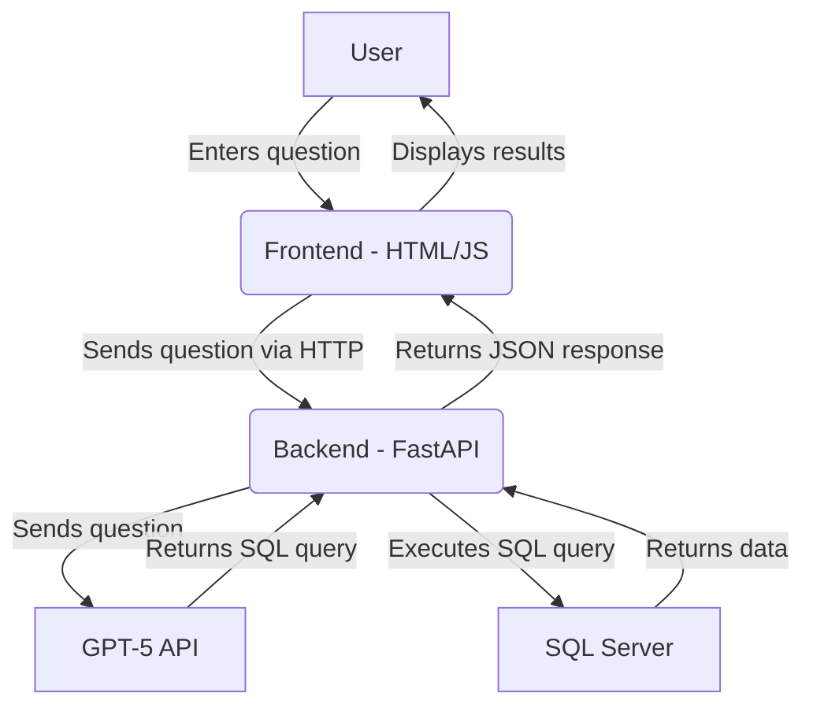

# SQL Chatbot POC Architecture Document

## Introduction
This document outlines the overall project architecture for the SQL Chatbot POC. Its primary goal is to serve as the guiding architectural blueprint for development, ensuring consistency and adherence to chosen patterns and technologies.

### Change Log

| Date       | Version | Description                    | Author            |
| :--------- | :------ | :----------------------------- | :---------------- |
| 2025-09-28 | 1.0     | Initial draft of the architecture | BMad Architect Agent |

## High Level Architecture

### Technical Summary
The system will be a simple, monolithic web application. The backend will be built with Python and FastAPI, and the frontend will be a basic HTML/JavaScript interface. The core architectural pattern is a 3-tier application (Frontend, Backend, Database). This architecture is simple to implement for a POC, yet provides a solid foundation for future expansion into a more complex, production-ready system.

### High Level Overview
- **Architectural Style:** Monolith
- **Repository Structure:** Monorepo (a single repository for both frontend and backend code)
- **User Interaction Flow:**
    1. User loads the webpage.
    2. User types a question and clicks "Submit".
    3. Frontend sends the question to the FastAPI backend.
    4. Backend sends the question to the GPT-5 API.
    5. Backend receives the SQL query from GPT-5.
    6. Backend executes the query against the SQL Server.
    7. Backend returns the SQL query and the data results to the frontend.
    8. Frontend displays the query and the data.

### High Level Project Diagram


## Tech Stack

| Category | Technology | Version | Purpose | Rationale |
| :--- | :--- | :--- | :--- | :--- |
| Language | Python | 3.11 | Backend development | Modern, widely supported, excellent for web services. |
| Framework | FastAPI | 0.103.1 | Backend API framework | High performance, easy to learn, great for building APIs. |
| Database | MS SQL Server | 2019 | Database | As required by the project. |
| Frontend | HTML/CSS/JS | latest | Basic UI | Simple and effective for a POC. No complex framework needed. |

## Components

### Frontend
- **Responsibility:** Provide the user interface for the chatbot.
- **Key Interfaces:** A single webpage with a text input, a submit button, and areas to display the SQL query and results.
- **Technology Stack:** HTML, CSS, JavaScript.

### Backend
- **Responsibility:** Handle API requests, interact with the GPT-5 API, and query the database.
- **Key Interfaces:** A single API endpoint to receive the user's question.
- **Dependencies:** GPT-5 API, SQL Server.
- **Technology Stack:** Python, FastAPI.

## External APIs

### GPT-5 API
- **Purpose:** To translate natural language questions into SQL queries.
- **Authentication:** API Key in the request header.

## Source Tree
```
/
├── app/
│   ├── __init__.py
│   ├── main.py         # FastAPI application
│   └── services.py     # Logic for GPT-5 and DB interaction
├── static/
│   ├── index.html
│   └── styles.css
└── requirements.txt
