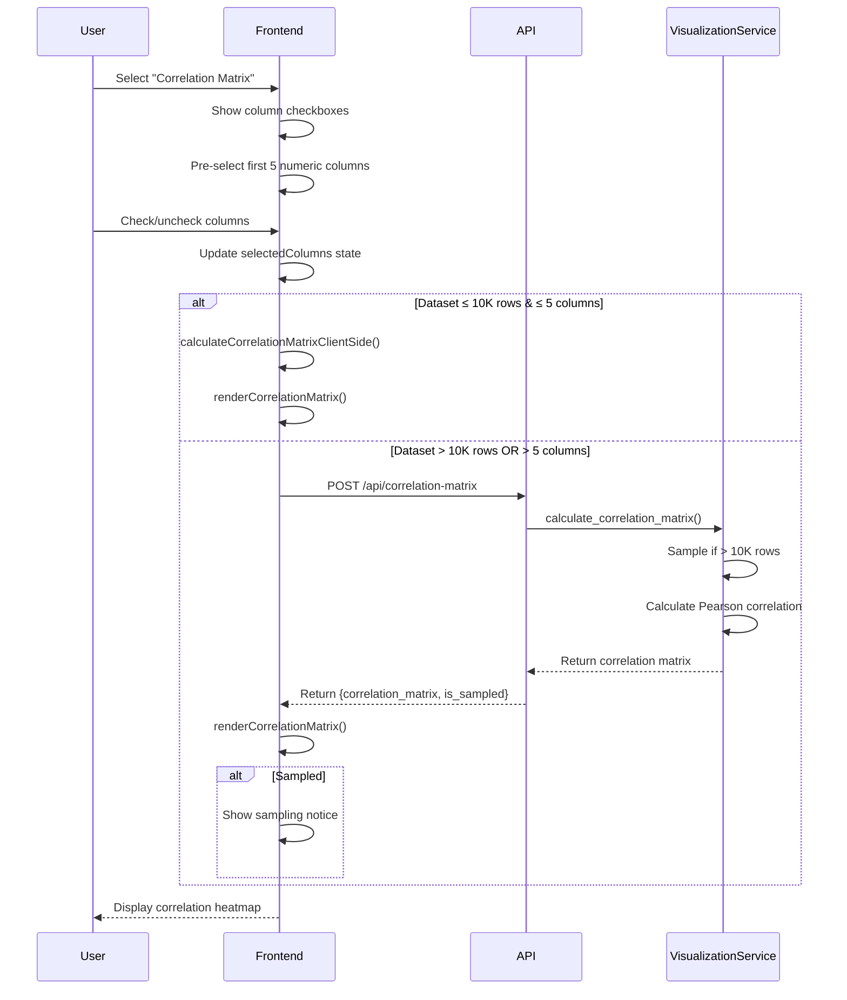

# SQL Chatbot Correlation Matrix Feature - Architecture Document

**Winston, Architect**  
**Version:** 1.0  
**Date:** 2025-10-10  
**Status:** Design Complete - Ready for Implementation

---

## Executive Summary

This document outlines the comprehensive architecture for integrating a correlation matrix visualization into the existing SQL Chatbot V2 Visualizations tab. This feature enables users to perform exploratory data analysis (EDA) by visualizing correlations between numeric variables, providing insights similar to data science tools like pandas' correlation matrix visualization.

### Key Architectural Highlights

- **Seamless Integration**: Extends existing Visualizations tab with "Correlation Matrix" chart type
- **Consistent UX Pattern**: Follows established chart-type-first user flow
- **Hybrid Performance**: Client-side calculation (<10K rows) + Backend calculation (>10K rows)
- **Smart Defaults**: Pre-selects first 5 numeric columns to reduce friction
- **Statistical Rigor**: Pearson correlation with proper handling of missing data
- **Memory Safe**: Leverages existing Plotly.js lifecycle management
- **Accessibility First**: Inherits WCAG 2.1 Level AA compliance from visualization framework

### Change Log

| Date       | Version | Description                                      | Author    |
|:-----------|:--------|:-------------------------------------------------|:----------|
| 2025-10-10 | 1.0     | Initial architecture for correlation matrix feature | Winston   |

---

## 1. Feature Overview

### 1.1 Purpose and Value

The correlation matrix feature enables users to:
- **Identify Relationships**: Quickly spot strong positive/negative correlations between variables
- **Guide Analysis**: Focus on highly correlated variables for deeper investigation
- **Validate Assumptions**: Confirm expected relationships in the data
- **Detect Patterns**: Discover unexpected correlations that may warrant attention

**Use Case Example:**
> A user analyzes sales data with columns: ProductID, UnitPrice, Quantity, Discount, TotalSales, CustomerAge, OrderMonth. By generating a correlation matrix, they discover that Discount and Quantity are strongly negatively correlated (-0.72), while TotalSales and Quantity are strongly positively correlated (+0.89), providing actionable insights for pricing strategy.

### 1.2 Integration Point

The correlation matrix integrates as a new chart type within the existing Visualizations tab:

**Existing Chart Types:**
- Scatter Plot
- Bar Chart
- Line Chart
- Histogram

**New Chart Type:**
- **Correlation Matrix** ← New

**User Flow:**
```
Query Execution → Results Tab → Visualizations Tab → 
Select "Correlation Matrix" → Select Numeric Columns (2-10) → 
View Heatmap with Correlation Coefficients
```

### 1.3 Scope Definition

**MVP Scope (Phase 1):**
- ✅ Simple correlation heatmap (Plotly heatmap)
- ✅ Multi-select column chooser (checkboxes)
- ✅ Smart defaults (pre-select first 5 numeric columns)
- ✅ RdBu diverging color scale (red=negative, blue=positive)
- ✅ Hover tooltips showing exact correlation coefficients
- ✅ Annotations displaying correlation values on cells
- ✅ Sampling support for datasets >10,000 rows
- ✅ Client-side calculation for small datasets (<10K rows)
- ✅ Backend calculation for large datasets (>10K rows)
- ✅ 2-10 column selection range (soft limit)

**Future Enhancements (Phase 2+):**
- 🔵 Click correlation cell → Show scatter plot in modal
- 🔵 Statistical significance indicators (p-values)
- 🔵 Filter by correlation strength (slider)
- 🔵 Diagonal histograms (distribution of each variable)
- 🔵 Lower triangle: Scatter plot matrix
- 🔵 Export correlation matrix as CSV
- 🔵 Spearman/Kendall correlation options
- 🔵 Hierarchical clustering of variables

---

## 2. Architecture Decisions

### 2.1 Integration Strategy

**Decision:** Add "Correlation Matrix" as a new chart type in the existing Visualizations tab

**Rationale:**
- **Consistency**: Maintains established chart-type-first UX pattern
- **Discoverability**: Natural location alongside other chart types
- **Reuse**: Leverages existing infrastructure (Plotly.js, column type detection, sampling)
- **Implementation Efficiency**: Minimal changes to existing codebase

**Alternative Considered:** Separate "Analysis" sub-tab for correlation matrices
- Rejected due to: breaks UX consistency, increases navigation complexity, no clear benefit

**Implementation Impact:**
```html
<!-- Updated chart type selector in static/index.html -->
<div id="chart-type-selector" class="chart-type-selector">
    <!-- Existing chart types... -->
    <button class="chart-type-button" data-chart="correlation">
        <span class="icon">🔢</span>
        <span class="label">Correlation Matrix</span>
    </button>
</div>
```

### 2.2 Column Selection Strategy

**Decision:** Multi-select checkboxes with smart defaults

**User Flow:**
1. User selects "Correlation Matrix" chart type
2. System displays multi-select checkbox list of numeric columns only
3. System pre-selects first 5 numeric columns (if ≥5 exist)
4. User can check/uncheck columns (minimum 2, maximum 10)
5. Chart auto-generates when 2+ columns selected (debounced 500ms)
6. Chart updates dynamically as user modifies selection

**Rationale:**
- **Visual Clarity**: Checkboxes are intuitive for multi-select
- **Smart Defaults**: Pre-selection reduces friction for simple cases
- **Auto-Generation**: Responsive feel without explicit "Generate" button
- **Clear Constraints**: Minimum/maximum enforced at UI level
- **Progressive Disclosure**: Only shows numeric columns

**Alternative Considered:** Dropdown multi-select (like AG Grid column chooser)
- Rejected due to: less visual, harder to see all options, less familiar pattern

**Implementation:**
```html
<div id="correlation-columns-wrapper" style="display: none;">
    <label>Select Numeric Columns (2-10):</label>
    <div class="column-checkbox-list" id="correlation-column-list">
        <!-- Dynamically populated checkboxes -->
        <label class="column-checkbox">
            <input type="checkbox" value="UnitPrice" checked>
            <span>UnitPrice</span>
        </label>
        <label class="column-checkbox">
            <input type="checkbox" value="Quantity" checked>
            <span>Quantity</span>
        </label>
        <!-- ... -->
    </div>
    <small class="helper-text">
        Select at least 2 columns. Maximum 10 recommended for readability.
    </small>
</div>
```

### 2.3 Calculation Strategy: Hybrid Approach

**Decision:** Three-tier calculation strategy based on dataset size

**Performance Tiers:**

| Dataset Size | Strategy | Rationale |
|:-------------|:---------|:----------|
| ≤ 10,000 rows & ≤ 5 cols | Client-side JavaScript | Instant results, no network overhead |
| 10,001-100,000 rows OR 6-10 cols | Backend (Python/pandas) | Recommended: Sample for performance |
| > 100,000 rows | Backend (Python/pandas) | Recommended: Sample to 10K-100K rows |
| 1M+ rows | Backend (Python/pandas) | **User-configurable sampling** - can process full dataset if needed |

**IMPORTANT: No Hard Row Limits**
- Users can process datasets of ANY size (1M, 10M+ rows)
- Sampling is **recommended** for performance, not required
- Users can configure `maxRows` parameter to control sampling behavior
- Set `maxRows=null` or very high value to process full dataset
- Warning messages inform about expected processing time

**Client-Side Calculation (JavaScript):**
```javascript
// Pearson correlation formula implementation
function calculateCorrelationMatrix(data, columns) {
    const n = data.length;
    const matrix = {};
    
    columns.forEach(col1 => {
        matrix[col1] = {};
        columns.forEach(col2 => {
            if (col1 === col2) {
                matrix[col1][col2] = 1.0; // Perfect correlation with self
            } else {
                const x = data.map(r => r[col1]);
                const y = data.map(r => r[col2]);
                matrix[col1][col2] = pearsonCorrelation(x, y);
            }
        });
    });
    
    return matrix;
}

function pearsonCorrelation(x, y) {
    const n = x.length;
    const sumX = x.reduce((a, b) => a + b, 0);
    const sumY = y.reduce((a, b) => a + b, 0);
    const sumXY = x.reduce((sum, xi, i) => sum + xi * y[i], 0);
    const sumX2 = x.reduce((sum, xi) => sum + xi * xi, 0);
    const sumY2 = y.reduce((sum, yi) => sum + yi * yi, 0);
    
    const numerator = n * sumXY - sumX * sumY;
    const denominator = Math.sqrt((n * sumX2 - sumX * sumX) * (n * sumY2 - sumY * sumY));
    
    return numerator / denominator;
}
```

**Backend Calculation (Python):**
```python
# In app/visualization_service.py
def calculate_correlation_matrix(
    df: pd.DataFrame, 
    columns: List[str], 
    max_rows: int = 10000
) -> dict:
    """
    Calculate correlation matrix with sampling for large datasets.
    """
    original_count = len(df)
    
    # Sample if needed
    if original_count > max_rows:
        sample_result = sample_large_dataset(df, columns[0], max_rows)
        df_sampled = sample_result["data"]
        is_sampled = True
    else:
        df_sampled = df
        is_sampled = False
    
    # Filter to selected columns only (numeric types)
    df_filtered = df_sampled[columns].select_dtypes(include=[np.number])
    
    # Calculate correlation matrix (pandas uses Pearson by default)
    corr_matrix = df_filtered.corr()
    
    # Generate histograms for diagonal (future enhancement)
    # histograms = generate_histograms(df_filtered)
    
    return {
        "status": "success",
        "correlation_matrix": corr_matrix.to_dict(),
        "columns": columns,
        "is_sampled": is_sampled,
        "sample_size": len(df_sampled),
        "original_size": original_count
    }
```

**Rationale:**
- **Performance**: Client-side is instant for small datasets
- **Accuracy**: Backend leverages pandas' optimized correlation calculation
- **Scalability**: Sampling ensures consistent performance at scale
- **Consistency**: Follows existing pattern from visualization feature

**Alternative Considered:** Always use backend
- Rejected due to: unnecessary network overhead for small datasets, slower UX

### 2.4 Visualization Design: Simple Heatmap

**Decision:** Plotly heatmap with RdBu diverging color scale and annotations

**Design Specifications:**

**Color Scale:**
- Strong negative (-1.0): Dark Red (#d32f2f)
- Weak negative (-0.3): Light Red
- No correlation (0.0): White (#ffffff)
- Weak positive (+0.3): Light Blue
- Strong positive (+1.0): Dark Blue (#1976d2)

**Visual Elements:**
- **Heatmap Cells**: Colored by correlation strength
- **Annotations**: Correlation values displayed on each cell (2 decimal places)
- **Diagonal**: Self-correlations (value = 1.0) in distinct color
- **Hover Tooltip**: Detailed information (variable names, exact correlation)
- **Color Legend**: Vertical bar showing scale from -1 to +1

**Layout Specifications:**
- **Matrix Size**: Square matrix (n × n where n = number of columns)
- **Aspect Ratio**: 1:1 (square)
- **Dimensions**: 700×700 pixels (responsive)
- **Margins**: 100px on all sides for labels
- **Font Size**: 12px for annotations, 10px for axis labels

**Plotly Implementation:**
```javascript
function renderCorrelationMatrix(correlationData, columns) {
    // Build Z-matrix for heatmap
    const zData = columns.map(col1 => 
        columns.map(col2 => correlationData[col1][col2])
    );
    
    // Create annotations for correlation values
    const annotations = [];
    for (let i = 0; i < columns.length; i++) {
        for (let j = 0; j < columns.length; j++) {
            const value = correlationData[columns[i]][columns[j]];
            annotations.push({
                x: columns[j],
                y: columns[i],
                text: value.toFixed(2),
                showarrow: false,
                font: {
                    size: 12,
                    color: Math.abs(value) > 0.5 ? 'white' : 'black'
                }
            });
        }
    }
    
    const data = [{
        type: 'heatmap',
        z: zData,
        x: columns,
        y: columns,
        colorscale: 'RdBu',
        reversescale: true,  // Red = negative, Blue = positive
        zmid: 0,
        zmin: -1,
        zmax: 1,
        colorbar: {
            title: {
                text: 'Correlation<br>Coefficient',
                side: 'right'
            },
            tickmode: 'linear',
            tick0: -1,
            dtick: 0.5
        },
        hovertemplate: 
            '<b>%{y}</b> vs <b>%{x}</b><br>' +
            'Correlation: %{z:.3f}<br>' +
            '<extra></extra>'
    }];
    
    const layout = {
        title: {
            text: 'Correlation Matrix',
            font: {size: 18}
        },
        xaxis: {
            side: 'bottom',
            tickangle: -45
        },
        yaxis: {
            side: 'left'
        },
        annotations: annotations,
        width: 700,
        height: 700,
        margin: {l: 100, r: 100, t: 100, b: 100}
    };
    
    const config = {
        responsive: true,
        displayModeBar: true,
        modeBarButtonsToRemove: ['pan2d', 'lasso2d'],
        displaylogo: false
    };
    
    Plotly.newPlot('chart-container', data, layout, config);
}
```

**Rationale:**
- **Simplicity**: Single heatmap is easier to implement and maintain
- **Familiarity**: Standard visualization in data science (pandas, seaborn, R)
- **Clarity**: Diverging color scale clearly shows positive/negative correlations
- **Interactivity**: Plotly provides zoom, pan, hover tooltips
- **Future-Proof**: Easy to add diagonal histograms in Phase 2

**Alternative Considered:** Complex matrix with diagonal histograms and scatter plots
- Rejected for MVP due to: implementation complexity, subplot coordination challenges, cluttered visual

### 2.5 State Management Extension

**Decision:** Extend existing appState.visualization with correlation-specific properties

**State Structure:**
```javascript
// Extension to appState.visualization in static/app.js
appState.visualization = {
    // Existing properties...
    chartType: null,
    xColumn: null,
    yColumn: null,
    
    // NEW: Correlation matrix specific
    selectedColumns: [],           // Array of column names for correlation
    correlationMatrix: null,        // Cached correlation data
    correlationStatus: "idle",      // idle | loading | success | error
    correlationError: null
};
```

**State Lifecycle:**
1. **Chart Type Selection**: User selects "correlation", clear previous selections
2. **Column Selection**: User checks/unchecks columns, update selectedColumns array
3. **Auto-Generation Trigger**: When selectedColumns.length >= 2, debounce 500ms, then generate
4. **Generation**: Set status to loading, calculate/fetch correlation matrix
5. **Rendering**: On success, cache result, render heatmap, set status to success
6. **Tab Switch**: Persist state (for return)
7. **New Query**: Clear all correlation state

**Rationale:**
- **Consistency**: Follows existing state management pattern
- **Separation of Concerns**: Correlation state isolated from other chart types
- **Performance**: Cached matrix avoids recalculation on re-render

---

## 3. Component Architecture

### 3.1 Backend Components

#### 3.1.1 Updated Visualization Service

**File:** `app/visualization_service.py`

**New Functions:**

```python
from typing import List, Dict
import pandas as pd
import numpy as np

def calculate_correlation_matrix(
    df: pd.DataFrame,
    columns: List[str],
    max_rows: int = 10000
) -> dict:
    """
    Calculate Pearson correlation matrix for selected numeric columns.
    
    Args:
        df: Input DataFrame
        columns: List of column names to correlate
        max_rows: Maximum rows before sampling (default 10000)
    
    Returns:
        Dictionary with correlation matrix and metadata
    """
    original_count = len(df)
    
    # Sample if needed (reuse existing sampling function)
    if original_count > max_rows:
        sample_result = sample_large_dataset(df, columns[0], max_rows)
        df_sampled = sample_result["data"]
        is_sampled = True
    else:
        df_sampled = df
        is_sampled = False
    
    # Filter to selected columns and ensure numeric
    df_filtered = df_sampled[columns].select_dtypes(include=[np.number])
    
    # Validate all columns are numeric
    if len(df_filtered.columns) != len(columns):
        non_numeric = set(columns) - set(df_filtered.columns)
        raise ValueError(
            f"Non-numeric columns detected: {', '.join(non_numeric)}. "
            f"Correlation matrix requires numeric columns only."
        )
    
    # Drop rows with any NaN in selected columns
    df_clean = df_filtered.dropna()
    
    if len(df_clean) < 2:
        raise ValueError(
            "Insufficient data after removing missing values. "
            "At least 2 complete rows required for correlation calculation."
        )
    
    # Calculate correlation matrix (pandas uses Pearson by default)
    corr_matrix = df_clean.corr()
    
    # Convert to nested dict for JSON serialization
    corr_dict = {}
    for col1 in columns:
        corr_dict[col1] = {}
        for col2 in columns:
            corr_dict[col1][col2] = float(corr_matrix.loc[col1, col2])
    
    return {
        "status": "success",
        "correlation_matrix": corr_dict,
        "columns": columns,
        "is_sampled": is_sampled,
        "sample_size": len(df_clean),
        "original_size": original_count,
        "rows_with_missing_data": original_count - len(df_clean)
    }

def validate_correlation_request(
    df: pd.DataFrame,
    columns: List[str]
) -> Dict[str, bool | str]:
    """
    Validate correlation matrix request.
    
    Returns:
        Dictionary with validation result and error message if invalid
    """
    # Check minimum columns
    if len(columns) < 2:
        return {
            "valid": False,
            "message": "At least 2 columns required for correlation matrix."
        }
    
    # Check maximum columns (soft limit)
    if len(columns) > 15:
        return {
            "valid": False,
            "message": "Maximum 15 columns allowed for correlation matrix."
        }
    
    # Check columns exist
    missing_columns = [col for col in columns if col not in df.columns]
    if missing_columns:
        return {
            "valid": False,
            "message": f"Columns not found: {', '.join(missing_columns)}"
        }
    
    # Check all columns are numeric
    non_numeric = []
    for col in columns:
        if not pd.api.types.is_numeric_dtype(df[col]):
            non_numeric.append(col)
    
    if non_numeric:
        return {
            "valid": False,
            "message": f"Non-numeric columns: {', '.join(non_numeric)}. "
                      f"Correlation matrix requires numeric columns only."
        }
    
    return {"valid": True}
```

**CHART_COMPATIBILITY Update:**
```python
# In app/visualization_service.py
CHART_COMPATIBILITY = {
    "scatter": {"x": ["numeric"], "y": ["numeric"]},
    "bar": {"x": ["categorical"], "y": ["numeric"]},
    "line": {"x": ["datetime", "numeric"], "y": ["numeric"]},
    "histogram": {"x": ["numeric"]},
    "correlation": {"columns": ["numeric"]}  # NEW: Multi-select numeric only
}
```

#### 3.1.2 New API Endpoint

**File:** `app/main.py`

```python
from pydantic import BaseModel, Field
from typing import List, Dict, Any

class CorrelationMatrixRequest(BaseModel):
    columns: List[str] = Field(..., min_items=2, max_items=15)
    rows: List[Dict[str, Any]]
    maxRows: Optional[int] = Field(10000, ge=100)  # NO upper limit - user configurable

@app.post("/api/correlation-matrix")
async def correlation_matrix_endpoint(request: CorrelationMatrixRequest):
    """
    Calculate correlation matrix for selected numeric columns.
    
    NO ROW LIMITS - Users can process datasets of ANY size (1M, 10M+ rows).
    Sampling is RECOMMENDED for performance, not required.
    
    Request:
        - columns: List[str] - Column names to correlate (2-15 columns)
        - rows: List[dict] - Query result data
        - maxRows: Optional[int] - Max rows before sampling (default 10000)
                                   Set to None or very high value to process full dataset
    
    Response:
        - status: success | error | warning
        - correlation_matrix: Dict[str, Dict[str, float]]
        - columns: List[str]
        - is_sampled: bool
        - sample_size: int
        - original_size: int
        - rows_with_missing_data: int
        - processing_time: float (seconds)
        - warning: Optional[str] - Performance warning for large datasets
    """
    import time
    start_time = time.time()
    
    try:
        # Convert to DataFrame
        df = pd.DataFrame(request.rows)
        
        # Validate request
        validation = validate_correlation_request(df, request.columns)
        if not validation["valid"]:
            return {
                "status": "error",
                "message": validation["message"]
            }
        
        # NO HARD ROW LIMIT - but warn if processing large datasets without sampling
        warning = None
        if len(df) > 100000 and (request.maxRows is None or request.maxRows >= len(df)):
            warning = (
                f"Processing {len(df):,} rows without sampling. "
                f"This may take 10-30 seconds. Consider setting maxRows to 10000-100000 for faster results."
            )
            logger.info(f"Large dataset correlation: {len(df)} rows, {len(request.columns)} columns")
        
        # Calculate correlation matrix
        result = calculate_correlation_matrix(
            df=df,
            columns=request.columns,
            max_rows=request.maxRows if request.maxRows else len(df)  # Process full dataset if maxRows is None
        )
        
        # Add processing time and warning
        result["processing_time"] = round(time.time() - start_time, 2)
        if warning:
            result["warning"] = warning
        
        return result
        
    except ValueError as e:
        # Validation errors (non-numeric columns, insufficient data)
        logger.warning(f"Correlation matrix validation error: {str(e)}")
        return {
            "status": "error",
            "message": str(e),
            "error_type": "validation"
        }
    except Exception as e:
        # Unexpected errors
        logger.error(f"Correlation matrix error: {str(e)}", exc_info=True)
        return {
            "status": "error",
            "message": "Failed to calculate correlation matrix. Please try again.",
            "error_type": "server",
            "error_detail": str(e) if DEBUG else None
        }
```

### 3.2 Frontend Components

#### 3.2.1 HTML Structure Updates

**File:** `static/index.html`

```html
<!-- Add correlation matrix chart type button -->
<div id="chart-type-selector" class="chart-type-selector">
    <button class="chart-type-button" data-chart="scatter">
        <span class="icon">📊</span>
        <span class="label">Scatter Plot</span>
    </button>
    <button class="chart-type-button" data-chart="bar">
        <span class="icon">📶</span>
        <span class="label">Bar Chart</span>
    </button>
    <button class="chart-type-button" data-chart="line">
        <span class="icon">📈</span>
        <span class="label">Line Chart</span>
    </button>
    <button class="chart-type-button" data-chart="histogram">
        <span class="icon">📜</span>
        <span class="label">Histogram</span>
    </button>
    <!-- NEW: Correlation Matrix -->
    <button class="chart-type-button" data-chart="correlation">
        <span class="icon">🔢</span>
        <span class="label">Correlation Matrix</span>
    </button>
</div>

<!-- NEW: Multi-select column chooser for correlation -->
<div id="correlation-columns-wrapper" class="correlation-columns-wrapper" style="display: none;">
    <label>Select Numeric Columns (2-10):</label>
    <div class="column-checkbox-list" id="correlation-column-list">
        <!-- Dynamically populated checkboxes -->
    </div>
    <small class="helper-text">
        Select at least 2 columns. Maximum 10 recommended for readability.
    </small>
    
    <!-- NEW: Advanced sampling configuration (optional) -->
    <details class="sampling-config" style="margin-top: 10px;">
        <summary>Advanced: Sampling Configuration</summary>
        <div class="sampling-controls">
            <label for="max-rows-input">Max Rows (0 = no limit):</label>
            <input type="number" id="max-rows-input" value="10000" min="0" step="1000">
            <small class="help-text">
                Default: 10,000 rows (recommended for 1M+ datasets).<br>
                Set to 0 or very high value to process full dataset (slower for large data).
            </small>
        </div>
    </details>
</div>
```

#### 3.2.2 JavaScript Logic Updates

**File:** `static/app.js`

```javascript
// ============================================
// CORRELATION MATRIX LOGIC
// ============================================

// Handle correlation matrix chart type selection
function handleCorrelationChartSelection() {
    appState.visualization.chartType = 'correlation';
    appState.visualization.selectedColumns = [];
    appState.visualization.correlationMatrix = null;
    
    // Hide other chart configurations
    document.getElementById('axis-config').style.display = 'none';
    document.getElementById('chart-type-selector').style.display = 'none';
    
    // Show correlation column selector
    showCorrelationColumnSelector();
}

// Show correlation column selector with checkboxes
function showCorrelationColumnSelector() {
    const wrapper = document.getElementById('correlation-columns-wrapper');
    const columnList = document.getElementById('correlation-column-list');
    
    // Clear existing checkboxes
    columnList.innerHTML = '';
    
    // Get numeric columns only
    const numericColumns = getNumericColumns();
    
    if (numericColumns.length < 2) {
        showChartError('At least 2 numeric columns required for correlation matrix.');
        return;
    }
    
    // Pre-select first 5 numeric columns (smart default)
    const defaultColumns = numericColumns.slice(0, Math.min(5, numericColumns.length));
    appState.visualization.selectedColumns = defaultColumns;
    
    // Create checkbox for each numeric column
    numericColumns.forEach(col => {
        const label = document.createElement('label');
        label.className = 'column-checkbox';
        
        const checkbox = document.createElement('input');
        checkbox.type = 'checkbox';
        checkbox.value = col;
        checkbox.checked = defaultColumns.includes(col);
        checkbox.addEventListener('change', handleCorrelationColumnChange);
        
        const span = document.createElement('span');
        span.textContent = col;
        
        label.appendChild(checkbox);
        label.appendChild(span);
        columnList.appendChild(label);
    });
    
    wrapper.style.display = 'block';
    
    // Auto-generate if default selection is valid
    if (defaultColumns.length >= 2) {
        debouncedGenerateCorrelationMatrix();
    }
}

// Get numeric columns from current query results
function getNumericColumns() {
    const columnTypes = appState.visualization.columnTypes;
    return Object.keys(columnTypes).filter(col => 
        columnTypes[col] === 'numeric'
    );
}

// Handle correlation column checkbox change
let correlationGenerationTimeout = null;

function handleCorrelationColumnChange(event) {
    const column = event.target.value;
    const isChecked = event.target.checked;
    
    if (isChecked) {
        // Add column to selection
        if (!appState.visualization.selectedColumns.includes(column)) {
            appState.visualization.selectedColumns.push(column);
        }
    } else {
        // Remove column from selection
        appState.visualization.selectedColumns = 
            appState.visualization.selectedColumns.filter(col => col !== column);
    }
    
    // Clear previous timeout
    clearTimeout(correlationGenerationTimeout);
    
    // Check if we have minimum columns
    if (appState.visualization.selectedColumns.length >= 2) {
        // Debounce generation (500ms)
        correlationGenerationTimeout = setTimeout(() => {
            generateCorrelationMatrix();
        }, 500);
    } else {
        // Clear chart if below minimum
        cleanupChart();
        document.getElementById('chart-container').style.display = 'none';
    }
}

// Debounced wrapper for initial generation
function debouncedGenerateCorrelationMatrix() {
    clearTimeout(correlationGenerationTimeout);
    correlationGenerationTimeout = setTimeout(() => {
        generateCorrelationMatrix();
    }, 500);
}

// Generate correlation matrix
async function generateCorrelationMatrix() {
    const selectedColumns = appState.visualization.selectedColumns;
    const results = appState.currentQuery.results;
    
    // Validate selection
    if (selectedColumns.length < 2) {
        showChartError('Please select at least 2 columns for correlation analysis.');
        return;
    }
    
    if (selectedColumns.length > 15) {
        showChartError('Maximum 15 columns allowed for correlation matrix.');
        return;
    }
    
    // Update status
    appState.visualization.correlationStatus = 'loading';
    
    // Show loading state
    document.getElementById('chart-loading').style.display = 'block';
    document.getElementById('chart-container').style.display = 'none';
    document.getElementById('chart-error').style.display = 'none';
    document.getElementById('sampling-notice').style.display = 'none';
    
    try {
        let correlationData;
        
        // Decide client-side vs backend
        if (results.rows.length <= 10000 && selectedColumns.length <= 5) {
            // Client-side calculation
            correlationData = calculateCorrelationMatrixClientSide(
                results.rows,
                selectedColumns
            );
            correlationData.is_sampled = false;
        } else {
            // Backend calculation
            const response = await fetch('/api/correlation-matrix', {
                method: 'POST',
                headers: {'Content-Type': 'application/json'},
                body: JSON.stringify({
                    columns: selectedColumns,
                    rows: results.rows,
                    maxRows: 10000
                })
            });
            
            correlationData = await response.json();
            
            if (correlationData.status !== 'success') {
                throw new Error(correlationData.message || 'Failed to calculate correlation matrix');
            }
            
            // Show sampling notice if applicable
            if (correlationData.is_sampled) {
                showSamplingNotice(
                    correlationData.original_size,
                    correlationData.sample_size
                );
            }
        }
        
        // Render the heatmap
        renderCorrelationMatrix(
            correlationData.correlation_matrix,
            selectedColumns
        );
        
        // Update state
        appState.visualization.correlationStatus = 'success';
        appState.visualization.correlationMatrix = correlationData;
        
    } catch (error) {
        console.error('Correlation matrix error:', error);
        appState.visualization.correlationStatus = 'error';
        appState.visualization.correlationError = error.message;
        showChartError(error.message);
    } finally {
        document.getElementById('chart-loading').style.display = 'none';
    }
}

// Calculate correlation matrix on client side
function calculateCorrelationMatrixClientSide(rows, columns) {
    const matrix = {};
    
    columns.forEach(col1 => {
        matrix[col1] = {};
        columns.forEach(col2 => {
            if (col1 === col2) {
                matrix[col1][col2] = 1.0;
            } else {
                const x = rows.map(r => r[col1]).filter(v => v != null);
                const y = rows.map(r => r[col2]).filter(v => v != null);
                matrix[col1][col2] = pearsonCorrelation(x, y);
            }
        });
    });
    
    return {
        status: 'success',
        correlation_matrix: matrix,
        columns: columns
    };
}

// Pearson correlation coefficient
function pearsonCorrelation(x, y) {
    const n = Math.min(x.length, y.length);
    if (n < 2) return 0;
    
    const sumX = x.reduce((a, b) => a + b, 0);
    const sumY = y.reduce((a, b) => a + b, 0);
    const sumXY = x.reduce((sum, xi, i) => sum + xi * y[i], 0);
    const sumX2 = x.reduce((sum, xi) => sum + xi * xi, 0);
    const sumY2 = y.reduce((sum, yi) => sum + yi * yi, 0);
    
    const numerator = n * sumXY - sumX * sumY;
    const denominator = Math.sqrt((n * sumX2 - sumX * sumX) * (n * sumY2 - sumY * sumY));
    
    if (denominator === 0) return 0;
    return numerator / denominator;
}

// Render correlation matrix heatmap
function renderCorrelationMatrix(correlationData, columns) {
    cleanupChart();
    
    // Build Z-matrix for heatmap
    const zData = columns.map(col1 => 
        columns.map(col2 => correlationData[col1][col2])
    );
    
    // Create annotations for correlation values
    const annotations = [];
    for (let i = 0; i < columns.length; i++) {
        for (let j = 0; j < columns.length; j++) {
            const value = correlationData[columns[i]][columns[j]];
            annotations.push({
                x: columns[j],
                y: columns[i],
                text: value.toFixed(2),
                showarrow: false,
                font: {
                    size: 12,
                    color: Math.abs(value) > 0.5 ? 'white' : 'black'
                }
            });
        }
    }
    
    const data = [{
        type: 'heatmap',
        z: zData,
        x: columns,
        y: columns,
        colorscale: 'RdBu',
        reversescale: true,
        zmid: 0,
        zmin: -1,
        zmax: 1,
        colorbar: {
            title: {
                text: 'Correlation<br>Coefficient',
                side: 'right'
            },
            tickmode: 'linear',
            tick0: -1,
            dtick: 0.5
        },
        hovertemplate: 
            '<b>%{y}</b> vs <b>%{x}</b><br>' +
            'Correlation: %{z:.3f}<br>' +
            '<extra></extra>'
    }];
    
    const layout = {
        title: {
            text: 'Correlation Matrix',
            font: {size: 18}
        },
        xaxis: {
            side: 'bottom',
            tickangle: -45
        },
        yaxis: {
            side: 'left'
        },
        annotations: annotations,
        width: 700,
        height: 700,
        margin: {l: 100, r: 100, t: 100, b: 100}
    };
    
    const config = {
        responsive: true,
        displayModeBar: true,
        modeBarButtonsToRemove: ['pan2d', 'lasso2d'],
        displaylogo: false
    };
    
    const container = document.getElementById('chart-container');
    container.style.display = 'block';
    
    Plotly.newPlot(container, data, layout, config);
}
```

---

## 4. Data Flow

### 4.1 Sequence Diagram



---

## 5. Testing Strategy

### 5.1 Backend Unit Tests

**File:** `tests/test_visualization_service.py`

```python
def test_calculate_correlation_matrix_success():
    """Test successful correlation matrix calculation."""
    df = pd.DataFrame({
        'A': [1, 2, 3, 4, 5],
        'B': [2, 4, 6, 8, 10],
        'C': [5, 4, 3, 2, 1]
    })
    
    result = calculate_correlation_matrix(df, ['A', 'B', 'C'])
    
    assert result['status'] == 'success'
    assert result['columns'] == ['A', 'B', 'C']
    assert result['correlation_matrix']['A']['B'] == pytest.approx(1.0, abs=0.01)
    assert result['correlation_matrix']['A']['C'] == pytest.approx(-1.0, abs=0.01)

def test_calculate_correlation_matrix_with_sampling():
    """Test correlation matrix with dataset > 10K rows."""
    df = pd.DataFrame({
        'X': range(15000),
        'Y': range(15000)
    })
    
    result = calculate_correlation_matrix(df, ['X', 'Y'], max_rows=10000)
    
    assert result['is_sampled'] == True
    assert result['sample_size'] == 10000
    assert result['original_size'] == 15000

def test_validate_correlation_request_minimum_columns():
    """Test validation rejects < 2 columns."""
    df = pd.DataFrame({'A': [1, 2, 3]})
    
    validation = validate_correlation_request(df, ['A'])
    
    assert validation['valid'] == False
    assert 'at least 2' in validation['message'].lower()

def test_validate_correlation_request_non_numeric():
    """Test validation rejects non-numeric columns."""
    df = pd.DataFrame({
        'A': [1, 2, 3],
        'B': ['x', 'y', 'z']
    })
    
    validation = validate_correlation_request(df, ['A', 'B'])
    
    assert validation['valid'] == False
    assert 'non-numeric' in validation['message'].lower()
```

### 5.2 Backend Integration Tests

**File:** `tests/test_correlation_endpoint.py`

```python
from fastapi.testclient import TestClient

def test_correlation_matrix_endpoint_success():
    """Test /api/correlation-matrix with valid request."""
    client = TestClient(app)
    
    response = client.post("/api/correlation-matrix", json={
        "columns": ["A", "B"],
        "rows": [
            {"A": 1, "B": 2},
            {"A": 2, "B": 4},
            {"A": 3, "B": 6}
        ],
        "maxRows": 10000
    })
    
    assert response.status_code == 200
    data = response.json()
    assert data["status"] == "success"
    assert "A" in data["correlation_matrix"]
    assert "B" in data["correlation_matrix"]

def test_correlation_matrix_endpoint_too_few_columns():
    """Test endpoint rejects < 2 columns."""
    client = TestClient(app)
    
    response = client.post("/api/correlation-matrix", json={
        "columns": ["A"],
        "rows": [{"A": 1}, {"A": 2}],
        "maxRows": 10000
    })
    
    assert response.status_code == 422  # Pydantic validation error
```

### 5.3 Frontend Manual Testing

**Test Scenarios:**

1. **Happy Path:**
   - Execute query with 5+ numeric columns
   - Click Visualizations tab → Select Correlation Matrix
   - Verify first 5 columns pre-selected
   - Verify heatmap renders with annotations
   - Hover over cells → Verify tooltips show correlation values

2. **Column Selection:**
   - Uncheck columns → Verify matrix updates (debounced 500ms)
   - Select only 1 column → Verify no chart (below minimum)
   - Select 2 columns → Verify 2×2 matrix renders
   - Select 10 columns → Verify 10×10 matrix renders

3. **Large Dataset (>10K rows):**
   - Execute query returning >10K rows
   - Generate correlation matrix
   - Verify sampling notice displayed
   - Verify matrix renders within 3 seconds

4. **Error Handling:**
   - Query with no numeric columns → Verify error message
   - Select non-numeric columns → Backend should reject (shouldn't happen due to filtering)

5. **State Persistence:**
   - Generate correlation matrix
   - Switch to Results tab
   - Switch back to Visualizations tab
   - Verify correlation matrix persists

6. **New Query Clears State:**
   - Generate correlation matrix
   - Execute new query
   - Click Visualizations tab
   - Verify correlation state reset

---

## 6. Performance Benchmarks

### 6.1 Performance Targets

| Scenario | Target Time | Notes |
|:---------|:------------|:------|
| Client-side calculation (1K rows, 5 cols) | <100ms | Instant feel |
| Client-side calculation (10K rows, 5 cols) | <500ms | Acceptable responsiveness |
| Backend calculation (10K rows, 5 cols) | <1s | Includes network round-trip |
| Backend calculation (50K rows, 10 cols) | <3s | With sampling to 10K rows |
| Chart rendering (5×5 matrix) | <200ms | Plotly render time |
| Chart rendering (10×10 matrix) | <500ms | Larger matrix |

### 6.2 Optimization Strategies

**Client-Side:**
- Use Web Workers for correlation calculation (future enhancement)
- Cache calculated correlations to avoid recalculation
- Limit matrix size to 15×15 (hard limit)

**Backend:**
- Leverage pandas' optimized correlation implementation
- Use efficient sampling (systematic sampling for numeric data)
- Consider caching for identical column selections (Redis in production)

**Rendering:**
- Reuse existing Plotly.js cleanup patterns
- Limit annotation count for large matrices (>10×10 consider removing annotations)

---

## 7. Implementation Checklist

### 7.1 Backend Tasks

- [ ] Add `calculate_correlation_matrix()` to `app/visualization_service.py`
- [ ] Add `validate_correlation_request()` to `app/visualization_service.py`
- [ ] Update `CHART_COMPATIBILITY` dict with correlation entry
- [ ] Add `/api/correlation-matrix` endpoint to `app/main.py`
- [ ] Add `CorrelationMatrixRequest` Pydantic model
- [ ] Write unit tests for correlation calculation
- [ ] Write unit tests for validation logic
- [ ] Write integration tests for endpoint
- [ ] Test with various dataset sizes (100, 1K, 10K, 50K rows)
- [ ] Test error scenarios (non-numeric, too few columns, missing data)

### 7.2 Frontend Tasks

- [ ] Update `index.html` with correlation matrix chart type button
- [ ] Add `correlation-columns-wrapper` HTML structure
- [ ] Add `handleCorrelationChartSelection()` function
- [ ] Add `showCorrelationColumnSelector()` function
- [ ] Add `getNumericColumns()` function
- [ ] Add `handleCorrelationColumnChange()` function with debouncing
- [ ] Add `generateCorrelationMatrix()` function
- [ ] Add `calculateCorrelationMatrixClientSide()` function
- [ ] Add `pearsonCorrelation()` function
- [ ] Add `renderCorrelationMatrix()` function
- [ ] Update `appState.visualization` with correlation properties
- [ ] Add CSS styles for column checkboxes
- [ ] Test chart type selection flow
- [ ] Test column selection with various combinations
- [ ] Test client-side calculation with small datasets
- [ ] Test backend calculation with large datasets
- [ ] Test error scenarios and messages
- [ ] Test state persistence on tab switching

### 7.3 Documentation Tasks

- [ ] Update README.md with correlation matrix feature description
- [ ] Add user guide section for correlation matrix
- [ ] Document `/api/correlation-matrix` endpoint in API docs
- [ ] Add correlation matrix to architecture diagram
- [ ] Update feature list in project documentation

---

## 8. Risk Assessment

| Risk | Likelihood | Impact | Mitigation |
|:-----|:-----------|:-------|:-----------|
| Client-side calculation slow for 10K rows | Medium | Medium | Fallback to backend, add loading indicator |
| Correlation matrix difficult to read with many columns | Medium | Low | Enforce 10 column soft limit, 15 hard limit |
| User selects non-numeric columns | Low | Low | Filter to numeric only in UI |
| Missing data causes calculation errors | Medium | Medium | Drop rows with NaN, show count of excluded rows |
| Large matrices cause rendering issues | Low | Medium | Limit matrix size, optimize Plotly settings |
| State management complexity | Low | Low | Clear state on new query, isolated correlation state |

---

## 9. Future Enhancements

### 9.1 Phase 2 Features

**Statistical Significance:**
- Calculate p-values for each correlation
- Display asterisks (* p<0.05, ** p<0.01, *** p<0.001)
- Filter matrix to show only significant correlations

**Interactive Scatter Plots:**
- Click on correlation cell → Show scatter plot in modal
- Two-variable scatter plot with regression line
- Ability to identify outliers

**Advanced Filtering:**
- Slider to filter by correlation strength (|r| > threshold)
- Sort columns by average correlation strength
- Hierarchical clustering to group related variables

### 9.2 Phase 3 Features

**Diagonal Enhancements:**
- Replace diagonal with histograms (distribution of each variable)
- Show mean, std dev on hover

**Export Capabilities:**
- Export correlation matrix as CSV
- Export as image (PNG/SVG)
- Copy matrix to clipboard

**Alternative Correlation Methods:**
- Spearman rank correlation (non-linear relationships)
- Kendall tau correlation
- Toggle between methods

---

## 10. Conclusion

This correlation matrix feature seamlessly extends the SQL Chatbot V2 Visualizations tab with a powerful exploratory data analysis capability. The architecture follows established patterns from the existing visualization infrastructure while introducing targeted enhancements:

**Key Strengths:**
1. **Minimal Disruption**: Integrates as new chart type, requires no changes to core infrastructure
2. **Performance**: Hybrid calculation strategy ensures responsive UX across dataset sizes
3. **User Experience**: Smart defaults and auto-generation reduce friction
4. **Maintainability**: Clear separation of concerns, follows existing patterns
5. **Extensibility**: Foundation for future statistical features (p-values, hierarchical clustering)

**Implementation Complexity:** Medium (estimated 2-3 days)
- Backend: 1 day (correlation calculation, endpoint, tests)
- Frontend: 1-1.5 days (UI, client-side calculation, integration)
- Testing & Polish: 0.5 day

The feature is ready for implementation following this architecture document.

---

**Document prepared by:** Winston, Architect  
**Last updated:** 2025-10-10  
**Status:** Design Complete - Ready for Implementation

**For implementation questions, refer to:**
- Existing visualization architecture: `docs/visualisation-feature-architecture.md`
- Brainstorming session: `docs/brainstorming-correlation-matrix-feature.md`
- Main architecture: `docs/architecture.md`
