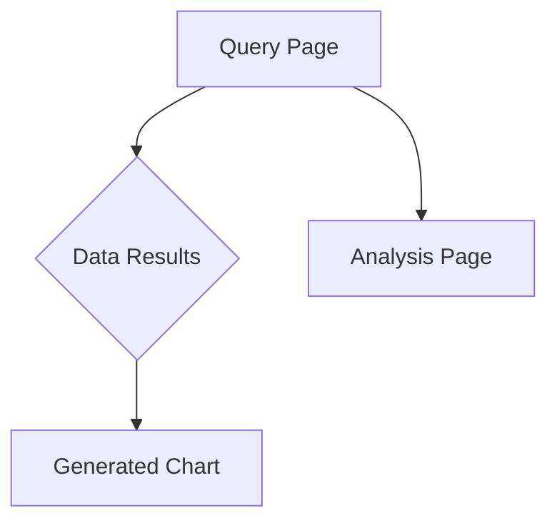
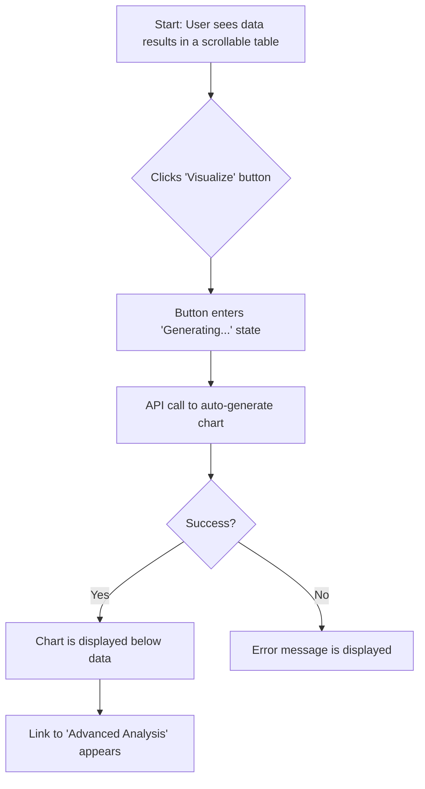

# SQL Chatbot V2 UI/UX Specification

This document defines the user experience goals, information architecture, user flows, and visual design specifications for the SQL Chatbot V2's user interface. It serves as the foundation for visual design and frontend development, ensuring a cohesive and user-centered experience.

---

## Overall UX Goals & Principles

### Target User Personas

*   **Primary Chatbot User:** A non-technical business stakeholder who needs quick answers from data without writing SQL. They value simplicity and clarity.
*   **Analysis Feature User:** A data analyst who is comfortable with data but wants to accelerate the visualization and exploration process. They value efficiency, power, and flexibility.

### Usability Goals

*   **Ease of Learning:** A first-time user can get a data result and a basic visualization within 2 minutes.
*   **Efficiency:** The data analyst can move from a SQL query to a useful automated visualization with a single click.
*   **Clarity:** The interface for both querying and analysis is clean, uncluttered, and immediately understandable.
*   **Error Prevention:** The system provides clear feedback if a query fails or an analysis cannot be generated.
*   **Discoverability:** Simple, high-value features (like basic visualizations) are easily discoverable from the main user interface.

### Design Principles

1.  **Clarity First:** Prioritize clear, unambiguous interfaces and communication over aesthetic complexity.
2.  **Separation of Concerns:** Keep the core SQL query experience distinct from the advanced analysis and visualization tools, but provide a clear and simple entry point to visualization from the main results.
3.  **Progressive Disclosure:** The main page offers a simple, one-click "Visualize" button. More advanced features (like custom prompts and detailed analysis) are located on a dedicated "Analysis" page.
4.  **Consistency:** Maintain a consistent visual and interactive pattern across both the query and analysis pages.
5.  **Empowerment through Choice:** Provide both a simple, automated path (the one-click "Visualize" button) and a more powerful, custom path to suit different user needs.

---

## Information Architecture (IA)

### Site Map / Screen Inventory



*   **Query Page:** The main interface where users input natural language questions.
*   **Data Results:** The area on the Query Page where the SQL output table is displayed.
*   **Generated Chart:** A container that appears directly below the Data Results after the user clicks the "Visualize" button.
*   **Analysis Page:** A separate page for advanced analysis and custom visualization, linked from the Generated Chart area.

### Navigation Structure

*   **Primary Navigation:** A simple top navigation bar with two links: "Query" (the main page) and "Analysis" (the advanced page).
*   **Secondary Navigation:** Not applicable for this simple two-page structure.
*   **Breadcrumb Strategy:** Not required due to the flat architecture.

---

## User Flows

### Flow 1: Get a Quick Visualization

*   **User Goal:** To get a simple, automated chart of their data with minimal effort.
*   **Persona:** Primary Chatbot User
*   **Entry Points:** The user has just successfully run a query on the Query Page.
*   **Success Criteria:** The user sees a relevant chart displayed below their data table within seconds of clicking the "Visualize" button.

**Flow Diagram:**



**Edge Cases & Error Handling:**

*   The data results table is contained within a scrollable element to handle large datasets gracefully.
*   If the data is unsuitable for visualization (e.g., no numeric columns), the "Visualize" button is disabled and a tooltip explains why.
*   If the chart generation fails on the backend, a user-friendly error message appears in the chart container.

---

### Flow 2: Perform Custom Analysis

*   **User Goal:** To explore data in-depth, create a specific type of chart, and view detailed statistical analysis.
*   **Persona:** Analysis Feature User
*   **Entry Points:**
    1.  Clicking the "Analysis" link in the primary navigation.
    2.  Clicking the "Customize this chart..." link after generating a basic visualization.
*   **Success Criteria:** The user can generate a custom chart by typing a natural language prompt and can view detailed data statistics.

**Flow Diagram:**

```mermaid
graph TD
    A[Start: User is on Analysis Page] --> B{Types custom prompt, e.g., 'bar chart of sales'};
    B --> C{Clicks 'Send' button};
    C --> D[API call to generate custom chart];
    D --> E{Success?};
    E -- Yes --> F[Custom chart is displayed];
    E -- No --> G[Error message is displayed];
    A --> H{Clicks 'Auto Generate' button};
    H --> D;
