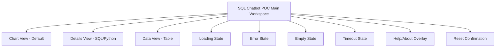
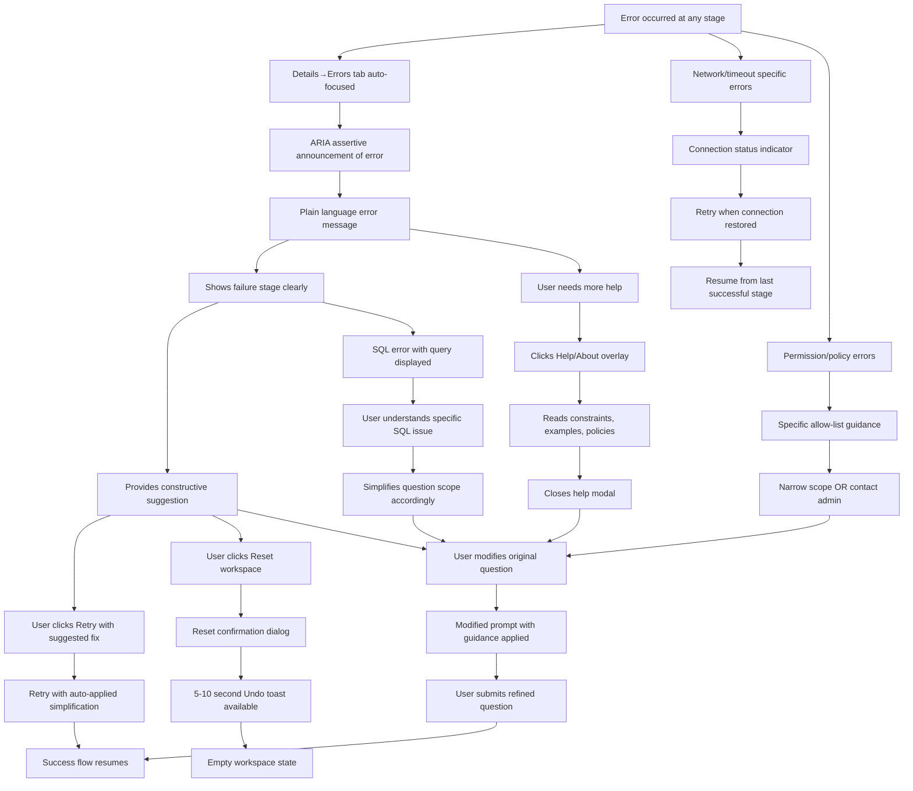
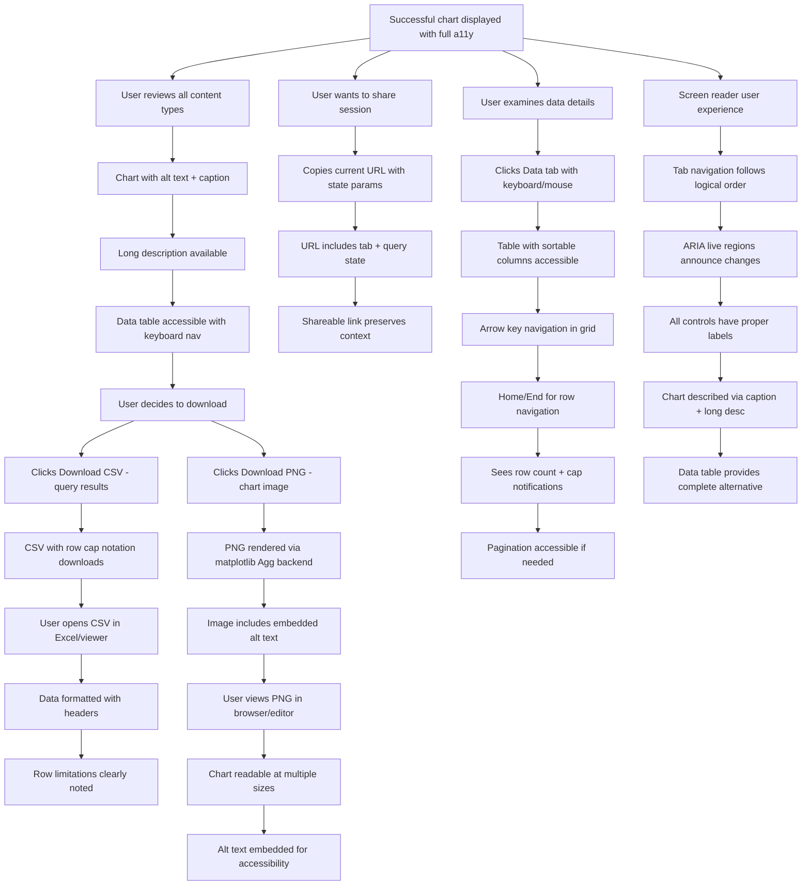

# SQL Chatbot POC UI/UX Specification

Status: Draft v0.1  
Date: 2025-09-28  
Owner: UX Expert (Sally)

## Introduction

This document defines the user experience goals, information architecture, user flows, and visual design specifications for SQL Chatbot POC’s user interface. It serves as the foundation for visual design and frontend development, ensuring a cohesive and user-centered experience.

### Overall UX Goals & Principles

#### Target User Personas
- Primary: Data Consumer (business/analyst) — Asks plain-English questions, needs quick, trustworthy charts and captions. Priorities: clarity, speed-to-visual, confidence in results, simple flows, easy export.
- Secondary: Power User / Analyst — Inspects SQL and generated Python, iterates on prompts/mappings. Priorities: transparency, control over chart type and axis mapping, quick iterations, reproducibility (CSV/PNG).
- Out of scope (MVP): Admin/Config — Manages data sources, guardrails, and policy. Priorities: safety, compliance, reliability.

#### Usability Goals
- Time-to-first-visual: Small queries render a chart in ≤10s with clear loading states; larger queries provide meaningful progress and timeout messaging.
- Transparency with progressive disclosure: Always provide generated SQL & Python, collapsed behind a “Show details” toggle so the Chart + Caption remain primary. SQL/Code panels clearly labeled and easy to expand.
- Downloads: CSV (query result) and PNG (chart) available from the Chart panel.
- Accessibility: Keyboard navigation across input, controls, and tabs; WCAG-compliant contrast; auto-generated alt text/summary derived from the caption and chart metadata.

#### Design Principles
- Progressive disclosure by default: Start with the simplest view; surface advanced details (SQL, Python, axis mappings) on demand.
- Clear axis mapping: Once columns are known, show X, Y, and optional Series/Color controls that reflect the detected schema and sensible defaults.
- Guardrails and transparency cues: Inline explanations for row caps/timeouts; “Safe SQL” badge when query validation passes; consistent error affordances.

#### Notes to surface in UI copy (constraints)
- Read-only, SELECT-only; schema allow-list; automatic row caps when not aggregated.
- Code sandbox: matplotlib/seaborn only, headless backend (Agg), no filesystem/network, bounded time/memory.
- Failure messaging: If SQL or Code fails, show which stage failed and provide suggested fix.

#### Change Log
| Date | Version | Description | Author |
|------|---------|-------------|--------|
| 2025-09-28 | 0.1 | Initial draft with UX Goals & Principles | UX Expert (Sally) |

## Wireframes & Mockups

### Primary Design Approach
**Selected Variant: B — Stacked with Primary Tabs**

This layout prioritizes information hierarchy with primary tabs and clearly separates the chart view from detailed technical information, while maintaining accessibility and progressive disclosure principles.

### Key Screen Layout: Main Interface

**Purpose:** Primary interface for natural language to data visualization workflow

**Layout Structure:**
- **Top Section:** Prompt input area with Generate button and quick constraint hints
- **Primary Tab Navigation:** Chart | Details | Data (following ARIA tabs pattern)
- **Right Rail:** Chart Controls (collapsible) - Chart Type, X/Y axis mapping, Series/Color options
- **Tab Content Areas:** Context-specific content with consistent action patterns

**Key Elements:**

**Header Area:**
- Title: "SQL Chatbot POC"  
- Constraint hints: "Read-only, SELECT-only" (unobtrusive)
- Safe SQL badge (appears when query validation passes)

**Prompt Section:**
- Large text input area with placeholder: "Ask a question about your data..."
- Generate button (primary CTA)
- Character count/limits if applicable

**Tab Navigation (Primary):**
1. **Chart Tab (Default):**
   - Primary chart canvas (responsive, accessible)
   - Caption beneath chart (doubles as alt text source)
   - Actions row: Download CSV | Download PNG | Regenerate
   - Auto-generated text alternative for screen readers

2. **Details Tab:**
   - SQL accordion (auto-open only on first successful run to satisfy FR7)
   - Python accordion (collapsed by default)
   - Copy SQL and Copy Python actions
   - Safe SQL badge and validation logs
   - Error panel (auto-focus when failures occur)

3. **Data Tab:**
   - Paginated table preview of query results
   - Row count indicator with cap notes
   - Table accessibility features (sortable columns, keyboard navigation)

**Right Rail Controls:**
- Chart Type selector (Bar, Line, Scatter, Histogram)
- Axis Mapping: X, Y, Series/Color dropdowns
- Disabled state until schema is detected
- Advanced options (collapsible): binning, aggregation toggles

**States & Interactions:**

**Idle State:**
- Empty chart placeholder with instructional text
- Controls disabled until schema detected
- Tabs show empty state placeholders

**Generating State:**  
- Linear progress bar across tab header
- Stage indicators: "LLM → SQL → Execute → Render" 
- Indeterminate progress, switching to determinate when possible
- Cancel option available
- Loading labels: "Executing query... 62%"

**Success State:**
- Chart rendered with caption
- Safe SQL badge visible (if validated)
- All tabs populated with relevant content
- Controls enabled with detected schema options

**Error State:**
- Auto-focus Details→Errors tab
- Non-blocking toast notification
- Clear stage identification (SQL vs Code failure)
- Remediation tips and suggested actions
- Fallback to previous state where possible

**Interaction Notes:**

**Accessibility Implementation:**
- ARIA tabs pattern: `role="tablist"`, `role="tab"`, `role="tabpanel"`
- Roving tabindex for tab navigation
- Keyboard shortcuts: Arrow keys for tab navigation, Home/End for first/last tab
- Screen reader announcements for state changes
- Charts include programmatic labels and descriptions
- Color-blind friendly: patterns/markers in charts, not color alone
- Sufficient contrast ratios (WCAG AA minimum)

**Keyboard Navigation Order:**
1. Prompt input → Generate button
2. Tab navigation (Chart/Details/Data)
3. Right rail controls (Chart Type, X/Y/Series)  
4. Chart canvas (when focusable elements present)
5. Tab-specific actions (Download, Copy, etc.)
6. Details accordions and content

**Responsive Adaptations:**
- Mobile: Right rail collapses to bottom sheet
- Tablet: Right rail becomes overlay panel
- Desktop: Full layout as described

**Design File Reference:** _To be created in Figma/design tool_

### Component States Summary

**Progress Visualization:**
- Determinate: Linear progress with percentage and stage labels
- Indeterminate: Pulsing animation with current stage description
- Error: Red accent with error icon and descriptive text
- Success: Brief success animation before content reveal

**Interactive Feedback:**
- Hover states for all clickable elements
- Focus indicators meeting WCAG requirements  
- Loading states for all async operations
- Confirmation dialogs for destructive actions (if any)

**Error Handling Patterns:**
- Toast notifications for non-blocking alerts
- Inline error panels for context-specific issues
- Auto-focus to relevant tabs/sections when errors occur
- Clear remediation guidance with actionable next steps

## Information Architecture (IA)

### Site Map / Screen Inventory



### Navigation Structure

**Primary Navigation:**
Tab-based navigation (Chart | Details | Data) using ARIA tabs pattern (`role="tablist"`, `role="tab"`, `role="tabpanel"`). Horizontal layout, persistent across all states. Roving tabindex with arrow key navigation, Home/End for first/last tab. Focus management: when tabs change, focus moves to active tab panel and announces change politely to screen readers.

**Tab Behavior:**
- **Default:** Chart tab active on load and after Reset
- **Auto-open behavior:** Details→SQL accordion auto-opens only on first successful query to satisfy FR7 requirement, then remembers last-opened tab
- **Error handling:** When errors occur, automatically switch focus to Details→Errors tab with polite announcement

**Secondary Navigation:**
Right rail controls for Chart Type and Axis Mapping (X, Y, Series/Color). Contextual - disabled until schema/columns are detected. On narrow viewports (<768px), right rail collapses to bottom sheet while preserving tab order and ARIA labeling.

**Breadcrumb Strategy:**
Not applicable for single-page POC scope.

### Application States

**Idle/Empty State:**
- Empty chart placeholder with instructional text: "Enter a question above to generate a visualization"
- Suggested example queries relevant to AdventureWorks
- Clear explanation of constraints and capabilities

**Loading State:**
- Linear progress bar across tab header
- Indeterminate progress initially, switching to determinate when progress can be estimated
- Stage indicators: "Processing question..." → "Generating SQL..." → "Executing query..." → "Creating visualization..."
- Cancel option with confirmation dialog

**Success State:**
- Chart rendered with auto-generated caption/summary
- All tabs populated with relevant content
- Controls enabled with detected schema options
- Safe SQL badge visible when validation passes

**Error State:**
- Auto-focus to Details→Errors tab with polite announcement
- Clear stage identification (LLM processing, SQL generation, query execution, or visualization rendering)
- Remediation tips: "Try a more specific question" or "Reduce the date range" 
- Fallback options: modify prompt, reset workspace, or contact support

**Timeout State:**
- Clear explanation: "Query is taking longer than expected"
- Options: Wait longer, try a smaller scope, add filters, or regenerate
- Estimated time remaining when possible

**Empty Results State:**
- "No data found for your query"
- Show the generated SQL for transparency
- Suggestions: broaden search terms, check date ranges, or try different questions

### Global Actions & Utilities

**Reset Workspace:**
- Clear button separate from Regenerate
- Clears prompt, controls, results, and returns to idle state
- Confirmation dialog: "This will clear your current work. Continue?"

**Help/About Overlay:**
- Small "?" icon in header
- Lightweight modal explaining:
  - What the tool does (natural language to SQL visualization)
  - Constraints: read-only, SELECT-only, row caps, time limits
  - How to download results (CSV/PNG)
  - Link to security guardrails and data policies
- Keyboard shortcut: `?` to open

**Keyboard Shortcuts (Optional):**
- `/` - Focus prompt input
- `g` then `g` - Focus Generate button  
- `t` - Cycle through tabs
- `r` - Regenerate (when applicable)
- `?` - Open help overlay
- `Escape` - Close overlays/modals

### Deep-linking & URL State

**Lightweight State Persistence:**
- URL parameters for current tab: `?tab=chart|details|data`
- Basic result state preservation for sharing: `?tab=chart&query=encoded-question`
- No authentication or server-side sessions required
- Client-side state management only

### Accessibility Implementation

**ARIA Tabs Pattern:**
- Complete implementation with `role="tablist"`, `role="tab"`, `role="tabpanel"`
- Roving tabindex: only active tab is in tab order
- Keyboard navigation: Arrow keys for tab selection, Home/End for first/last
- Screen reader announcements for tab changes and state updates

**Chart Accessibility:**
- Auto-generated short caption beneath each chart (doubles as alt text source)
- Longer description available via "Describe chart" link for screen readers
- Color-independent design: patterns, markers, and labels for data series
- High contrast mode support
- Data table alternative always available via Data tab

**Focus Management:**
- Clear focus indicators meeting WCAG AA standards
- Logical tab order: Prompt → Generate → Tabs → Right rail → Actions → Details
- Focus preservation: returning from overlays restores previous focus
- Skip links for keyboard users when needed

**Responsive Adaptations:**
- **Desktop (>1024px):** Full layout with right rail
- **Tablet (768-1024px):** Right rail becomes overlay panel triggered by "Chart Options" button
- **Mobile (<768px):** Right rail becomes bottom sheet, tabs may stack vertically if needed
- Touch targets minimum 44px as per WCAG guidelines

This information architecture reflects the MVP scope while establishing patterns that can scale for future enhancements.

## User Flows

### Flow 1: Primary Query Flow

**User Goal:** Get a data visualization from a natural language question  
**Entry Points:** Direct URL, bookmark, or shared link  
**Success Criteria:** Chart displayed with caption, SQL visible in Details, data downloadable

```mermaid
graph TD
    A[User opens application] --> B[Sees empty workspace with example chips]
    B --> C[Reads example questions OR clicks example chip]
    C --> D[Prompt pre-filled OR types custom question]
    D --> E[Shift+Enter for newline OR Enter/Generate to submit]
    E --> F[Validation check]
    F --> G[Progress: LLM processing - indeterminate]
    G --> H[Progress: SQL generation - indeterminate] 
    H --> I[Progress: Query execution - determinate if estimable]
    I --> J[Progress: Chart rendering - determinate]
    J --> K[Success: Chart displayed]
    K --> L[Caption auto-generated + alt text]
    L --> M[ARIA live region announces completion]
    M --> N[User views/downloads results]
    
    F --> O[Validation error]
    O --> P[Inline error with examples]
    P --> D
    
    G --> Q[LLM timeout/error]
    H --> R[SQL generation error]
    I --> S[Query execution error] 
    J --> T[Chart rendering failure]
    
    Q --> U[Error state: Details→Errors auto-focused]
    R --> U
    S --> U  
    T --> V[Fallback: Data tab with "Unable to render chart"]
    
    U --> W[ARIA assertive announcement]
    W --> X[Plain error message + suggestion]
    X --> Y[User clicks Retry with simplification]
    X --> Z[User clicks Reset with confirmation]
    X --> AA[User modifies question]
    
    Y --> D
    Z --> B
    AA --> D
    
    G --> BB[User clicks Cancel]
    H --> BB
    I --> BB
    J --> BB
    BB --> CC[Cancel confirmation]
    CC --> B
    
    I --> DD[Network/offline timeout]
    DD --> EE[Offline state with retry tips]
    EE --> FF[Retry when online]
    FF --> I
    
    I --> GG[Permission/allow-list denial]
    GG --> HH[Policy error with scope guidance]
    HH --> II[Contact admin OR narrow scope]
    II --> D
```

**Edge Cases & Error Handling:**
- Empty/invalid prompt → Inline validation with clickable example chips
- LLM timeout → "Taking longer than expected" with Cancel and Retry options
- SQL generation failure → "Couldn't understand your question" with simplification suggestions
- Query timeout → "Query taking too long" with scope reduction tips and Cancel option
- No results returned → "No data found" with query broadening suggestions + SQL transparency
- Chart rendering failure → Auto-switch to Data tab with "Unable to render chart - here's the data" + alternate chart suggestions
- Network/offline → "Connection lost" with retry guidance and offline tips
- Permission denied → "Table/column restricted" with scope narrowing guidance or admin contact

### Flow 2: Chart Customization & Accessibility Flow

**User Goal:** Adjust chart type and axis mapping, ensure accessibility  
**Entry Points:** From successful chart generation  
**Success Criteria:** Updated chart reflects preferences with full accessibility support

```mermaid
graph TD
    A[Chart successfully displayed] --> B[User examines chart + caption]
    B --> C[Reads auto-generated alt text]
    C --> D[Accesses long description if needed]
    D --> E[Reviews data table fallback in Data tab]
    E --> F[User wants chart customization]
    F --> G[Opens right rail controls]
    G --> H[Chart type selector: Bar/Line/Scatter/Histogram]
    H --> I[Selects new type]
    I --> J[Chart re-renders with indeterminate progress]
    J --> K[Success announcement via ARIA live region]
    K --> L[User adjusts X/Y axes with tooltips]
    L --> M[Real-time chart updates]
    M --> N[User satisfied with result]
    N --> O[Downloads PNG/CSV with clear labeling]
    
    B --> P[User wants technical details]
    P --> Q[Clicks Details tab with roving tabindex]
    Q --> R[Reviews SQL accordion - auto-open on first success]
    R --> S[Reviews Python accordion - collapsed by default]
    S --> T[Copies SQL/Python with one-click buttons]
    
    J --> U[Chart type not suitable for data]
    U --> V[Error message with suggestions]
    V --> W[Try different chart type]
    W --> H
    
    L --> X[Axis mapping unclear/invalid]
    X --> Y[Tooltip guidance + validation]
    Y --> L
    
    N --> Z[User wants reproducibility]
    Z --> AA[Clicks "Copy session bundle"]
    AA --> BB[Copies prompt + SQL + Python + metadata]
    
    M --> CC[Too few data points for chart]
    CC --> DD[Auto-fallback to Data tab]
    DD --> EE[Suggest aggregation or different question]
```

### Flow 3: Error Recovery & Resilience Flow

**User Goal:** Recover from errors gracefully with clear guidance  
**Entry Points:** Any error state (LLM, SQL, execution, rendering, network)  
**Success Criteria:** Successful resolution within 1-2 user actions



### Flow 4: Download, Share & Accessibility Flow

**User Goal:** Export results and ensure accessibility across all interactions  
**Entry Points:** From successful chart display  
**Success Criteria:** Files downloaded successfully, accessibility maintained throughout



### Accessibility & Technical Implementation Notes

**ARIA Live Regions:**
- Progress updates: `aria-live="polite"` for status changes
- Error announcements: `aria-live="assertive"` for critical failures
- Success completion: `aria-live="polite"` for non-disruptive confirmations

**Keyboard Navigation Patterns:**
- Tabs: Roving tabindex with Arrow keys, Home/End for first/last
- Data grid: Arrow keys for cell navigation, Tab to exit grid
- Controls: Standard tab order with clear focus indicators
- Shortcuts: `/` focus prompt, `g g` focus generate, `t` cycle tabs, `?` help

**Chart Accessibility:**
- Auto-generated concise alt text from caption
- Long description available via "Describe chart" link
- Data table always available as complete alternative
- Color-blind friendly: patterns, markers, not color alone
- High contrast support for all visual elements

**Progress Semantics:**
- **Indeterminate:** LLM processing, SQL generation (unknown duration)
- **Determinate:** Query execution (when row count estimable), file downloads
- **Stage labeling:** Clear "Processing question...", "Executing query...", "Creating chart..."
- **Cancel option:** Available during all async operations

**Error Messaging Standards:**
- Plain language, no technical codes or jargon
- Specific stage identification (LLM, SQL, execution, rendering)
- Constructive suggestions with actionable next steps
- Recovery options within 1-2 clicks maximum
- Offline/network guidance with retry mechanisms

**Download Specifications:**
- **CSV:** Query results respecting row caps, with headers and limitation notes
- **PNG:** Chart rendered via matplotlib Agg (headless), embedded alt text, multiple size optimization
- **Session bundle:** Prompt + SQL + Python + model version + data sample hash for reproducibility

These user flows ensure comprehensive coverage of the primary use cases while maintaining accessibility, error resilience, and clear user guidance throughout all interactions.

## Component Library / Design System

### Design System Approach
**Lightweight custom system optimized for data visualization and accessibility.** Focus on functional components over decorative elements, ensuring WCAG AA compliance throughout. Built with modern web standards and comprehensive keyboard/screen reader support.

### Design Tokens

**Color Palette (Semantic Tokens):**
- `--color-bg-primary`: Background primary (#ffffff)
- `--color-bg-secondary`: Background secondary (#f8f9fa) 
- `--color-fg-primary`: Foreground primary (#212529) - 4.5:1+ contrast
- `--color-fg-secondary`: Foreground secondary (#6c757d) - 4.5:1+ contrast
- `--color-fg-muted`: Muted text (#868e96) - 4.5:1+ contrast for large text
- `--color-accent`: Primary accent (#0066cc) - 4.5:1+ contrast
- `--color-success`: Success state (#28a745) - 3:1+ contrast for UI elements
- `--color-warning`: Warning state (#ffc107) - 3:1+ contrast for UI elements  
- `--color-danger`: Error state (#dc3545) - 3:1+ contrast for UI elements
- `--color-focus-ring`: Focus indicator (#0066cc) - 3:1+ contrast minimum

**Spacing & Border Radius (4/8px Scale):**
- Spacing: 4, 8, 12, 16, 24, 32, 48, 64px
- Border radius: 4, 8, 12px for different component sizes

**Typography:**
- Body font: System font stack (Segoe UI, Roboto, sans-serif)
- Monospace: Consolas, Monaco, 'Courier New', monospace
- Sizes: 14px (small), 16px (body), 18px (large), 20px (heading)
- Line heights: 1.4 (body), 1.2 (headings), 1.6 (large text blocks)

**Component States:**
- Hover: 10% darken for backgrounds, 15% darken for borders
- Active: 15% darken, slight inset shadow
- Disabled: 50% opacity, cursor not-allowed
- Focus: 2px outline using `--color-focus-ring` with 2px offset

### Core Components

#### 1. Input & Controls

**Text Input (Prompt):**
- **Purpose:** Natural language question entry with multi-line support
- **Variants:** Default, focused, error, disabled, with character count
- **States:** Empty (placeholder), filled, validating (with spinner), error (red border + message)
- **Props:** `placeholder`, `maxLength`, `disabled`, `error`, `value`, `onValueChange`
- **Keyboard:** Shift+Enter for newline, Enter or Generate button to submit
- **Accessibility:** `aria-label`, `aria-describedby` for errors, `aria-invalid` when error state
- **Usage Guidelines:** Minimum 3 rows visible, auto-resize up to 8 rows, clear error recovery

**Button (Primary/Secondary/Ghost):**
- **Purpose:** All interactive actions (Generate, Download, Reset, Cancel, Copy)
- **Variants:** 
  - Primary: Generate, major actions (filled, high contrast)
  - Secondary: Download, Reset (outlined, medium contrast)
  - Ghost: Cancel, dismiss (text only, low contrast)
- **States:** Default, hover, active, loading (with spinner), disabled
- **Props:** `variant`, `loading`, `disabled`, `icon`, `children`, `onClick`
- **Touch Targets:** 44px minimum height, sufficient horizontal padding
- **Accessibility:** Clear `aria-label`, `aria-describedby` for context, `aria-pressed` for toggles
- **Loading State:** Spinner + "Processing..." text, prevent double submission

**Segmented Control (Chart Type Selector):**
- **Purpose:** Switch between Bar, Line, Scatter, Histogram visualizations
- **Implementation:** Radio group with custom styling
- **Variants:** Horizontal (desktop), vertical stack (mobile)
- **States:** Selected, unselected, disabled (until schema detected), focus
- **Props:** `options`, `value`, `onValueChange`, `disabled`, `orientation`
- **Keyboard:** Arrow keys to navigate, Space/Enter to select
- **Accessibility:** `role="radiogroup"`, `aria-labelledby`, each option `role="radio"`
- **Visual:** Clear icons + text labels, selected state with background + border

**Select / Combobox (Column Mapping):**
- **Purpose:** X/Y axis and series column selection with search
- **Variants:** Single select, with clear button, with search/typeahead
- **States:** Closed, open, searching, selected, disabled, error
- **Props:** `options`, `value`, `placeholder`, `searchable`, `clearable`, `onValueChange`
- **Keyboard:** Arrow keys, Enter to select, Escape to close, typing to search
- **Accessibility:** `role="combobox"`, `aria-expanded`, `aria-owns`, `aria-activedescendant`
- **Usage:** Disabled until schema available, clear selection option

#### 2. Navigation & Structure

**Tab Navigation:**
- **Purpose:** Primary content switching (Chart | Details | Data)
- **Implementation:** ARIA tabs pattern with manual activation
- **Variants:** Default, with notification badges, disabled tabs
- **States:** Active, inactive, hover, focus, disabled
- **Props:** `tabs`, `activeTab`, `onTabChange`, `orientation`
- **Keyboard:** 
  - Arrow keys for navigation (roving tabindex)
  - Space/Enter for activation on focused tab
  - Home/End for first/last tab
- **Accessibility:** 
  - `role="tablist"` on container
  - `role="tab"` on each tab, `aria-selected`, `aria-controls`
  - `role="tabpanel"` on content, `aria-labelledby`
- **Visual:** Clear active state, focus indicators, sufficient contrast

**Accordion/Collapsible:**
- **Purpose:** SQL/Python code disclosure, advanced options, error details
- **Variants:** Default collapsed, default expanded, nested accordions
- **States:** Collapsed, expanded, animating (respects prefers-reduced-motion)
- **Props:** `title`, `expanded`, `onToggle`, `children`, `level` (for nesting)
- **Keyboard:** Enter/Space to toggle, arrow keys between headers
- **Accessibility:** 
  - `role="button"` on header, `aria-expanded`, `aria-controls`
  - `role="region"` on content, `aria-labelledby`
- **Animation:** 300ms ease-out expand, 200ms ease-in collapse

#### 3. Data Visualization

**Chart Container:**
- **Purpose:** Primary data visualization display with accessibility support
- **Variants:** Bar chart, line chart, scatter plot, histogram
- **States:** Loading (skeleton), rendered, error (fallback), empty (no data)
- **Props:** `type`, `data`, `caption`, `altText`, `onTypeChange`
- **Accessibility:** 
  - Visible caption below chart
  - `aria-label` with brief description
  - Link to long description in Details/Data tabs
  - Color-independent design (patterns, markers, labels)
- **Responsive:** Canvas resizes, maintains aspect ratio, readable on mobile
- **Error Handling:** Auto-switch to Data tab when chart rendering fails

**Progress Indicator:**
- **Purpose:** Multi-stage operation progress with clear stage communication
- **Variants:** 
  - Linear indeterminate (LLM, SQL generation)
  - Linear determinate (query execution, file downloads)
  - With stage labels and cancel option
- **States:** Processing, paused, complete, error, cancelled
- **Props:** `stages`, `currentStage`, `progress`, `onCancel`, `determinate`
- **Accessibility:** 
  - `role="progressbar"`, `aria-valuemin`, `aria-valuemax`, `aria-valuenow`
  - `aria-valuetext` for stage descriptions: "Generating SQL query..."
  - `aria-busy="true"` on results container during processing
- **Visual:** Clear stage labels, cancel button, smooth transitions

#### 4. Feedback & Status

**Toast/Alert:**
- **Purpose:** Success confirmations, non-blocking notifications, status updates
- **Variants:** Success (green), warning (yellow), error (red), info (blue)
- **States:** Entering, visible, dismissing
- **Props:** `type`, `message`, `duration`, `dismissible`, `onDismiss`
- **Accessibility:** 
  - `role="status"` for non-urgent (implicit aria-live="polite")
  - `role="alert"` only for urgent errors requiring immediate attention
  - Clear dismiss button with `aria-label="Close notification"`
- **Behavior:** Auto-dismiss after 5-10 seconds, manual dismiss option
- **Animation:** Slide in from top, fade out, respect reduced motion

**Error Panel:**
- **Purpose:** Detailed error messaging with stage identification and remediation
- **Variants:** Inline validation, system errors, critical modals
- **States:** Hidden, revealed, with actions (retry, reset)
- **Props:** `stage`, `message`, `suggestion`, `actions`, `severity`
- **Content Standards:**
  - Plain language, no technical jargon or error codes
  - Clear stage identification (LLM, SQL, execution, rendering)
  - Constructive suggestions with actionable next steps
  - Recovery options within 1-2 clicks
- **Accessibility:** `role="alert"` for critical errors, clear action labels

**Badge/Status Indicator:**
- **Purpose:** "Safe SQL" validation, row count limits, connection status
- **Variants:** Success (Safe SQL), warning (row limits), error (offline), info
- **States:** Active, inactive, pulsing (processing)
- **Props:** `type`, `text`, `icon`, `pulsing`
- **Accessibility:** Icon + text (not color alone), `aria-label` for screen readers
- **Visual:** Consistent sizing, clear contrast, readable at small sizes

#### 5. Data Display

**Data Table:**
- **Purpose:** Tabular result display, accessibility fallback for charts
- **Implementation:** Native `<table>` with enhanced keyboard support
- **Variants:** Sortable columns, paginated, fixed header, loading skeleton
- **States:** Loading, populated, empty, error
- **Props:** `data`, `columns`, `sortable`, `pageSize`, `loading`
- **Accessibility:**
  - `<caption>` describing table content and row count
  - `<th scope="col">` for column headers
  - `<th scope="row">` for row headers if applicable
  - Sortable columns announce sort state
- **Keyboard:** 
  - Tab to enter/exit table
  - Arrow keys for cell navigation (optional ARIA grid pattern)
  - Home/End for row navigation
- **Responsive:** Horizontal scroll on mobile, sticky headers

**Code Block (SQL/Python):**
- **Purpose:** Formatted code display with syntax highlighting
- **Variants:** SQL highlighting, Python highlighting, plain text
- **States:** Default, copied (feedback), wrapped/unwrapped text
- **Props:** `language`, `code`, `copyable`, `wrap`
- **Features:**
  - Syntax highlighting appropriate to language
  - Copy button with success feedback
  - Text wrapping toggle for long lines
- **Accessibility:**
  - `role="region"` with `aria-label="SQL Code"`
  - Copy button announces "Copied to clipboard" via `role="status"`
  - Monospace font for readability
- **Visual:** Consistent color coding, sufficient contrast for all tokens

**Tooltip:**
- **Purpose:** Contextual help for axis mapping, chart controls
- **Variants:** On hover, on focus, persistent (for complex help)
- **States:** Hidden, visible, positioned
- **Props:** `content`, `trigger`, `placement`, `persistent`
- **Accessibility:**
  - Triggered by focus and hover
  - `role="tooltip"`, `aria-describedby` on trigger element
  - Dismissible with Escape key
- **Behavior:** Smart positioning, fade in/out, not blocking interactions

**Skeleton Loader:**
- **Purpose:** Loading states for Chart, Table, Code blocks
- **Variants:** Chart skeleton (bars/lines), table skeleton (rows), text skeleton
- **Animation:** Subtle pulse or shimmer, respect reduced motion
- **Props:** `type`, `rows`, `animated`
- **Accessibility:** `aria-label="Loading content"`, `aria-busy="true"`

**Empty State:**
- **Purpose:** First-run guidance, no results messaging
- **Variants:** First use, no data found, connection error
- **Content:** Clear headline, explanation, actionable suggestions
- **Props:** `type`, `title`, `description`, `actions`
- **Examples:** "Ask your first question", "No data found - try broadening your search"

### Accessibility Standards (All Components)

**Color & Contrast:**
- Normal text: 4.5:1 minimum contrast ratio
- Large text (18px+ or 14px+ bold): 3:1 minimum
- UI components and focus indicators: 3:1 minimum
- Color never sole means of conveying information

**Keyboard Navigation:**
- Logical tab order following visual layout
- All interactive elements keyboard accessible
- Standard interaction patterns (Space, Enter, Arrow keys, Escape)
- Visible focus indicators with sufficient contrast
- Skip links where beneficial

**Screen Reader Support:**
- Semantic HTML elements where possible
- ARIA labels, roles, and properties where needed
- Live regions for dynamic content updates
- Alternative text for images and charts
- Table headers and captions

**Touch & Motor:**
- Minimum 44px touch targets (24px for WCAG 2.2 compliance)
- Sufficient spacing between interactive elements
- Click/tap areas larger than visual element when beneficial
- No hover-only interactions

**Reduce Motion:**
- Respect `prefers-reduced-motion: reduce` setting
- Essential motion only when reduced motion preferred
- Alternative communication methods when animation disabled

### Responsive Behavior

**Desktop (>1024px):**
- Full component layout with right rail controls
- Hover states active
- Tooltips on hover + focus

**Tablet (768-1024px):**
- Stacked components, right rail becomes overlay
- Touch-optimized interactions
- Larger tap targets

**Mobile (<768px):**
- Single column layout
- Bottom sheets for secondary controls
- Simplified interactions where appropriate
- Horizontal scroll for tables

### Motion & Animation

**Duration Standards:**
- Micro-interactions: 150-200ms (desktop), 225-300ms (mobile)
- Major state changes: 300-400ms
- Page transitions: 400-600ms

**Easing:**
- Enter: ease-out (cubic-bezier(0.25, 0.46, 0.45, 0.94))
- Exit: ease-in (cubic-bezier(0.55, 0.06, 0.68, 0.19))
- Standard: ease (cubic-bezier(0.25, 0.1, 0.25, 1.0))

**Reduced Motion:**
- Honor `@media (prefers-reduced-motion: reduce)`
- Replace animations with instant state changes
- Maintain essential transitions for usability

### Component Acceptance Checklist

Each component must meet:
- ✅ Keyboard navigation coverage
- ✅ Screen reader labels and announcements
- ✅ Visible focus indicators
- ✅ Color contrast compliance
- ✅ Touch target size requirements
- ✅ Reduced motion support
- ✅ All error states defined
- ✅ Loading states implemented
- ✅ Responsive behavior specified
- ✅ Internationalization considerations (numbers, dates)

This component library provides the foundation for consistent, accessible, and maintainable implementation of the SQL Chatbot POC interface.

## Branding & Style Guide

### Visual Identity Approach
**Clean, professional, data-focused design** optimized for clarity and accessibility. Prioritizes functional design over decorative elements, ensuring the data visualization remains the primary focus while maintaining corporate professionalism suitable for management presentations.

### Color System (WCAG AA Compliant)

#### Core UI Colors (Neutrals)
- **Background Primary:** `#FFFFFF` (Pure white for main areas)
- **Surface:** `#F7F7F9` (Subtle off-white for secondary surfaces)  
- **Border:** `#E5E7EB` (Light gray for component borders)
- **Text Primary:** `#111827` (Near-black, 4.5:1+ contrast on white)
- **Text Secondary:** `#4B5563` (Medium gray, 4.5:1+ contrast for secondary text)
- **Text Muted:** `#9CA3AF` (Light gray, 3:1+ contrast for large text only)

#### Accent & Interactive Colors
- **Primary Accent:** `#2563EB` (Blue 600 - controls, links, focus states)
- **Primary Hover:** `#1D4ED8` (Blue 700 - hover states)
- **Primary Active:** `#1E40AF` (Blue 800 - active states)

#### Semantic Colors
- **Success:** `#16A34A` (Green 600) with **Success Text:** `#FFFFFF` (4.5:1+ contrast)
- **Warning:** `#F59E0B` (Amber 500) with **Warning Text:** `#000000` (4.5:1+ contrast)  
- **Error:** `#DC2626` (Red 600) with **Error Text:** `#FFFFFF` (4.5:1+ contrast)
- **Info:** `#0EA5E9` (Sky 500) with **Info Text:** `#FFFFFF` (4.5:1+ contrast)

#### Focus & State Indicators
- **Focus Ring:** `#2563EB` (Primary accent, 2px outline, 2px offset)
- **Focus Ring Alt:** `#FFFFFF` (White ring for dark backgrounds)
- **Disabled:** 50% opacity of base color with `cursor: not-allowed`

### Data Visualization Color Palettes

#### Categorical Data (Color-Blind Safe)
**Primary Palette (≤7 series) - Paul Tol "Bright":**
- `#4477AA` (Blue), `#66CCEE` (Cyan), `#228833` (Green)
- `#CCBB44` (Yellow), `#EE6677` (Red), `#AA3377` (Purple), `#BBBBBB` (Gray)

**Extended Palette (>7 series) - Matplotlib tab10:**
- Fallback to standard tab10 cycle for compatibility
- Ensure sufficient contrast between adjacent series

#### Sequential Data (Single Metrics)
**ColorBrewer "Blues"** for single-metric heatmaps or size encoding:
- Light: `#EFF3FF` → Medium: `#3182BD` → Dark: `#08519C`

#### Diverging Data (Above/Below Baseline)  
**ColorBrewer "RdBu"** for data with meaningful center point:
- Red negative: `#CA0020` → Neutral: `#F7F7F7` → Blue positive: `#0571B0`

### Typography

#### Font Families
**Primary:** Inter, Segoe UI, -apple-system, BlinkMacSystemFont, Roboto, Helvetica Neue, Arial, sans-serif
**Monospace:** 'SF Mono', Consolas, Monaco, 'Cascadia Code', 'Courier New', monospace

#### Type Scale & Usage
- **Heading 1:** 32px/1.2, 600 weight (Page title)
- **Heading 2:** 24px/1.2, 600 weight (Section headers)
- **Heading 3:** 20px/1.25, 500 weight (Subsection headers)
- **Body Large:** 18px/1.4, 400 weight (Prominent content)
- **Body:** 16px/1.4, 400 weight (Default text)
- **Body Small:** 14px/1.4, 400 weight (Secondary text, labels)
- **Caption:** 12px/1.3, 400 weight (Chart captions, metadata)
- **Code:** 14px/1.6, 400 weight (SQL, Python code blocks)

#### Text Color Applications
- **Primary text** on light backgrounds: `#111827`
- **Secondary text** on light backgrounds: `#4B5563`
- **Muted text** on light backgrounds: `#9CA3AF` (large text only)
- **Interactive text:** `#2563EB` (links, interactive elements)

### Iconography

#### Icon System
**Primary Set:** Lucide (outline variant)
**Fallback Set:** Heroicons (outline variant)
**Stroke Width:** 1.5-2px for optimal clarity at 16-24px sizes
**Sizing:** 16px (small), 20px (medium), 24px (large), 32px (extra large)

#### Icon Applications
- **Success/Confirmation:** Check circle, checkmark
- **Warning/Caution:** Alert triangle, warning circle  
- **Error/Danger:** X circle, alert octagon
- **Info/Help:** Info circle, question mark circle
- **Actions:** Download, copy, refresh, settings, external link
- **Navigation:** Arrow left/right/up/down, chevron variants
- **Data:** Bar chart, line chart, table, database

#### Icon Color Usage
- **Default:** `#4B5563` (matches secondary text)
- **Interactive:** `#2563EB` (matches primary accent)
- **Success:** `#16A34A`, **Warning:** `#F59E0B`, **Error:** `#DC2626`
- **Disabled:** 50% opacity of base color

### Chart Styling Defaults

#### Matplotlib/Seaborn Configuration
**Backend:** `Agg` (non-interactive, optimized for PNG export)
**DPI:** 150 for high-quality export images
**Figure Size:** 10x6 inches default, responsive scaling
**Font Family:** Inter (or system fallback)

#### Default Chart Styling
```python
# Matplotlib RC defaults
plt.rcParams.update({
    'font.family': 'Inter',
    'font.size': 12,
    'axes.titlesize': 14,
    'axes.labelsize': 12,
    'xtick.labelsize': 10,
    'ytick.labelsize': 10,
    'legend.fontsize': 10,
    'figure.titlesize': 16
})

# Color cycle
plt.rcParams['axes.prop_cycle'] = plt.cycler('color', [
    '#4477AA', '#66CCEE', '#228833', '#CCBB44', 
    '#EE6677', '#AA3377', '#BBBBBB'  # Paul Tol Bright
])
```

#### Chart Elements
- **Grid:** Light gray (`#F3F4F6`), subtle, behind data
- **Axes:** Dark gray (`#374151`) with clear labels and units
- **Data Points:** Sufficient size for visibility, distinct markers when needed
- **Legends:** Positioned to not obscure data, clear labels
- **Captions:** Always below chart, describing key insights

#### Seaborn Fallback
When using Seaborn: `sns.set_palette("colorblind")` as accessible fallback
Default context: `sns.set_context("notebook", font_scale=1.1)`

### Accessibility Standards

#### Chart Accessibility Implementation
**Short Alt Text:** Concise description of chart type and main finding
- Example: "Bar chart showing sales increased 23% from Q1 to Q2 2024"

**Long Description:** Detailed explanation available in Details→Data section
- Include data trends, outliers, units, and interpretation
- Structured as expandable text accessible via keyboard navigation

**Color Independence:**
- Never use color alone to convey information
- Supplement with patterns, markers, labels, or position
- Test with color-blind simulation tools

#### WCAG Compliance Verification
All color combinations tested for:
- **Normal text:** 4.5:1 minimum contrast ratio
- **Large text (18px+ or 14px+ bold):** 3:1 minimum contrast ratio  
- **UI components:** 3:1 minimum contrast ratio
- **Focus indicators:** 3:1 minimum contrast ratio with adjacent colors

### States & Interaction Patterns

#### Hover States
- **Buttons:** 10% darker background, 15% darker borders
- **Interactive text:** Underline + color change to `#1D4ED8`
- **Chart elements:** Subtle highlight with tooltip

#### Focus States  
- **All interactive elements:** 2px `#2563EB` outline with 2px offset
- **High contrast mode:** White outline on dark backgrounds
- **Never remove focus indicators**

#### Loading States
- **Primary:** Subtle pulse animation on skeleton loaders
- **Progress:** Smooth progress bar with stage labels
- **Respect:** `prefers-reduced-motion` setting

#### Disabled States
- **Visual:** 50% opacity, `cursor: not-allowed`
- **Accessibility:** `aria-disabled="true"`, removed from tab order
- **Never disable without clear re-enabling path**

### Responsive Design Tokens

#### Breakpoint-Specific Adjustments
**Desktop (>1024px):**
- Full color palette available
- Hover interactions active
- Detailed tooltips on hover + focus

**Tablet (768-1024px):**
- Simplified hover states (touch-first)
- Larger touch targets (44px minimum)
- Consolidated color usage

**Mobile (<768px):**
- High contrast color variants prioritized
- Touch-optimized spacing (8px minimum between interactive elements)
- Simplified chart styling with larger text

### Performance Considerations

#### Color & Asset Optimization
- **CSS Custom Properties:** All colors defined as CSS variables
- **Icon Optimization:** SVG sprites for repeated icons  
- **Chart Rendering:** Matplotlib Agg backend for consistent cross-platform rendering
- **Image Compression:** PNG optimization for chart exports

### Corporate Brand Integration

#### POC-Safe Defaults
Current color palette designed for professional presentation without specific brand requirements. Colors selected for:
- Accessibility compliance (WCAG AA)
- Color-blind accessibility  
- Professional appearance suitable for management demos
- Cross-platform consistency

#### Future Brand Mapping
For corporate brand integration:
1. Map primary accent to brand primary color (ensure WCAG compliance)
2. Adapt semantic colors to brand guidelines while maintaining contrast requirements
3. Replace Inter with brand typography (verify readability at small sizes)
4. Update data visualization palettes to brand-compliant alternatives
5. Maintain all accessibility standards during brand adaptation

### Design File References

**Primary Design Tool:** Figma (recommended for component library creation)
**Color Swatches:** Available as Figma color styles and CSS custom properties
**Component Documentation:** Detailed in Component Library section above
**Chart Examples:** Reference implementations using specified palettes and accessibility patterns

### Brand Acceptance Checklist

Each branded element must meet:
- ✅ WCAG AA contrast compliance verified
- ✅ Color-blind accessibility tested (Deuteranopia, Protanopia, Tritanopia)
- ✅ Chart examples provided with accessible captions and long descriptions
- ✅ Matplotlib/Seaborn configuration documented and tested
- ✅ All semantic color combinations validated
- ✅ Focus indicator visibility confirmed across color combinations
- ✅ Typography hierarchy readable at specified sizes
- ✅ Icon clarity maintained at minimum sizes
- ✅ Responsive color usage optimized for different screen sizes
- ✅ Loading and disabled states clearly distinguishable

This branding system provides a professional, accessible foundation that can evolve with corporate brand requirements while maintaining usability and compliance standards.

## Next Steps & Handoff

### Implementation Roadmap

#### Phase 1: Foundation & Core Components (Sprint 1-2)
**Priority: Critical Path**
- Set up development environment with accessibility testing tools
- Implement design token system (CSS custom properties)
- Build core components: Button, Text Input, Tab Navigation, Progress Indicator
- Establish Matplotlib/Seaborn chart rendering pipeline with Agg backend
- Create basic responsive grid layout

**Acceptance Criteria:**
- All components pass WCAG AA automated testing
- Keyboard navigation functional across all core components
- Chart rendering pipeline produces accessible PNG exports
- Mobile responsiveness verified on key breakpoints

#### Phase 2: Data Visualization & Interactions (Sprint 3-4)
**Priority: Core Functionality**
- Implement Chart Container with Paul Tol color palette
- Build Data Table with keyboard navigation and sorting
- Develop Error Panel and Toast notification systems
- Create Accordion/Collapsible components for Details sections
- Integrate Select/Combobox for column mapping

**Acceptance Criteria:**
- Charts include accessible captions and long descriptions
- Data table navigable with arrow keys and screen readers
- Error recovery flows tested with real failure scenarios
- Column mapping works with dynamic schema detection

#### Phase 3: Enhanced UX & Polish (Sprint 5)
**Priority: User Experience**
- Implement Skeleton Loaders and Empty States
- Add Tooltip system for contextual help
- Polish animations and micro-interactions (respect reduced motion)
- Optimize performance and PNG export quality
- Complete responsive mobile adaptations

**Acceptance Criteria:**
- Loading states provide clear progress feedback
- All animations respect `prefers-reduced-motion` setting
- Mobile experience fully functional with touch targets ≥44px
- Chart exports optimized for sharing and presentations

### Team Handoffs

#### Development Team Deliverables
**Required Before Implementation:**
1. **Component Specifications** (Complete ✅)
   - Detailed component props, states, and behaviors
   - ARIA patterns and keyboard navigation requirements
   - Responsive behavior specifications

2. **Accessibility Requirements** (Complete ✅)
   - WCAG AA compliance standards
   - Screen reader testing protocols
   - Color contrast verification procedures
   - Keyboard navigation testing scenarios

3. **Technical Integration Points:**
   - FastAPI backend integration for LLM → SQL → Execute → Render pipeline
   - Matplotlib configuration for consistent chart rendering
   - Error handling integration with backend services
   - CSV/PNG download implementation

**Developer Setup Requirements:**
- Accessibility testing tools: axe-core, WAVE, Lighthouse
- Color contrast analyzers: WebAIM Contrast Checker
- Screen reader testing: NVDA (Windows), VoiceOver (Mac)
- Browser testing: Chrome, Firefox, Safari, Edge
- Responsive testing: Chrome DevTools, real mobile devices

#### Design Team Deliverables  
**Required for Visual Design:**
1. **High-Fidelity Mockups** (To Be Created)
   - Detailed visual designs using Figma component library
   - All states documented (idle, loading, success, error, empty)
   - Responsive layouts for desktop, tablet, mobile breakpoints
   - Interactive prototype for stakeholder review

2. **Asset Preparation:**
   - Optimized icon set (SVG format, consistent stroke weights)
   - Chart template examples using specified color palettes
   - Loading animation specifications
   - Brand application guidelines if corporate identity required

**Design File Organization:**
- Figma component library with variants and states
- Color styles matching CSS custom properties
- Typography styles with defined hierarchy
- Responsive layout templates with grid specifications

#### QA Team Testing Protocols
**Accessibility Testing Checklist:**
- [ ] WCAG AA automated scan (axe-core) passes
- [ ] Keyboard navigation covers all interactive elements
- [ ] Screen reader announces all state changes appropriately
- [ ] Color contrast meets 4.5:1 (normal) and 3:1 (large text)
- [ ] Focus indicators visible and sufficient contrast
- [ ] Charts include accessible alternatives (captions + data tables)

**User Flow Testing Scenarios:**
- [ ] Primary Query Flow: End-to-end natural language to chart success
- [ ] Error Recovery: All error states tested with appropriate recovery paths
- [ ] Chart Customization: All chart types and axis mappings functional
- [ ] Download & Share: CSV and PNG exports work with proper formatting
- [ ] Responsive: All flows functional on mobile, tablet, desktop
- [ ] Offline/Network: Graceful degradation and recovery tested

**Cross-Browser Compatibility:**
- Chrome (latest), Firefox (latest), Safari (latest), Edge (latest)
- Mobile Safari (iOS), Chrome Mobile (Android)
- Windows High Contrast Mode, macOS Increase Contrast

### Stakeholder Review & Approval

#### Management Presentation Materials
**Demo Script & Success Scenarios:**
1. **Primary Use Case:** "Show quarterly sales trends by region"
2. **Technical Transparency:** Reveal SQL generation and validation
3. **Error Handling:** Demonstrate recovery from network/query timeout
4. **Accessibility:** Show keyboard navigation and screen reader compatibility
5. **Export Capabilities:** Generate shareable PNG and data CSV

**Key Messaging Points:**
- Professional appearance suitable for executive presentations
- Accessibility compliance reduces legal risk and expands user base
- Error handling prevents user frustration during demo failures
- Data transparency builds trust in AI-generated insights
- Export capabilities support decision-making workflows

#### Success Metrics & KPIs
**Usability Targets:**
- Time-to-first-visual: ≤10 seconds for typical queries
- Error recovery: Users can resolve issues within 1-2 actions
- Accessibility: 100% keyboard navigable, screen reader compatible
- Cross-browser: Consistent experience across all major browsers

**Technical Performance:**
- Chart rendering: <3 seconds for typical datasets
- Page load: <2 seconds initial load time
- Export generation: <5 seconds for PNG/CSV creation
- Mobile responsiveness: Touch targets ≥44px, readable text

### Risk Mitigation & Contingencies

#### Technical Risks
**Risk: Chart rendering inconsistencies across platforms**
- Mitigation: Matplotlib Agg backend provides consistent output
- Fallback: Data table always available as accessibility alternative

**Risk: LLM/SQL generation failures during demo**
- Mitigation: Comprehensive error handling with clear recovery paths
- Fallback: Example questions pre-tested with AdventureWorks database

**Risk: Accessibility compliance gaps**
- Mitigation: Automated testing integrated into development workflow
- Fallback: Manual accessibility audit before management presentation

#### Timeline Risks
**Risk: Component development extends beyond Sprint 2**
- Mitigation: Prioritize core functionality over polish features
- Fallback: Simplified UI with essential accessibility maintained

**Risk: Design review cycle delays implementation**
- Mitigation: Parallel development using specification wireframes
- Fallback: Developer-implemented UI refined post-launch

### Maintenance & Evolution

#### Documentation Updates
**Living Documentation:**
- Component library updates with new variants/states
- User flow refinements based on user feedback
- Accessibility improvements and compliance updates
- Brand integration guidelines when corporate identity defined

#### Future Enhancement Considerations
**Phase 2 Capabilities (Post-MVP):**
- Dark mode support with accessible color alternatives
- Advanced chart customization (annotations, styling options)
- Query history and result caching
- User authentication and personalization
- Additional database connections beyond AdventureWorks

**Scalability Planning:**
- Component system designed for extension
- Color palette supports brand customization
- Responsive patterns accommodate new screen sizes
- Accessibility patterns scale to new features

### Conclusion

This UI/UX specification provides a comprehensive foundation for implementing the SQL Chatbot POC with professional quality, accessibility compliance, and user-centered design principles. The specification addresses all aspects from initial user interaction through data visualization and export, ensuring a cohesive experience suitable for management demonstration and potential future development.

**Key Success Factors:**
1. **Accessibility First:** WCAG AA compliance throughout ensures broad usability
2. **Error Resilience:** Comprehensive error handling prevents user frustration
3. **Progressive Disclosure:** Simple interface with power user capabilities available
4. **Professional Polish:** Clean, data-focused design appropriate for executive audiences
5. **Technical Foundation:** Component system and patterns support future enhancement

**Final Recommendations:**
- Begin Phase 1 implementation immediately focusing on core components and accessibility
- Conduct regular accessibility testing throughout development cycle
- Prepare comprehensive demo scenarios for management presentation
- Maintain specification as living document updated with implementation learnings

The specification is now ready for development team implementation and design team visual creation.
