# SQL Chatbot Visualization Feature - Architecture Document

**Winston, Architect**  
**Version:** 1.0  
**Date:** 2025-10-01  
**Status:** Design Complete - Ready for Implementation

---

## Executive Summary

This document outlines the comprehensive architecture for integrating an interactive Plotly-based visualization feature into the existing SQL Chatbot V2 POC. The feature enables users to create custom charts from query results, providing PowerBI-like visual analysis capabilities with programmatic flexibility.

### Key Architectural Highlights

- **Seamless Integration**: Extends existing tab-based interface with "Visualizations" tab
- **Progressive Performance**: Adaptive strategy handling 100 to 50,000+ row datasets
- **User-Centric Design**: Chart-type-first selection with intelligent column compatibility
- **Separation of Concerns**: New `/api/visualize` endpoint isolates visualization logic
- **Memory Safety**: Proper Plotly.js lifecycle management prevents memory leaks
- **Accessibility First**: WCAG 2.1 Level AA compliance built into architecture

### Change Log

| Date       | Version | Description                                    | Author    |
|:-----------|:--------|:-----------------------------------------------|:----------|
| 2025-10-01 | 1.0     | Initial architecture for visualization feature | Winston   |

---

## 1. Integration Overview

### 1.1 Current System State

The existing POC implements a 3-tier architecture:

**Frontend (HTML/JS)** → **Backend (FastAPI)** → **Database (SQL Server)**

Current capabilities:
- Natural language to SQL query generation (OpenAI GPT)
- Query execution against SQL Server database
- Tabbed interface: Results + Analysis (statistical via skimpy)
- Simple vanilla JavaScript state management

### 1.2 New Visualization Flow

The visualization feature extends the analysis capabilities while maintaining architectural consistency:

```mermaid
sequenceDiagram
    participant User
    participant Frontend
    participant QueryAPI as /api/query
    participant VisualizeAPI as /api/visualize
    participant Database
    participant Plotly

    User->>Frontend: Submit question
    Frontend->>QueryAPI: POST question
    QueryAPI->>Database: Execute SQL
    Database-->>QueryAPI: Return results
    QueryAPI-->>Frontend: Return {sql, results}
    Frontend->>Frontend: Display Results tab (default)
    
    User->>Frontend: Click Visualizations tab
    Frontend->>Frontend: Check visualization availability
    alt Dataset valid for visualization
        Frontend->>Frontend: Show chart type selector
        User->>Frontend: Select chart type + columns
        Frontend->>Frontend: Check dataset size
        
        alt Dataset ≤ 10,000 rows
            Frontend->>Frontend: Prepare data client-side
            Frontend->>Plotly: Render chart
            Plotly-->>Frontend: Display chart
        else Dataset > 10,000 rows
            Frontend->>VisualizeAPI: POST {columns, rows, chartType}
            VisualizeAPI->>VisualizeAPI: Sample data (10K rows)
            VisualizeAPI->>VisualizeAPI: Detect column types
            VisualizeAPI-->>Frontend: Return {sampled_data, column_types}
            Frontend->>Plotly: Render chart
            Plotly-->>Frontend: Display chart + sampling notice
        end
    else Dataset invalid
        Frontend->>Frontend: Disable Visualizations tab
        Frontend->>Frontend: Show informational message
    end
```



---

## 2. Architecture Decisions

### 2.1 Tab Integration Strategy

**Decision:** Add "Visualizations" as third tab in existing interface

**Rationale:**
- **Consistency**: Maintains established UX pattern (Results → Analysis → Visualizations)
- **Discoverability**: Natural progression of data exploration workflow
- **Progressive Disclosure**: Functionality only visible when relevant
- **Implementation Efficiency**: Leverages existing tab infrastructure

**Alternative Considered:** Separate page at `/visualizations`
- Rejected due to: breaks user flow, requires navigation, state management complexity

**Implementation Impact:**
```html
<!-- Updated tab structure in static/index.html -->
<div class="tab-container">
    <button class="tab-button active" data-tab="results">Results</button>
    <button class="tab-button" data-tab="analysis">Analysis</button>
    <button class="tab-button" data-tab="visualizations">Visualizations</button>
</div>
```

### 2.2 Plotly.js Loading Strategy

**Decision:** Local hosting with dynamic (lazy) import

**Rationale:**
- **Reliability**: No external CDN dependency; works in air-gapped environments
- **Version Control**: Guarantees tested version in production
- **Performance**: Initial page load unaffected (loaded only when tab accessed)
- **Offline Capability**: Full functionality without internet access
- **Security**: No third-party CDN trust issues

**Technical Implementation:**
```javascript
// Dynamic loading in static/app.js
let plotlyLoaded = false;

async function loadPlotly() {
    return new Promise((resolve, reject) => {
        if (plotlyLoaded) {
            resolve();
            return;
        }
        
        const script = document.createElement('script');
        script.src = 'static/lib/plotly.min.js';
        script.onload = () => {
            plotlyLoaded = true;
            resolve();
        };
        script.onerror = reject;
        document.head.appendChild(script);
    });
}

async function showVisualizationTab() {
    if (!plotlyLoaded) {
        showLoadingIndicator('Loading visualization library...');
        await loadPlotly();
        hideLoadingIndicator();
    }
    initializeVisualizationUI();
}
```

**Alternative Considered:** CDN with fallback
- Rejected due to: added complexity, external dependency, privacy concerns

### 2.3 User Interaction Flow: Chart-Type-First

**Decision:** Users select chart type before column selection

**Rationale:**
- **Cognitive Clarity**: Users know their visualization intent ("I want a bar chart")
- **Reduced Complexity**: Only show compatible column combinations
- **Error Prevention**: Impossible to select incompatible axis pairs
- **Faster Workflow**: Fewer decisions, clearer path to result

**Flow Sequence:**
1. User clicks Visualizations tab
2. System displays chart type selector (Scatter, Bar, Line, Histogram)
3. User selects chart type
4. System displays dropdown(s) filtered to compatible columns only
5. User selects column(s)
6. System auto-generates chart (debounced 300ms)

**Alternative Considered:** Column-first selection
- Rejected due to: higher cognitive load, error-prone, requires complex validation

### 2.4 Adaptive Performance Strategy

**Decision:** Three-tier performance approach based on dataset size

**Performance Tiers:**

| Dataset Size | Strategy | Implementation | User Experience |
|:-------------|:---------|:---------------|:----------------|
| ≤ 1,000 rows | Full client-side | All data rendered in browser | Instant, full interactivity |
| 1,001-10,000 rows | Client-side optimization | Decimation or aggregation | Fast, full interactivity |
| > 10,000 rows | Server-side sampling | Backend samples to 10K rows | Fast with sampling notice |

**Backend Sampling Algorithm:**
```python
# In app/visualization_service.py
def sample_large_dataset(df: pd.DataFrame, max_rows: int = 10000) -> dict:
    """
    Sample large datasets while preserving statistical distribution.
    Uses stratified sampling for categorical data, random for numeric.
    """
    if len(df) <= max_rows:
        return {"data": df, "sampled": False}
    
    # For categorical X-axis: stratified sampling
    if df[x_column].dtype == 'object':
        sampled = df.groupby(x_column, group_keys=False).apply(
            lambda x: x.sample(min(len(x), max_rows // df[x_column].nunique()))
        )
    else:
        # For numeric: systematic sampling to preserve distribution
        step = len(df) // max_rows
        sampled = df.iloc[::step][:max_rows]
    
    return {
        "data": sampled,
        "sampled": True,
        "original_count": len(df),
        "sampled_count": len(sampled)
    }
```

**Rationale:**
- **Scalability**: Handles POC's 50K row limit gracefully
- **User Transparency**: Clear messaging about data sampling
- **Performance**: Consistent render times regardless of dataset size
- **Future-Proof**: Easy to adjust thresholds based on performance data

**Alternative Considered:** Always send full dataset
- Rejected due to: browser memory issues, rendering timeouts, poor UX

### 2.5 State Management Architecture

**Decision:** Extend existing `appState` object with visualization namespace

**State Structure:**
```javascript
// Extension to appState in static/app.js
const appState = {
    // Existing states...
    currentQuery: {
        question: "",
        sql: "",
        results: {columns: [], rows: []},
        timestamp: null
    },
    analysis: {...},
    
    // NEW: Visualization state
    visualization: {
        isAvailable: false,          // Can visualizations be created?
        plotlyLoaded: false,          // Is Plotly.js loaded?
        status: "idle",               // idle | loading | success | error
        error: null,
        
        // Chart configuration
        chartType: null,              // scatter | bar | line | histogram
        xColumn: null,                // {name, type}
        yColumn: null,                // {name, type} (null for histogram)
        
        // Column metadata
        columnTypes: {},              // {"columnName": "numeric|categorical|datetime"}
        compatibleColumns: {          // Filtered by chart type
            x: [],
            y: []
        },
        
        // Chart data
        chartData: null,              // Plotly data/layout/config object
        isSampled: false,
        originalRowCount: null,
        sampledRowCount: null
    }
};
```

**State Lifecycle:**
1. **Query Execution**: Reset visualization state, check availability
2. **Tab Switch to Visualizations**: Load Plotly.js if needed, show UI
3. **Chart Type Selection**: Update compatibleColumns filters
4. **Column Selection**: Store selection, trigger chart generation (debounced)
5. **Chart Generation**: Set status to loading, fetch/render, update state
6. **New Query**: Clear all visualization state
7. **Tab Switch Away**: Persist state (for return), optionally purge chart

**Rationale:**
- **Consistency**: Follows existing state management pattern
- **Simplicity**: No framework overhead (React/Vue) for POC
- **Maintainability**: Single source of truth
- **Extensibility**: Easy to add features (chart customization, export)

**Alternative Considered:** Framework (React/Vue)
- Rejected due to: overkill for POC, increases bundle size, learning curve

### 2.6 Column Type Detection

**Decision:** Backend-driven type detection with frontend caching

**Algorithm (Backend - Python):**
```python
# In app/visualization_service.py
def detect_column_types(df: pd.DataFrame) -> dict[str, str]:
    """
    Detect column types for visualization compatibility.
    Returns: {"column_name": "numeric|categorical|datetime"}
    """
    column_types = {}
    
    for col in df.columns:
        sample = df[col].dropna().head(100)  # Sample first 100 non-null
        
        # Test 1: Is numeric?
        try:
            pd.to_numeric(sample, errors='raise')
            # Check cardinality for categorical override
            if df[col].nunique() <= 10 and df[col].nunique() < len(df) * 0.05:
                column_types[col] = "categorical"  # Low cardinality = category
            else:
                column_types[col] = "numeric"
            continue
        except:
            pass
        
        # Test 2: Is datetime?
        try:
            pd.to_datetime(sample, errors='raise')
            column_types[col] = "datetime"
            continue
        except:
            pass
        
        # Default: categorical
        column_types[col] = "categorical"
    
    return column_types
```

**Chart Type Compatibility Matrix:**
```python
CHART_COMPATIBILITY = {
    "scatter": {"x": ["numeric"], "y": ["numeric"]},
    "bar": {"x": ["categorical"], "y": ["numeric"]},
    "line": {"x": ["datetime", "numeric"], "y": ["numeric"]},
    "histogram": {"x": ["numeric"]}  # Single column
}
```

**Frontend Column Filtering:**
```javascript
// In static/app.js
function getCompatibleColumns(chartType, axis) {
    const compatibility = {
        scatter: {x: ['numeric'], y: ['numeric']},
        bar: {x: ['categorical'], y: ['numeric']},
        line: {x: ['datetime', 'numeric'], y: ['numeric']},
        histogram: {x: ['numeric']}
    };
    
    const allowedTypes = compatibility[chartType][axis];
    const allColumns = Object.keys(appState.visualization.columnTypes);
    
    return allColumns.filter(col => 
        allowedTypes.includes(appState.visualization.columnTypes[col])
    );
}
```

**Rationale:**
- **Accuracy**: 100-row sample provides reliable type inference
- **Performance**: Type detection happens once per query result
- **User Experience**: No invalid combinations possible
- **Clarity**: Clear type labels in UI (e.g., "X-Axis (Categorical)")

**Edge Cases Handled:**
- Product IDs (numeric but categorical): Cardinality check
- String dates: Datetime detection with common formats
- Mixed types in column: Sample-based majority vote
- All NULL column: Treated as categorical with warning

### 2.7 Memory Management

**Decision:** Explicit Plotly.js cleanup with lifecycle hooks

**Memory Leak Prevention:**
```javascript
// Chart cleanup before re-render or tab switch
function cleanupChart() {
    const chartContainer = document.getElementById('chart-container');
    if (chartContainer && window.Plotly && chartContainer.data) {
        Plotly.purge(chartContainer);  // Critical: releases WebGL context
        chartContainer.innerHTML = '';
    }
}

// Tab switch handler
document.querySelectorAll('[data-tab]').forEach(tab => {
    tab.addEventListener('click', (e) => {
        const currentTab = document.querySelector('.tab-button.active').dataset.tab;
        const newTab = e.target.dataset.tab;
        
        if (currentTab === 'visualizations' && newTab !== 'visualizations') {
            cleanupChart();  // Clean up when leaving visualizations
        }
    });
});

// Before generating new chart
async function generateChart(config) {
    cleanupChart();  // Clean up previous chart
    
    const chartData = await prepareChartData(config);
    Plotly.newPlot('chart-container', chartData.data, chartData.layout, chartData.config);
}

// Page unload cleanup
window.addEventListener('beforeunload', () => {
    cleanupChart();
});
```

**Memory Monitoring:**
```javascript
// Optional: Memory usage tracking
function logMemoryUsage() {
    if (performance.memory) {
        console.log('Memory:', {
            used: (performance.memory.usedJSHeapSize / 1048576).toFixed(2) + ' MB',
            total: (performance.memory.totalJSHeapSize / 1048576).toFixed(2) + ' MB'
        });
    }
}

// Log before and after chart generation
async function generateChart(config) {
    logMemoryUsage();
    // ... chart generation
    logMemoryUsage();
}
```

**Rationale:**
- **Prevention**: Plotly.js known for memory leaks without proper cleanup
- **Reliability**: Prevents browser slowdown after multiple chart generations
- **User Experience**: Smooth performance even with heavy visualization usage

---

## 3. Component Architecture

### 3.1 Backend Components

#### 3.1.1 New Visualization Service Module

**File:** `app/visualization_service.py`

**Responsibilities:**
- Column type detection and validation
- Dataset sampling for large results
- Chart configuration validation
- Error handling and user messaging

**Key Functions:**

```python
from typing import Dict, List, Optional, Literal
import pandas as pd
import numpy as np
from pydantic import BaseModel

ChartType = Literal["scatter", "bar", "line", "histogram"]
ColumnType = Literal["numeric", "categorical", "datetime"]

class VisualizationRequest(BaseModel):
    columns: List[str]
    rows: List[dict]
    chartType: ChartType
    xColumn: str
    yColumn: Optional[str] = None  # None for histogram

def check_visualization_availability(columns: List[str], rows: List[dict]) -> dict:
    """
    Check if dataset is suitable for visualization.
    Returns: {available: bool, reason: str}
    """
    if len(rows) < 2:
        return {"available": False, "reason": "At least 2 rows required"}
    
    df = pd.DataFrame(rows)
    column_types = detect_column_types(df)
    
    has_numeric = any(t == "numeric" for t in column_types.values())
    if not has_numeric:
        return {"available": False, "reason": "No numeric columns found"}
    
    return {
        "available": True,
        "column_types": column_types,
        "row_count": len(rows)
    }

def detect_column_types(df: pd.DataFrame) -> Dict[str, ColumnType]:
    """Detect column types for compatibility filtering."""
    # (Implementation shown in section 2.6)
    pass

def prepare_visualization_data(
    df: pd.DataFrame,
    chart_type: ChartType,
    x_column: str,
    y_column: Optional[str],
    max_rows: int = 10000
) -> dict:
    """
    Prepare data for visualization with sampling if needed.
    """
    original_count = len(df)
    
    # Sample if needed
    if original_count > max_rows:
        sampled_result = sample_large_dataset(df, max_rows)
        df = sampled_result["data"]
        is_sampled = True
    else:
        is_sampled = False
    
    # Validate column compatibility
    column_types = detect_column_types(df)
    validate_chart_compatibility(chart_type, x_column, y_column, column_types)
    
    # Prepare data structure
    return {
        "status": "success",
        "data": {
            "columns": [x_column, y_column] if y_column else [x_column],
            "rows": df[[c for c in [x_column, y_column] if c]].to_dict('records')
        },
        "is_sampled": is_sampled,
        "original_row_count": original_count,
        "sampled_row_count": len(df) if is_sampled else None,
        "column_types": column_types
    }

def sample_large_dataset(df: pd.DataFrame, max_rows: int) -> dict:
    """Sample large datasets preserving distribution."""
    # (Implementation shown in section 2.4)
    pass

def validate_chart_compatibility(
    chart_type: ChartType,
    x_column: str,
    y_column: Optional[str],
    column_types: Dict[str, ColumnType]
) -> None:
    """
    Validate that selected columns are compatible with chart type.
    Raises ValueError if incompatible.
    """
    compatibility = {
        "scatter": {"x": ["numeric"], "y": ["numeric"]},
        "bar": {"x": ["categorical"], "y": ["numeric"]},
        "line": {"x": ["datetime", "numeric"], "y": ["numeric"]},
        "histogram": {"x": ["numeric"]}
    }
    
    required = compatibility[chart_type]
    
    if column_types[x_column] not in required["x"]:
        raise ValueError(
            f"X-axis column '{x_column}' (type: {column_types[x_column]}) "
            f"is not compatible with {chart_type} chart (requires: {required['x']})"
        )
    
    if "y" in required and y_column:
        if column_types[y_column] not in required["y"]:
            raise ValueError(
                f"Y-axis column '{y_column}' (type: {column_types[y_column]}) "
                f"is not compatible with {chart_type} chart (requires: {required['y']})"
            )
```

#### 3.1.2 Updated Main Application

**File:** `app/main.py`

**New Endpoint:**

```python
from fastapi import FastAPI, HTTPException
from app.visualization_service import (
    check_visualization_availability,
    prepare_visualization_data,
    VisualizationRequest
)

@app.post("/api/visualize")
async def visualize_data(request: VisualizationRequest):
    """
    Endpoint for preparing visualization data.
    
    For datasets > 10,000 rows, samples data to improve performance.
    Returns column types for frontend filtering.
    """
    try:
        # Convert to DataFrame
        df = pd.DataFrame(request.rows)
        
        # Check row limit (50K consistent with analysis feature)
        if len(df) > 50000:
            return {
                "status": "too_large",
                "row_count": len(df),
                "message": "Dataset exceeds 50,000 rows. Please refine your query."
            }
        
        # Prepare visualization data (with sampling if needed)
        result = prepare_visualization_data(
            df=df,
            chart_type=request.chartType,
            x_column=request.xColumn,
            y_column=request.yColumn,
            max_rows=10000
        )
        
        return result
        
    except ValueError as e:
        # Validation errors (incompatible column types)
        return {
            "status": "error",
            "message": str(e),
            "error_type": "validation"
        }
    except Exception as e:
        # Unexpected errors
        logger.error(f"Visualization error: {str(e)}", exc_info=True)
        return {
            "status": "error",
            "message": "Failed to generate visualization data. Please try again.",
            "error_type": "server",
            "error_detail": str(e) if DEBUG else None
        }

@app.post("/api/check-visualization")
async def check_visualization(columns: List[str], rows: List[dict]):
    """
    Check if query results are suitable for visualization.
    Called when displaying Visualizations tab.
    """
    try:
        availability = check_visualization_availability(columns, rows)
        return availability
    except Exception as e:
        logger.error(f"Visualization check error: {str(e)}", exc_info=True)
        return {
            "available": False,
            "reason": "Error checking visualization availability"
        }
```

### 3.2 Frontend Components

#### 3.2.1 HTML Structure

**File:** `static/index.html`

**New Sections:**

```html
<!-- Updated tab container -->
<div class="tab-container">
    <button class="tab-button active" data-tab="results">Results</button>
    <button class="tab-button" data-tab="analysis">Analysis</button>
    <button class="tab-button" data-tab="visualizations">Visualizations</button>
</div>

<!-- New Visualizations tab content -->
<div id="visualizations-tab" class="tab-content">
    <h2>Interactive Visualizations</h2>
    
    <!-- Initial state: Chart type selector -->
    <div id="chart-type-selector" class="chart-type-selector">
        <button class="chart-type-button" data-chart="scatter">
            <span class="icon">📊</span>
            <span class="label">Scatter Plot</span>
        </button>
        <button class="chart-type-button" data-chart="bar">
            <span class="icon">📶</span>
            <span class="label">Bar Chart</span>
        </button>
        <button class="chart-type-button" data-chart="line">
            <span class="icon">📈</span>
            <span class="label">Line Chart</span>
        </button>
        <button class="chart-type-button" data-chart="histogram">
            <span class="icon">📜</span>
            <span class="label">Histogram</span>
        </button>
    </div>
    
    <!-- Configuration state: Axis selectors -->
    <div id="axis-config" class="axis-config" style="display: none;">
        <div class="chart-type-dropdown">
            <label for="chart-type-select">Chart Type:</label>
            <select id="chart-type-select" class="chart-selector"></select>
        </div>
        
        <div class="axis-selector-wrapper">
            <label for="x-axis-select" class="axis-selector-label">
                <span id="x-axis-label">X-Axis:</span>
            </label>
            <select id="x-axis-select" class="axis-selector">
                <option value="">Select Column</option>
            </select>
        </div>
        
        <div class="axis-selector-wrapper" id="y-axis-wrapper">
            <label for="y-axis-select" class="axis-selector-label">
                <span id="y-axis-label">Y-Axis:</span>
            </label>
            <select id="y-axis-select" class="axis-selector">
                <option value="">Select Column</option>
            </select>
        </div>
    </div>
    
    <!-- Chart container -->
    <div id="chart-container" class="chart-container"></div>
    
    <!-- Loading state -->
    <div id="chart-loading" class="skeleton-chart" style="display: none;">
        <div class="skeleton-bar"></div>
        <div class="skeleton-bar"></div>
        <div class="skeleton-bar"></div>
        <div class="skeleton-bar"></div>
        <div class="skeleton-bar"></div>
    </div>
    
    <!-- Sampling notice -->
    <div id="sampling-notice" class="sampling-notice" style="display: none;"></div>
    
    <!-- Error display -->
    <div id="chart-error" class="chart-error" style="display: none;"></div>
    
    <!-- Unavailable message -->
    <div id="viz-unavailable" class="viz-unavailable" style="display: none;">
        <p>Visualizations are not available for this dataset.</p>
        <p class="reason"></p>
    </div>
</div>
```

#### 3.2.2 JavaScript Logic

**File:** `static/app.js`

**New Functions:**

```javascript
// ============================================
// VISUALIZATION TAB LOGIC
// ============================================

// Initialize visualization tab
async function initializeVisualizationTab() {
    const vizTab = document.getElementById('visualizations-tab');
    const results = appState.currentQuery.results;
    
    // Check if visualization is available
    const availability = await checkVisualizationAvailability(results);
    
    if (!availability.available) {
        showVisualizationUnavailable(availability.reason);
        return;
    }
    
    // Store column types
    appState.visualization.columnTypes = availability.column_types;
    appState.visualization.isAvailable = true;
    
    // Load Plotly if needed
    if (!appState.visualization.plotlyLoaded) {
        await loadPlotly();
    }
    
    // Show chart type selector
    showChartTypeSelector();
}

// Check if dataset is suitable for visualization
async function checkVisualizationAvailability(results) {
    if (!results || !results.rows || results.rows.length < 2) {
        return {
            available: false,
            reason: "At least 2 rows required for visualization."
        };
    }
    
    // Call backend to check and get column types
    try {
        const response = await fetch('/api/check-visualization', {
            method: 'POST',
            headers: {'Content-Type': 'application/json'},
            body: JSON.stringify({
                columns: results.columns,
                rows: results.rows
            })
        });
        
        return await response.json();
    } catch (error) {
        console.error('Error checking visualization availability:', error);
        return {
            available: false,
            reason: "Error checking visualization availability."
        };
    }
}

// Chart type selection handler
function handleChartTypeSelection(chartType) {
    appState.visualization.chartType = chartType;
    appState.visualization.xColumn = null;
    appState.visualization.yColumn = null;
    
    showAxisConfiguration(chartType);
}

// Show axis configuration UI
function showAxisConfiguration(chartType) {
    document.getElementById('chart-type-selector').style.display = 'none';
    document.getElementById('axis-config').style.display = 'flex';
    
    // Populate chart type dropdown
    const chartSelect = document.getElementById('chart-type-select');
    chartSelect.value = chartType;
    
    // Update axis labels based on chart type
    const labels = {
        scatter: {x: 'X-Axis (Numeric)', y: 'Y-Axis (Numeric)'},
        bar: {x: 'X-Axis (Categorical)', y: 'Y-Axis (Numeric)'},
        line: {x: 'X-Axis (Time/Numeric)', y: 'Y-Axis (Numeric)'},
        histogram: {x: 'Column (Numeric)', y: null}
    };
    
    document.getElementById('x-axis-label').textContent = labels[chartType].x;
    
    if (labels[chartType].y) {
        document.getElementById('y-axis-wrapper').style.display = 'block';
        document.getElementById('y-axis-label').textContent = labels[chartType].y;
    } else {
        document.getElementById('y-axis-wrapper').style.display = 'none';
    }
    
    // Populate axis dropdowns with compatible columns
    populateAxisDropdowns(chartType);
}

// Populate axis dropdowns with compatible columns
function populateAxisDropdowns(chartType) {
    const xSelect = document.getElementById('x-axis-select');
    const ySelect = document.getElementById('y-axis-select');
    
    // Clear existing options
    xSelect.innerHTML = '<option value="">Select Column</option>';
    ySelect.innerHTML = '<option value="">Select Column</option>';
    
    // Get compatible columns
    const compatibleX = getCompatibleColumns(chartType, 'x');
    const compatibleY = chartType !== 'histogram' ? getCompatibleColumns(chartType, 'y') : [];
    
    // Populate X-axis
    compatibleX.forEach(col => {
        const option = document.createElement('option');
        option.value = col;
        option.textContent = col;
        xSelect.appendChild(option);
    });
    
    // Populate Y-axis (if applicable)
    if (chartType !== 'histogram') {
        compatibleY.forEach(col => {
            const option = document.createElement('option');
            option.value = col;
            option.textContent = col;
            ySelect.appendChild(option);
        });
    }
}

// Get compatible columns for chart type and axis
function getCompatibleColumns(chartType, axis) {
    const compatibility = {
        scatter: {x: ['numeric'], y: ['numeric']},
        bar: {x: ['categorical'], y: ['numeric']},
        line: {x: ['datetime', 'numeric'], y: ['numeric']},
        histogram: {x: ['numeric']}
    };
    
    const allowedTypes = compatibility[chartType][axis];
    const allColumns = Object.keys(appState.visualization.columnTypes);
    
    return allColumns.filter(col => 
        allowedTypes.includes(appState.visualization.columnTypes[col])
    );
}

// Handle axis selection change with debouncing
let chartGenerationTimeout = null;

function handleAxisSelection() {
    const xColumn = document.getElementById('x-axis-select').value;
    const yColumn = document.getElementById('y-axis-select').value;
    const chartType = appState.visualization.chartType;
    
    // Update state
    appState.visualization.xColumn = xColumn || null;
    appState.visualization.yColumn = yColumn || null;
    
    // Clear previous timeout
    clearTimeout(chartGenerationTimeout);
    
    // Check if we have all required columns
    const hasAllColumns = xColumn && (chartType === 'histogram' || yColumn);
    
    if (hasAllColumns) {
        // Debounce chart generation (300ms)
        chartGenerationTimeout = setTimeout(() => {
            generateChart();
        }, 300);
    }
}

// Generate chart
async function generateChart() {
    const {chartType, xColumn, yColumn} = appState.visualization;
    const results = appState.currentQuery.results;
    
    // Update status
    appState.visualization.status = 'loading';
    
    // Show loading state
    document.getElementById('chart-loading').style.display = 'block';
    document.getElementById('chart-container').style.display = 'none';
    document.getElementById('chart-error').style.display = 'none';
    
    try {
        let chartData;
        
        // Determine if we need backend processing
        if (results.rows.length > 10000) {
            // Large dataset: use backend sampling
            chartData = await fetchVisualizeData({
                columns: results.columns,
                rows: results.rows,
                chartType,
                xColumn,
                yColumn
            });
        } else {
            // Small/medium dataset: process client-side
            chartData = prepareChartDataClientSide({
                rows: results.rows,
                chartType,
                xColumn,
                yColumn
            });
        }
        
        // Render chart
        await renderChart(chartData);
        
        // Update state
        appState.visualization.status = 'success';
        appState.visualization.chartData = chartData;
        
    } catch (error) {
        console.error('Chart generation error:', error);
        appState.visualization.status = 'error';
        appState.visualization.error = error.message;
        showChartError(error.message);
    } finally {
        document.getElementById('chart-loading').style.display = 'none';
    }
}

// Fetch visualization data from backend (for large datasets)
async function fetchVisualizeData(request) {
    const response = await fetch('/api/visualize', {
        method: 'POST',
        headers: {'Content-Type': 'application/json'},
        body: JSON.stringify(request)
    });
    
    const result = await response.json();
    
    if (result.status === 'error') {
        throw new Error(result.message);
    }
    
    if (result.status === 'too_large') {
        throw new Error(result.message);
    }
    
    // Store sampling info
    if (result.is_sampled) {
        appState.visualization.isSampled = true;
        appState.visualization.originalRowCount = result.original_row_count;
        appState.visualization.sampledRowCount = result.sampled_row_count;
        showSamplingNotice(result.original_row_count, result.sampled_row_count);
    }
    
    return prepareChartDataClientSide({
        rows: result.data.rows,
        chartType: request.chartType,
        xColumn: request.xColumn,
        yColumn: request.yColumn
    });
}

// Prepare chart data on client side
function prepareChartDataClientSide({rows, chartType, xColumn, yColumn}) {
    const plotlyData = [];
    const layout = {};
    const config = {responsive: true, displayModeBar: true};
    
    switch (chartType) {
        case 'scatter':
            plotlyData.push({
                x: rows.map(r => r[xColumn]),
                y: rows.map(r => r[yColumn]),
                mode: 'markers',
                type: 'scatter',
                marker: {size: 8, color: '#0066CC'}
            });
            layout.title = `${yColumn} vs ${xColumn}`;
            layout.xaxis = {title: xColumn};
            layout.yaxis = {title: yColumn};
            break;
            
        case 'bar':
            plotlyData.push({
                x: rows.map(r => r[xColumn]),
                y: rows.map(r => r[yColumn]),
                type: 'bar',
                marker: {color: '#0066CC'}
            });
            layout.title = `${yColumn} by ${xColumn}`;
            layout.xaxis = {title: xColumn};
            layout.yaxis = {title: yColumn};
            break;
            
        case 'line':
            plotlyData.push({
                x: rows.map(r => r[xColumn]),
                y: rows.map(r => r[yColumn]),
                type: 'scatter',
                mode: 'lines+markers',
                line: {color: '#0066CC'}
            });
            layout.title = `${yColumn} over ${xColumn}`;
            layout.xaxis = {title: xColumn};
            layout.yaxis = {title: yColumn};
            break;
            
        case 'histogram':
            plotlyData.push({
                x: rows.map(r => r[xColumn]),
                type: 'histogram',
                marker: {color: '#0066CC'}
            });
            layout.title = `Distribution of ${xColumn}`;
            layout.xaxis = {title: xColumn};
            layout.yaxis = {title: 'Frequency'};
            break;
    }
    
    return {data: plotlyData, layout, config};
}

// Render chart with Plotly
async function renderChart(chartData) {
    cleanupChart();  // Clean up previous chart
    
    const container = document.getElementById('chart-container');
    container.style.display = 'block';
    
    await Plotly.newPlot(container, chartData.data, chartData.layout, chartData.config);
}

// Show sampling notice
function showSamplingNotice(originalCount, sampledCount) {
    const notice = document.getElementById('sampling-notice');
    notice.textContent = `* Data sampled for performance. Displaying ${sampledCount.toLocaleString()} of ${originalCount.toLocaleString()} rows.`;
    notice.style.display = 'block';
}

// Show chart error
function showChartError(message) {
    const errorDiv = document.getElementById('chart-error');
    errorDiv.textContent = `⚠️ ${message}`;
    errorDiv.style.display = 'block';
    document.getElementById('chart-container').style.display = 'none';
}

// Show visualization unavailable message
function showVisualizationUnavailable(reason) {
    document.getElementById('viz-unavailable').style.display = 'block';
    document.querySelector('#viz-unavailable .reason').textContent = reason;
    document.getElementById('chart-type-selector').style.display = 'none';
}
```

---

## 4. Data Models

### 4.1 Backend Models

```python
# Request Models
class VisualizationRequest(BaseModel):
    columns: List[str]
    rows: List[dict]
    chartType: Literal["scatter", "bar", "line", "histogram"]
    xColumn: str
    yColumn: Optional[str] = None

class CheckVisualizationRequest(BaseModel):
    columns: List[str]
    rows: List[dict]

# Response Models
class VisualizationSuccess(BaseModel):
    status: Literal["success"]
    data: dict
    is_sampled: bool
    original_row_count: int
    sampled_row_count: Optional[int]
    column_types: Dict[str, str]

class VisualizationTooLarge(BaseModel):
    status: Literal["too_large"]
    row_count: int
    message: str

class VisualizationError(BaseModel):
    status: Literal["error"]
    message: str
    error_type: str
    error_detail: Optional[str] = None

class CheckVisualizationResponse(BaseModel):
    available: bool
    reason: Optional[str] = None
    column_types: Optional[Dict[str, str]] = None
    row_count: Optional[int] = None
```

### 4.2 Frontend State Types

```javascript
// TypeScript-style annotations (for documentation)
interface VisualizationState {
    isAvailable: boolean;
    plotlyLoaded: boolean;
    status: 'idle' | 'loading' | 'success' | 'error';
    error: string | null;
    
    chartType: 'scatter' | 'bar' | 'line' | 'histogram' | null;
    xColumn: string | null;
    yColumn: string | null;
    
    columnTypes: Record<string, 'numeric' | 'categorical' | 'datetime'>;
    compatibleColumns: {
        x: string[];
        y: string[];
    };
    
    chartData: PlotlyChartData | null;
    isSampled: boolean;
    originalRowCount: number | null;
    sampledRowCount: number | null;
}

interface PlotlyChartData {
    data: Array<{
        x: any[];
        y?: any[];
        type: string;
        mode?: string;
        marker?: object;
        line?: object;
    }>;
    layout: {
        title: string;
        xaxis: {title: string};
        yaxis: {title: string};
    };
    config: {
        responsive: boolean;
        displayModeBar: boolean;
    };
}
```

---

## 5. Security & Validation

### 5.1 Input Validation

**Backend Validation:**

1. **Row Limit Check:** Enforce 50,000 row maximum (consistent with analysis feature)
2. **Column Existence:** Verify xColumn and yColumn exist in dataset
3. **Chart Type Validation:** Ensure chartType is one of: scatter, bar, line, histogram
4. **Data Structure Validation:** Use Pydantic models for request validation
5. **Type Safety:** Validate column types match chart requirements

**Frontend Validation:**

1. **Dataset Availability:** Check minimum 2 rows, at least 1 numeric column
2. **Column Compatibility:** Only show compatible columns in dropdowns
3. **Required Fields:** Ensure all required columns selected before generation
4. **State Consistency:** Validate state transitions

### 5.2 Error Boundaries

**Backend:**
```python
try:
    # DataFrame conversion
    df = pd.DataFrame(request.rows)
except Exception as e:
    return {"status": "error", "message": "Invalid data format"}

try:
    # Type detection
    column_types = detect_column_types(df)
except Exception as e:
    return {"status": "error", "message": "Failed to detect column types"}

try:
    # Validation
    validate_chart_compatibility(...)
except ValueError as e:
    return {"status": "error", "message": str(e), "error_type": "validation"}
```

**Frontend:**
```javascript
try {
    await generateChart();
} catch (error) {
    if (error.name === 'NetworkError') {
        showChartError('Network error. Please check your connection.');
    } else {
        showChartError(error.message || 'Failed to generate chart.');
    }
    appState.visualization.status = 'error';
}
```

---

## 6. Testing Strategy

### 6.1 Backend Testing

**Unit Tests (`tests/test_visualization_service.py`):**

```python
def test_detect_column_types_numeric():
    """Test numeric column detection."""
    
def test_detect_column_types_categorical():
    """Test categorical column detection."""
    
def test_detect_column_types_datetime():
    """Test datetime column detection."""
    
def test_detect_column_types_low_cardinality_numeric():
    """Test that numeric columns with low cardinality are treated as categorical."""
    
def test_sample_large_dataset():
    """Test sampling of datasets > 10K rows."""
    
def test_validate_chart_compatibility_scatter():
    """Test scatter plot requires numeric x and y."""
    
def test_validate_chart_compatibility_bar():
    """Test bar chart requires categorical x and numeric y."""
    
def test_check_visualization_availability_insufficient_rows():
    """Test that < 2 rows returns unavailable."""
    
def test_check_visualization_availability_no_numeric_columns():
    """Test that datasets with no numeric columns return unavailable."""
    
def test_prepare_visualization_data_small_dataset():
    """Test data preparation for datasets ≤10K rows."""
    
def test_prepare_visualization_data_large_dataset():
    """Test data preparation with sampling for datasets >10K rows."""
```

**Integration Tests (`tests/test_visualize_endpoint.py`):**

```python
def test_visualize_endpoint_scatter_success():
    """Test /api/visualize with valid scatter plot request."""
    
def test_visualize_endpoint_too_large():
    """Test /api/visualize with >50K rows."""
    
def test_visualize_endpoint_incompatible_columns():
    """Test /api/visualize with incompatible column types."""
    
def test_check_visualization_endpoint():
    """Test /api/check-visualization endpoint."""
```

### 6.2 Frontend Testing

**Manual Testing Scenarios:**

1. **Happy Path (Small Dataset):**
   - Execute query returning <1K rows
   - Click Visualizations tab
   - Select Bar Chart → Select categorical X → Select numeric Y
   - Verify chart renders instantly

2. **Large Dataset Handling:**
   - Execute query returning >10K rows
   - Generate chart
   - Verify sampling notice displayed
   - Verify chart renders within 3 seconds

3. **Chart Type Switching:**
   - Generate bar chart
   - Switch to scatter plot
   - Verify axis dropdowns update with compatible columns
   - Verify previous selections cleared if incompatible

4. **Tab Switching Persistence:**
   - Generate chart
   - Switch to Results tab
   - Switch back to Visualizations tab
   - Verify chart persists

5. **New Query Clears State:**
   - Generate chart
   - Execute new query
   - Verify Visualizations tab resets

6. **Error Scenarios:**
   - Empty result set → Visualizations tab disabled
   - No numeric columns → Unavailable message
   - Network error → Error message with retry guidance

---

## 7. Dependencies

### 7.1 Python Dependencies

Add to `requirements.txt`:

```txt
# Existing dependencies remain...

# Visualization Feature (no new dependencies needed)
# pandas>=2.0.0 (already present for analysis feature)
# numpy>=1.24.0 (already present)
```

**No New Python Dependencies Required** - visualization service uses existing pandas/numpy.

### 7.2 JavaScript Dependencies

**Plotly.js Library:**

- **Version:** 2.27.0 (latest stable as of 2025-10)
- **Size:** ~3.1 MB minified
- **License:** MIT (compatible with project)
- **Download:** https://cdn.plotly.com/plotly-2.27.0.min.js
- **Local Path:** `static/lib/plotly.min.js`

**Installation:**
```bash
# Download Plotly.js
mkdir -p static/lib
curl -o static/lib/plotly.min.js https://cdn.plotly.com/plotly-2.27.0.min.js
```

**No Build Tools Required** - Pure JavaScript implementation.

---

## 8. Deployment Considerations

### 8.1 Configuration

**Environment Variables (`.env`):**

```bash
# Existing variables remain...

# Visualization Feature Configuration
VISUALIZATION_MAX_ROWS=50000        # Maximum rows for visualization
VISUALIZATION_SAMPLE_SIZE=10000      # Target size for sampling
VISUALIZATION_TIMEOUT_SECONDS=10     # Processing timeout
```

### 8.2 Resource Requirements

**For POC:**
- Memory: Existing container limits sufficient (analysis feature is similar load)
- CPU: Visualization processing completes in <2s on single core
- Storage: +3.1 MB for Plotly.js library
- Network: No change (library served locally)

**If Scaling Beyond POC:**
- Consider caching sampled datasets (Redis)
- Implement rate limiting on `/api/visualize` endpoint
- Add async task queue for very large datasets
- CDN for Plotly.js in production

### 8.3 Performance Monitoring

**Key Metrics:**
- Chart generation time (p50, p95, p99)
- Sampling frequency and sizes
- Error rates by chart type
- Memory usage per visualization

---

## 9. Implementation Checklist

### 9.1 Backend Tasks

- [ ] Create `app/visualization_service.py`
- [ ] Implement `detect_column_types()`
- [ ] Implement `sample_large_dataset()`
- [ ] Implement `validate_chart_compatibility()`
- [ ] Implement `check_visualization_availability()`
- [ ] Implement `prepare_visualization_data()`
- [ ] Add `/api/visualize` endpoint to `main.py`
- [ ] Add `/api/check-visualization` endpoint to `main.py`
- [ ] Add error handling and logging
- [ ] Write unit tests for visualization_service
- [ ] Write integration tests for endpoints
- [ ] Update API documentation

### 9.2 Frontend Tasks

- [ ] Download and add `plotly.min.js` to `static/lib/`
- [ ] Update `index.html` with Visualizations tab structure
- [ ] Add chart type selector UI
- [ ] Add axis configuration UI
- [ ] Add chart container and loading states
- [ ] Implement Plotly.js dynamic loading
- [ ] Implement `initializeVisualizationTab()`
- [ ] Implement `checkVisualizationAvailability()`
- [ ] Implement `handleChartTypeSelection()`
- [ ] Implement `populateAxisDropdowns()`
- [ ] Implement `handleAxisSelection()` with debouncing
- [ ] Implement `generateChart()`
- [ ] Implement `prepareChartDataClientSide()` for all chart types
- [ ] Implement `renderChart()`
- [ ] Implement `cleanupChart()` for memory management
- [ ] Add CSS styles for visualization components
- [ ] Test tab switching behavior
- [ ] Test chart type switching
- [ ] Test with various dataset sizes
- [ ] Test error scenarios

### 9.3 Documentation Tasks

- [ ] Update README.md with visualization feature
- [ ] Document API endpoints
- [ ] Create user guide for Visualizations tab
- [ ] Update architecture diagrams

---

## 10. Risk Assessment

| Risk | Likelihood | Impact | Mitigation |
|:-----|:-----------|:-------|:-----------|
| Plotly.js memory leaks with repeated use | Medium | High | Implement explicit `Plotly.purge()` cleanup |
| Large datasets cause browser hangs | Low | High | Enforce sampling at 10K rows, backend timeout |
| Column type detection inaccuracies | Medium | Medium | 100-row sample + cardinality heuristics |
| Incompatible chart/column combinations | Low | Low | Smart filtering in UI, backend validation |
| Slow chart generation on large datasets | Medium | Medium | Progressive loading, sampling, user feedback |
| Browser compatibility issues | Low | Medium | Target modern browsers (Chrome 90+, Firefox 88+) |
| Integration breaks existing functionality | Low | High | Separate endpoints, extensive testing, feature flags |

---

## 11. Accessibility Compliance

### 11.1 WCAG 2.1 Level AA Requirements

**Keyboard Navigation:**
- All chart type buttons and dropdowns fully keyboard accessible
- Plotly.js provides native keyboard controls for charts
- Tab order: Visualizations tab → Chart type → X-axis → Y-axis → Chart

**Screen Reader Support:**
- ARIA labels on all interactive elements
- Chart descriptions via `aria-label` on container
- Status announcements for loading/success/error states
- Alternative text for chart data summaries

**Visual Design:**
- Minimum 4.5:1 contrast ratios for all text
- Focus indicators visible on all interactive elements
- Chart colors selected for color-blind accessibility
- Text sizing supports browser zoom up to 200%

**Error Handling:**
- Error messages have `role="alert"` for immediate announcement
- Errors communicated through text, not color alone
- Clear guidance provided for fixing errors

---

## 12. Monitoring & Observability

### 12.1 Logging

**Backend Logging:**

```python
# In visualization_service.py
import logging

logger = logging.getLogger(__name__)

def prepare_visualization_data(df, chart_type, x_column, y_column, max_rows):
    logger.info(f"Preparing {chart_type} chart: {len(df)} rows, columns: {x_column}, {y_column}")
    
    if len(df) > max_rows:
        logger.info(f"Sampling dataset from {len(df)} to {max_rows} rows")
    
    try:
        result = ...
        logger.info(f"Visualization data prepared successfully")
        return result
    except Exception as e:
        logger.error(f"Visualization preparation failed: {str(e)}", exc_info=True)
        raise
```

**Frontend Logging:**

```javascript
// In app.js
const VIZ_LOG_PREFIX = '[Visualization]';

function logVizEvent(event, data) {
    console.log(`${VIZ_LOG_PREFIX} ${event}:`, data);
}

// Usage
logVizEvent('Tab activated', {available: true});
logVizEvent('Chart type selected', {chartType: 'bar'});
logVizEvent('Chart generation started', {xColumn, yColumn, rowCount});
logVizEvent('Chart rendered', {duration: '1.2s', sampled: true});
logVizEvent('Error', {message, error});
```

### 12.2 Performance Metrics

**Track:**
- Visualization availability rate (% of queries that support viz)
- Chart type distribution (which charts most popular)
- Average generation time by dataset size
- Sampling frequency and average sample size
- Error rate by error type
- Memory usage before/after chart generation

---

## 13. Migration Path to Production

### 13.1 POC → MVP Enhancements

1. **Caching Layer:**
   - Implement Redis for sampled dataset caching
   - Cache key: hash(columns, rows, chartType)
   - TTL: 1 hour (configurable)

2. **Advanced Chart Types:**
   - Add: Pie chart, Box plot, Heatmap
   - Geographic maps (if location data present)

3. **Chart Customization:**
   - Color scheme selection
   - Title and axis label editing
   - Legend position control
   - Export as PNG/SVG

4. **Multi-Chart Dashboards:**
   - Pin multiple charts
   - Side-by-side comparison
   - Synchronized zoom/pan

### 13.2 Architectural Evolution

```
POC (Current)
  ↓ Add caching + customization
MVP
  ↓ Add advanced features + export
Production v1
  ↓ Add collaboration + AI insights
Production v2
```

---

## 14. Conclusion

This architecture integrates interactive Plotly visualizations seamlessly into the SQL Chatbot V2 POC. Key design principles:

1. **Consistency**: Extends existing tab-based pattern without disruption
2. **Performance**: Adaptive strategy handles 100-50K row datasets gracefully
3. **User Experience**: Chart-type-first flow with intelligent column filtering
4. **Reliability**: Explicit memory management prevents Plotly.js leaks
5. **Maintainability**: Follows existing patterns, minimal dependencies
6. **Accessibility**: WCAG 2.1 Level AA compliance built-in
7. **Extensibility**: Clear migration path to production features

The implementation maintains POC simplicity while providing foundation for future enhancements. All components follow existing code patterns and integrate seamlessly with current architecture.

---

## Appendix A: File Changes Summary

**New Files:**
- `app/visualization_service.py` (visualization logic)
- `static/lib/plotly.min.js` (Plotly.js library)
- `tests/test_visualization_service.py` (unit tests)
- `tests/test_visualize_endpoint.py` (integration tests)

**Modified Files:**
- `app/main.py` (add `/api/visualize` and `/api/check-visualization` endpoints)
- `static/index.html` (add Visualizations tab structure)
- `static/app.js` (add visualization logic and state management)
- `static/styles.css` (add visualization component styles)
- `README.md` (document visualization feature)

**Unchanged Core Files:**
- `app/services.py` (query logic remains untouched)
- `app/analysis_service.py` (analysis logic remains untouched)
- `app/config.py` (minimal config changes)

---

## Appendix B: API Reference

### POST /api/visualize

**Purpose:** Prepare visualization data, with sampling for large datasets.

**Request:**
```json
{
  "columns": ["ProductName", "Sales"],
  "rows": [
    {"ProductName": "Product A", "Sales": 1500},
    {"ProductName": "Product B", "Sales": 2300}
  ],
  "chartType": "bar",
  "xColumn": "ProductName",
  "yColumn": "Sales"
}
```

**Response (Success):**
```json
{
  "status": "success",
  "data": {
    "columns": ["ProductName", "Sales"],
    "rows": [...]
  },
  "is_sampled": false,
  "original_row_count": 150,
  "sampled_row_count": null,
  "column_types": {
    "ProductName": "categorical",
    "Sales": "numeric"
  }
}
```

**Response (Sampled):**
```json
{
  "status": "success",
  "data": {...},
  "is_sampled": true,
  "original_row_count": 50000,
  "sampled_row_count": 10000,
  "column_types": {...}
}
```

**Response (Too Large):**
```json
{
  "status": "too_large",
  "row_count": 75000,
  "message": "Dataset exceeds 50,000 rows. Please refine your query."
}
```

**Response (Error):**
```json
{
  "status": "error",
  "message": "X-axis column 'ProductName' (type: categorical) is not compatible with scatter chart (requires: numeric)",
  "error_type": "validation"
}
```

### POST /api/check-visualization

**Purpose:** Check if dataset is suitable for visualization.

**Request:**
```json
{
  "columns": ["col1", "col2"],
  "rows": [...]
}
```

**Response (Available):**
```json
{
  "available": true,
  "column_types": {
    "col1": "categorical",
    "col2": "numeric"
  },
  "row_count": 150
}
```

**Response (Unavailable):**
```json
{
  "available": false,
  "reason": "At least 2 rows required"
}
```

---

**Document prepared by:** Winston, Architect  
**Last updated:** 2025-10-01  
**Status:** Design Complete - Ready for Implementation

**For questions or clarifications, please contact the development team.**
